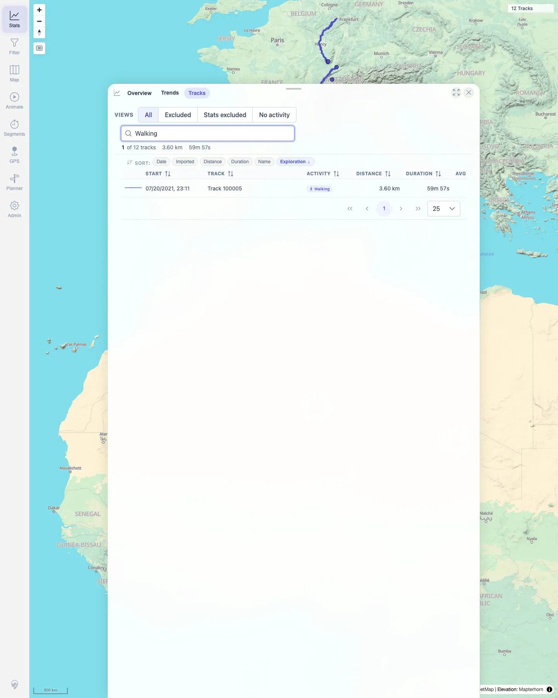

# Packet: TBS_03

## Scope

- Coverage source: `documentation/testing/frontend-regression-test-plan.md`
- Coverage ID or run packet: TBS_03
- In scope: Track browser table header sorts, sort chips, and summary changes for the visible subset.
- Out of scope: Quick-view preset behavior; covered by TBS_04.

## Prerequisites

- Required previous coverage IDs or run packets: TBS_02.
- Required app/data state: Filtering off; Stats Tracks tab lists 12 tracks; search cleared.
- Required browser context: Persistent desktop Chromium profile.

## Allowed Mutations

- Allowed: Click sort headers/chips and briefly search `Walking`.
- Not allowed: Edit track data.

## Actions And Results

| Coverage ID | Action | Expected result | Actual result | Status | Evidence |
|---|---|---|---|---|---|
| TBS_03 | Clicked sortable table headers (`Start`, `Track`, `Activity`, `Distance`, `Duration`, `Avg km/h`, `Energy`, `Exploration`, `Imported`), clicked sort chips (`Date`, `Imported`, `Distance`, `Duration`, `Name`, `Exploration`), then searched `Walking`. | Sort by each column works; summary row reflects what is currently visible. | Sortable headers and sort chips changed the first visible row and/or active sort state. Distance and Duration chips surfaced the longest-distance and longest-duration rows respectively. Searching `Walking` reduced the visible subset to the FIT Walking row and the browser summary reflected one matching track. Search was cleared afterward. | PASS | [assets/TBS_03-sort-results.txt](../assets/TBS_03-sort-results.txt); [assets/TBS_03-walking-summary.webp](../assets/TBS_03-walking-summary.webp) |

## Issues

| ID | Severity | Summary | Reproduction | Expected | Actual | Evidence | Release impact |
|---|---|---|---|---|---|---|---|

## Evidence Files

| File | Purpose |
|---|---|
| [assets/TBS_03-sort-results.txt](../assets/TBS_03-sort-results.txt) | Header/chip sort matrix and Walking summary assertion. |
| [assets/TBS_03-walking-summary.webp](../assets/TBS_03-walking-summary.webp) | Track browser after `Walking` search reduced visible rows to one. |

## Screenshot Evidence

**Track browser after Walking search reduced visible rows to one.**

## Timings

| Step | Timing |
|---|---:|
| Sort and summary check | ~3 min |

## Handoff Notes

- Completed: TBS_03 terminal as `PASS`.
- Remaining unfinished coverage: Continue with TBS_04.
- Blocked or not applicable: None.
- State left for the next packet: Stats Tracks tab open, search cleared, filtering off.
