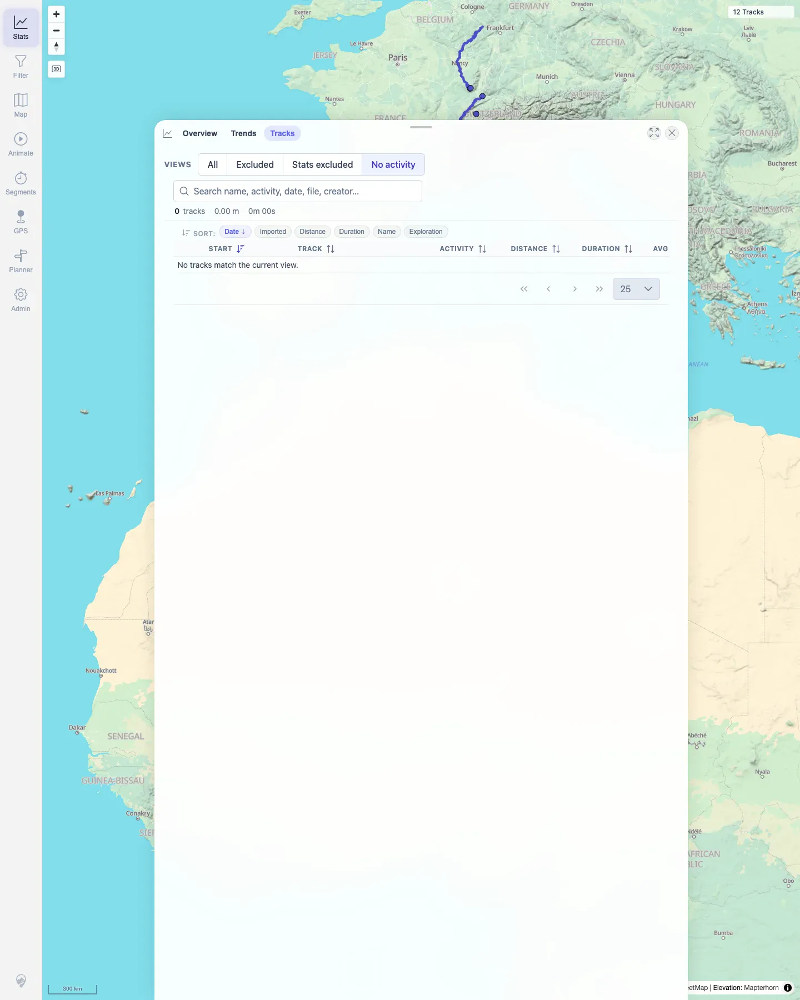
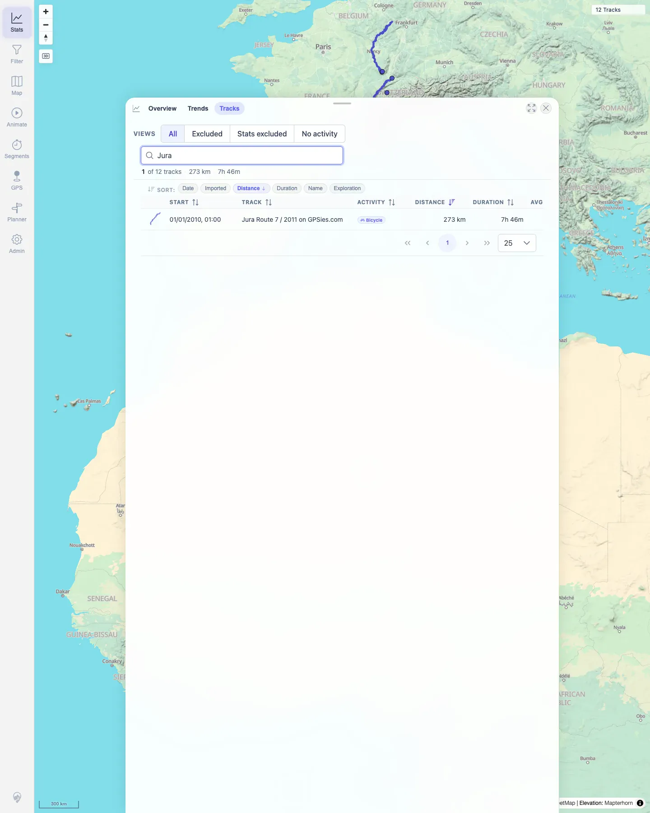

# Packet: TBS_04

## Scope

- Coverage source: `documentation/testing/frontend-regression-test-plan.md`
- Coverage ID or run packet: TBS_04
- In scope: Track browser quick-view/preset buttons and continued search/sort usability.
- Out of scope: Sorting matrix details; covered by TBS_03.

## Prerequisites

- Required previous coverage IDs or run packets: TBS_03.
- Required app/data state: Filtering off; Stats Tracks tab available; search cleared.
- Required browser context: Persistent desktop Chromium profile.

## Allowed Mutations

- Allowed: Switch track-browser quick views, search, and sort.
- Not allowed: Edit track data.

## Actions And Results

| Coverage ID | Action | Expected result | Actual result | Status | Evidence |
|---|---|---|---|---|---|
| TBS_04 | Switched quick views `All`, `Excluded`, `Stats excluded`, and `No activity`; returned to `All`, searched `Jura`, and sorted by Distance. | Quick-view/preset buttons switch the browser subset correctly and preserve usable sorting/search behavior. | `All` showed 12 tracks. `Excluded`, `Stats excluded`, and `No activity` showed controlled empty states for this dataset. Returning to `All`, search for `Jura` returned the Jura row and Distance sorting remained usable. Clearing search restored all 12 rows. | PASS | [assets/TBS_04-quick-views.txt](../assets/TBS_04-quick-views.txt); [assets/TBS_04-no-activity-view.webp](../assets/TBS_04-no-activity-view.webp); [assets/TBS_04-all-search-sort.webp](../assets/TBS_04-all-search-sort.webp) |

## Issues

| ID | Severity | Summary | Reproduction | Expected | Actual | Evidence | Release impact |
|---|---|---|---|---|---|---|---|

## Evidence Files

| File | Purpose |
|---|---|
| [assets/TBS_04-quick-views.txt](../assets/TBS_04-quick-views.txt) | Quick-view results and post-switch search/sort assertion. |
| [assets/TBS_04-no-activity-view.webp](../assets/TBS_04-no-activity-view.webp) | Empty preset view for No activity. |
| [assets/TBS_04-all-search-sort.webp](../assets/TBS_04-all-search-sort.webp) | All view after `Jura` search and Distance sort. |

## Screenshot Evidence

**Empty preset view for No activity.**

**All view after Jura search and Distance sort.**

## Timings

| Step | Timing |
|---|---:|
| Quick-view preset check | ~2 min |

## Handoff Notes

- Completed: TBS_04 terminal as `PASS`.
- Remaining unfinished coverage: Continue with TBS_05.
- Blocked or not applicable: None.
- State left for the next packet: Stats Tracks tab open, All view restored, search cleared, filtering off.
