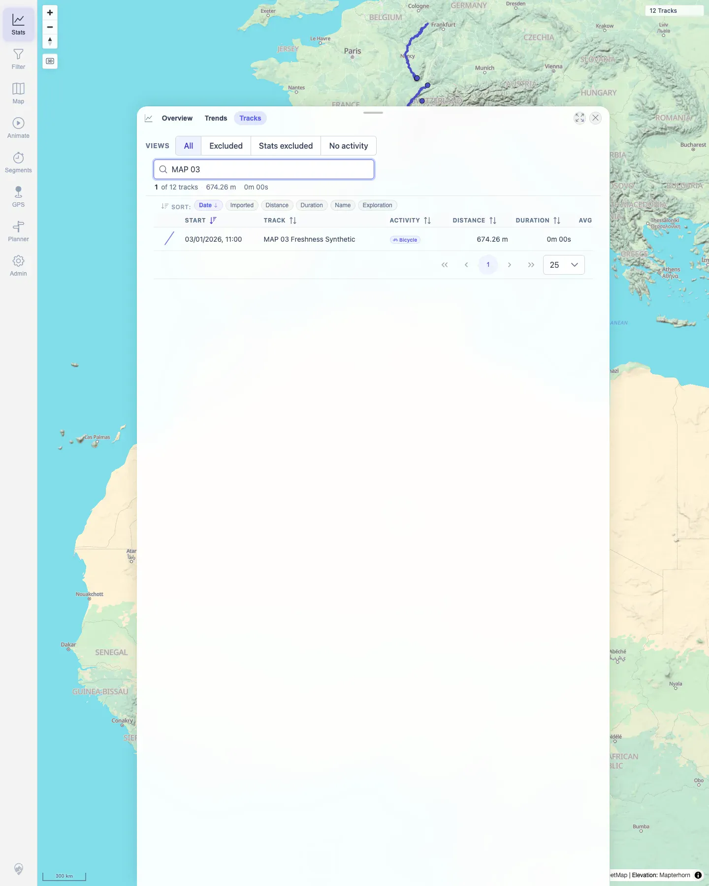
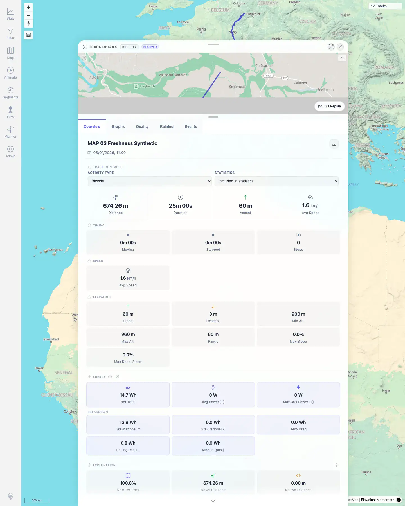

# Packet: TBS_05

## Scope

- Coverage source: `documentation/testing/frontend-regression-test-plan.md`
- Coverage ID or run packet: TBS_05
- In scope: Track browser row click navigation to track details.
- Out of scope: Detail tab content; covered by TRD packets.

## Prerequisites

- Required previous coverage IDs or run packets: TBS_04.
- Required app/data state: Filtering off; Stats Tracks tab available.
- Required browser context: Persistent desktop Chromium profile.

## Allowed Mutations

- Allowed: Search the track browser and open a track detail sheet.
- Not allowed: Edit track data.

## Actions And Results

| Coverage ID | Action | Expected result | Actual result | Status | Evidence |
|---|---|---|---|---|---|
| TBS_05 | Searched `MAP 03` in the Tracks tab and clicked the matching row. | Clicking a row opens the track's details. | The row `MAP 03 Freshness Synthetic` opened details for track `#100014`; the URL became `/mtl/track/100014` and the sheet showed Track Details tabs and the MAP 03 overview. | PASS | [assets/TBS_05-row-open-details.txt](../assets/TBS_05-row-open-details.txt); [assets/TBS_05-browser-row-before-click.webp](../assets/TBS_05-browser-row-before-click.webp); [assets/TBS_05-row-opens-details.webp](../assets/TBS_05-row-opens-details.webp) |

## Issues

| ID | Severity | Summary | Reproduction | Expected | Actual | Evidence | Release impact |
|---|---|---|---|---|---|---|---|

## Evidence Files

| File | Purpose |
|---|---|
| [assets/TBS_05-row-open-details.txt](../assets/TBS_05-row-open-details.txt) | Row-click result and detail URL assertion. |
| [assets/TBS_05-browser-row-before-click.webp](../assets/TBS_05-browser-row-before-click.webp) | Track browser with MAP 03 row before clicking. |
| [assets/TBS_05-row-opens-details.webp](../assets/TBS_05-row-opens-details.webp) | Track details opened for MAP 03. |

## Screenshot Evidence

**Track browser with MAP 03 row before clicking.**

**Track details opened for MAP 03.**

## Timings

| Step | Timing |
|---|---:|
| Track row open-details check | ~1 min |

## Handoff Notes

- Completed: TBS_05 terminal as `PASS`.
- Remaining unfinished coverage: Continue with TBS_06.
- Blocked or not applicable: None.
- State left for the next packet: MAP 03 track details open; filtering off.
