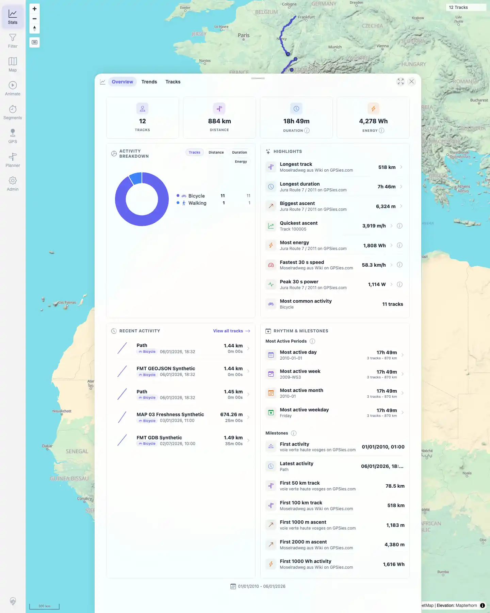

# Packet: TBS_06

## Scope

- Coverage source: `documentation/testing/frontend-regression-test-plan.md`
- Coverage ID or run packet: TBS_06
- In scope: Statistics overview totals, activity breakdown, rankings/highlights, milestones, and period summaries.
- Out of scope: Dedicated period chart switching; covered by TBS_09.

## Prerequisites

- Required previous coverage IDs or run packets: TBS_05.
- Required app/data state: Filtering off; all 12 tracks visible.
- Required browser context: Persistent desktop Chromium profile.

## Allowed Mutations

- Allowed: Open and review Stats Overview.
- Not allowed: Change data.

## Actions And Results

| Coverage ID | Action | Expected result | Actual result | Status | Evidence |
|---|---|---|---|---|---|
| TBS_06 | Opened Stats Overview and reviewed the visible top/lower overview sections. | Statistics overview shows total distance, time, elevation/activity-related totals, activity breakdown, rankings, milestones, and period charts/summaries. | Overview showed 12 tracks, 884 km, 18h49m duration, 4,278 Wh energy, Bicycle/Walking breakdown, highlight rankings, recent activity, Most active day/week/month/weekday period summaries, milestones, and overall date range. | PASS | [assets/TBS_06-overview.txt](../assets/TBS_06-overview.txt); [assets/TBS_06-overview-top.webp](../assets/TBS_06-overview-top.webp); [assets/TBS_06-overview-lower.webp](../assets/TBS_06-overview-lower.webp) |

## Issues

| ID | Severity | Summary | Reproduction | Expected | Actual | Evidence | Release impact |
|---|---|---|---|---|---|---|---|

## Evidence Files

| File | Purpose |
|---|---|
| [assets/TBS_06-overview.txt](../assets/TBS_06-overview.txt) | Compact assertions for overview sections. |
| [assets/TBS_06-overview-top.webp](../assets/TBS_06-overview-top.webp) | Stats Overview totals, breakdown, highlights, periods, and milestones. |
| [assets/TBS_06-overview-lower.webp](../assets/TBS_06-overview-lower.webp) | Additional overview capture after scrolling attempt. |

## Screenshot Evidence

**Stats Overview totals, breakdown, highlights, periods, and milestones.**

**Additional overview capture after scrolling attempt.**

## Timings

| Step | Timing |
|---|---:|
| Stats overview check | ~1 min |

## Handoff Notes

- Completed: TBS_06 terminal as `PASS`.
- Remaining unfinished coverage: Continue with TBS_07.
- Blocked or not applicable: None.
- State left for the next packet: Stats Overview open, filtering off.
