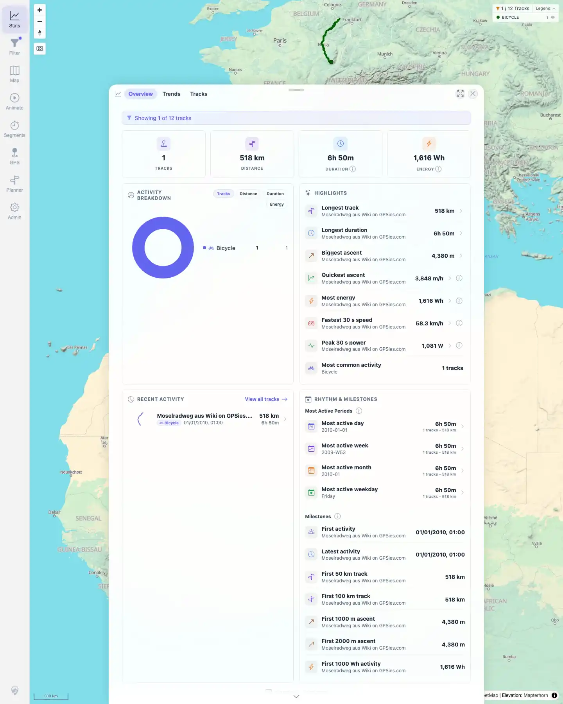

# Packet: TBS_07

## Scope

- Coverage source: `documentation/testing/frontend-regression-test-plan.md`
- Coverage ID or run packet: TBS_07
- In scope: Statistics correctness across empty, single-track, and many-track visible states.
- Out of scope: Recomputing every metric independently from source files.

## Prerequisites

- Required previous coverage IDs or run packets: IMP_01, FLT_03, TBS_06.
- Required app/data state: Earlier direct evidence captured for empty and one-track states; current many-track overview captured.
- Required browser context: Existing run evidence; no new browser mutation required.

## Allowed Mutations

- Allowed: Reuse direct evidence from earlier packets in this run.
- Not allowed: Change current data state for this cross-state verification.

## Actions And Results

| Coverage ID | Action | Expected result | Actual result | Status | Evidence |
|---|---|---|---|---|---|
| TBS_07 | Reviewed direct evidence for the empty import baseline, one-track filtered Stats, and current all-track Stats overview. | Stats are correct for empty dataset, a single track, and many tracks. | Empty baseline was captured before imports. The one-track filtered state showed Moselradweg-only Stats at `1 / 12`. The many-track overview showed 12 tracks, 884 km, 18h49m, 4,278 Wh, Bicycle/Walking breakdown, highlights, period summaries, milestones, and date range. | PASS | [assets/TBS_07-cross-state-stats.txt](../assets/TBS_07-cross-state-stats.txt); [assets/IMP_01-baseline-stats.webp](../assets/IMP_01-baseline-stats.webp); [assets/FLT_03-stats-filtered.webp](../assets/FLT_03-stats-filtered.webp); [assets/TBS_06-overview-top.webp](../assets/TBS_06-overview-top.webp) |

## Issues

| ID | Severity | Summary | Reproduction | Expected | Actual | Evidence | Release impact |
|---|---|---|---|---|---|---|---|

## Evidence Files

| File | Purpose |
|---|---|
| [assets/TBS_07-cross-state-stats.txt](../assets/TBS_07-cross-state-stats.txt) | Cross-state evidence summary. |
| [assets/IMP_01-baseline-stats.webp](../assets/IMP_01-baseline-stats.webp) | Empty dataset statistics baseline. |
| [assets/FLT_03-stats-filtered.webp](../assets/FLT_03-stats-filtered.webp) | One-track filtered statistics state. |
| [assets/TBS_06-overview-top.webp](../assets/TBS_06-overview-top.webp) | Many-track statistics overview. |

## Screenshot Evidence

**Empty dataset statistics baseline.**

**One-track filtered statistics state.**

**Many-track statistics overview.**

## Timings

| Step | Timing |
|---|---:|
| Cross-state stats evidence review | <1 min |

## Handoff Notes

- Completed: TBS_07 terminal as `PASS`.
- Remaining unfinished coverage: Continue with TBS_08.
- Blocked or not applicable: None.
- State left for the next packet: Stats Overview open, filtering off.
