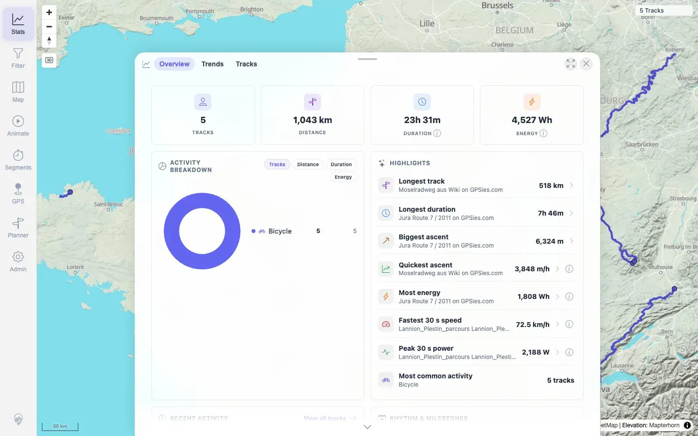
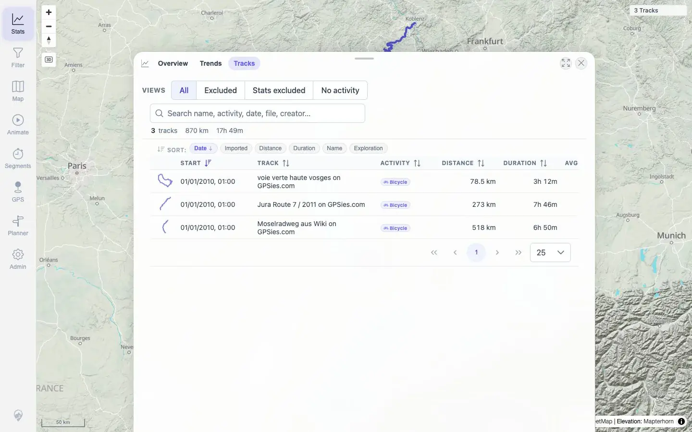
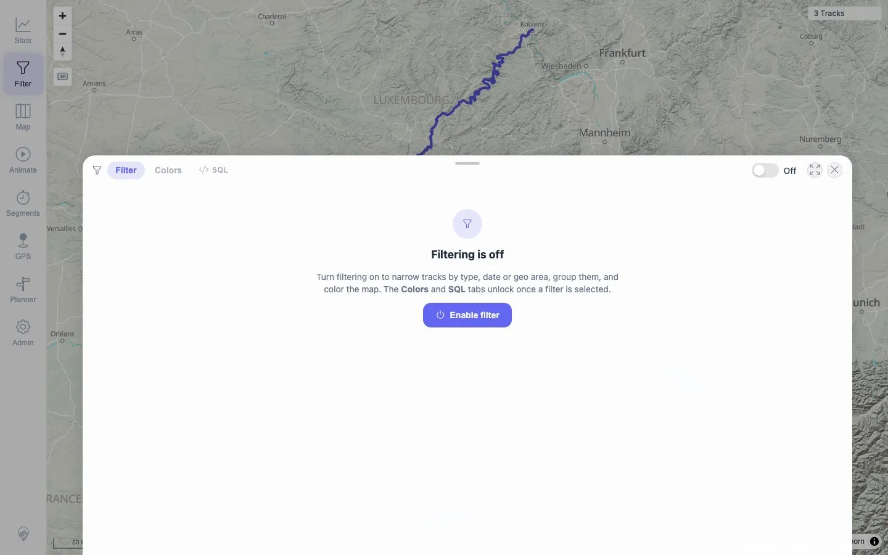

# Packet: TBS_08

## Scope

- Coverage source: `documentation/testing/frontend-regression-test-plan.md`
- Coverage ID or run packet: TBS_08
- In scope: Statistics updates after the required five-GPX import and after deleting two imported source files.
- Out of scope: Later FIT/format imports and current expanded dataset totals.

## Prerequisites

- Required previous coverage IDs or run packets: IMP_09 and DEL_03.
- Required app/data state: Five-GPX post-import evidence and post-delete evidence captured earlier in this run.
- Required browser context: Existing run evidence; no new browser mutation required.

## Allowed Mutations

- Allowed: Reuse direct evidence from earlier required import/delete packets.
- Not allowed: Change current data state for this cross-state verification.

## Actions And Results

| Coverage ID | Action | Expected result | Actual result | Status | Evidence |
|---|---|---|---|---|---|
| TBS_08 | Reviewed five-GPX post-import Stats evidence and post-delete Stats/filter/removal evidence. | Stats update after the required five-GPX import and again after deleting two imported tracks; no stale deleted-track totals remain. | Five-GPX evidence showed imported-track Stats totals, activity breakdown, period summaries, rankings, browser/map context, and heatmap density. Post-delete evidence showed the dataset dropped to three visible GPX tracks and deleted Vitry/Lannion names were absent from user-facing surfaces. | PASS | [assets/TBS_08-import-delete-stats.txt](../assets/TBS_08-import-delete-stats.txt); [assets/IMP_09-stats-overview.webp](../assets/IMP_09-stats-overview.webp); [assets/IMP_09-stats-api-summary.txt](../assets/IMP_09-stats-api-summary.txt); [assets/DEL_03-stats-3-tracks.webp](../assets/DEL_03-stats-3-tracks.webp); [assets/DEL_03-filter-3-tracks.webp](../assets/DEL_03-filter-3-tracks.webp); [assets/DEL_03-user-visible-removal.txt](../assets/DEL_03-user-visible-removal.txt) |

## Issues

| ID | Severity | Summary | Reproduction | Expected | Actual | Evidence | Release impact |
|---|---|---|---|---|---|---|---|

## Evidence Files

| File | Purpose |
|---|---|
| [assets/TBS_08-import-delete-stats.txt](../assets/TBS_08-import-delete-stats.txt) | Cross-state import/delete stats summary. |
| [assets/IMP_09-stats-overview.webp](../assets/IMP_09-stats-overview.webp) | Five-GPX post-import Stats overview. |
| [assets/IMP_09-stats-api-summary.txt](../assets/IMP_09-stats-api-summary.txt) | Five-GPX post-import API summary. |
| [assets/DEL_03-stats-3-tracks.webp](../assets/DEL_03-stats-3-tracks.webp) | Post-delete Stats state with three remaining GPX tracks. |
| [assets/DEL_03-filter-3-tracks.webp](../assets/DEL_03-filter-3-tracks.webp) | Post-delete filter/list state with three tracks. |
| [assets/DEL_03-user-visible-removal.txt](../assets/DEL_03-user-visible-removal.txt) | Deleted track absence evidence. |

## Screenshot Evidence

**Five-GPX post-import Stats overview.**

**Post-delete Stats state with three remaining GPX tracks.**

**Post-delete filter/list state with three tracks.**

## Timings

| Step | Timing |
|---|---:|
| Cross-state import/delete evidence review | <1 min |

## Handoff Notes

- Completed: TBS_08 terminal as `PASS`.
- Remaining unfinished coverage: Continue with TBS_09.
- Blocked or not applicable: None.
- State left for the next packet: Stats Overview open, filtering off.
