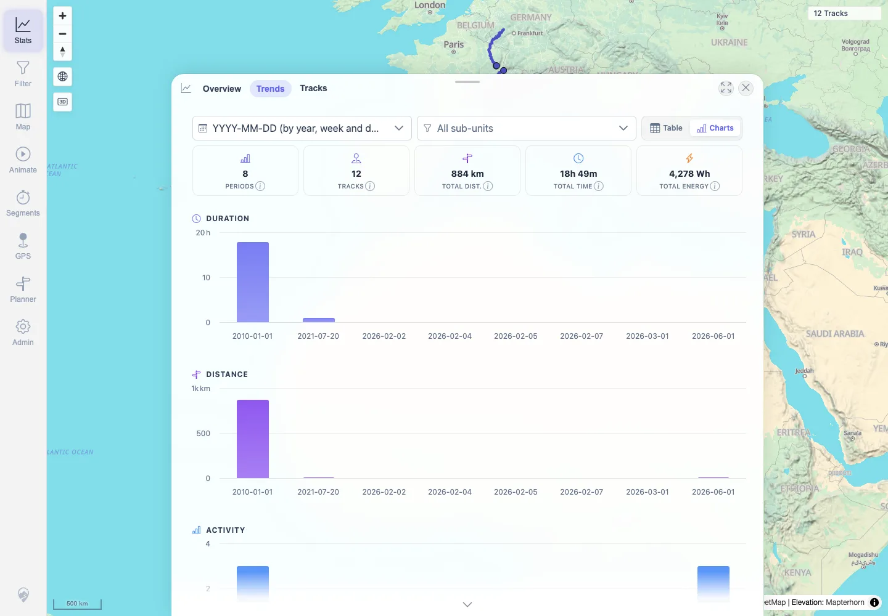
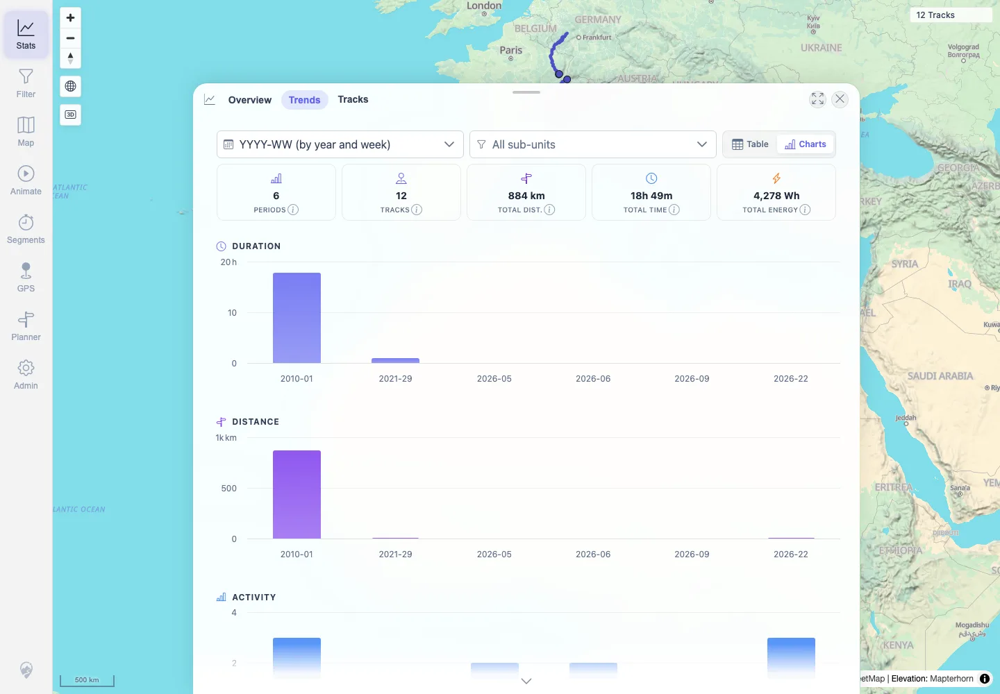
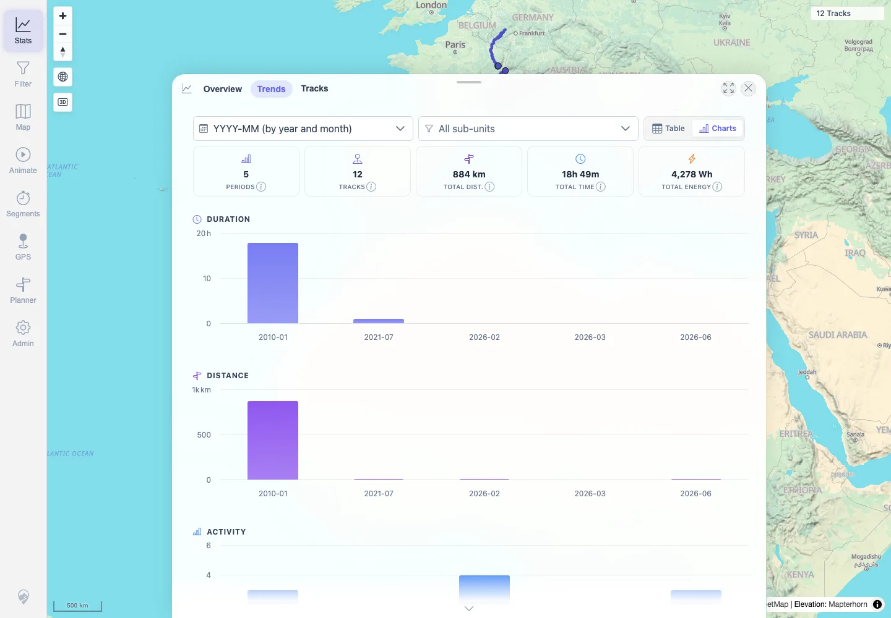

# Packet: TBS_09

## Scope

- Coverage source: `documentation/testing/frontend-regression-test-plan.md`
- Coverage ID or run packet: TBS_09
- In scope: Stats Trends time-period chart grouping for daily, weekly, and monthly periods.
- Out of scope: Statistics table mode and drilldown behavior covered by adjacent TBS packets.

## Prerequisites

- Required previous coverage IDs or run packets: RUN_SETUP through TBS_08 terminal.
- Required app/data state: Filter off; 12 visible tracks loaded.
- Required browser context: Authenticated desktop Chromium context against `http://167.233.16.201:18080/mtl/`.

## Allowed Mutations

- Allowed: Switch Stats Trends period dropdown.
- Not allowed: Change imported source data or delete tracks.

## Actions And Results

| Coverage ID | Action | Expected result | Actual result | Status | Evidence |
|---|---|---|---|---|---|
| TBS_09 | Opened Stats > Trends, inspected available period options, selected daily, weekly, and monthly groupings in chart mode. | Time-period charts render and switch correctly for daily, weekly, and monthly periods. | Daily (`YYYY-MM-DD`), weekly (`YYYY-WW`), and monthly (`YYYY-MM`) selections all rendered 8 Highcharts containers; period counts and x-axis labels changed to match the selected grouping. | PASS | [assets/TBS_09-period-charts.txt](../assets/TBS_09-period-charts.txt), [assets/TBS_09-daily-charts.webp](../assets/TBS_09-daily-charts.webp), [assets/TBS_09-weekly-charts.webp](../assets/TBS_09-weekly-charts.webp), [assets/TBS_09-monthly-charts.webp](../assets/TBS_09-monthly-charts.webp) |

## Issues

| ID | Severity | Summary | Reproduction | Expected | Actual | Evidence | Release impact |
|---|---|---|---|---|---|---|---|
|  |  |  |  |  |  |  |  |

## Evidence Files

| File | Purpose |
|---|---|
| [assets/TBS_09-period-charts.txt](../assets/TBS_09-period-charts.txt) | Period option list, selected labels, chart counts, period counts, and axis samples. |
| [assets/TBS_09-daily-charts.webp](../assets/TBS_09-daily-charts.webp) | Daily chart rendering evidence. |
| [assets/TBS_09-weekly-charts.webp](../assets/TBS_09-weekly-charts.webp) | Weekly chart rendering evidence. |
| [assets/TBS_09-monthly-charts.webp](../assets/TBS_09-monthly-charts.webp) | Monthly chart rendering evidence. |

## Screenshot Evidence

**Daily chart rendering evidence.**

**Weekly chart rendering evidence.**

**Monthly chart rendering evidence.**

## Timings

| Step | Timing |
|---|---:|
| Stats Trends period switching | 2026-06-01T22:19:06+0200 |

## Handoff Notes

- Completed: TBS_09 is terminal PASS.
- Remaining unfinished coverage: TBS_10 onward.
- Blocked or not applicable: None for this packet.
- State left for the next packet: Stats Trends view may remain on monthly chart grouping; no source data changed.
