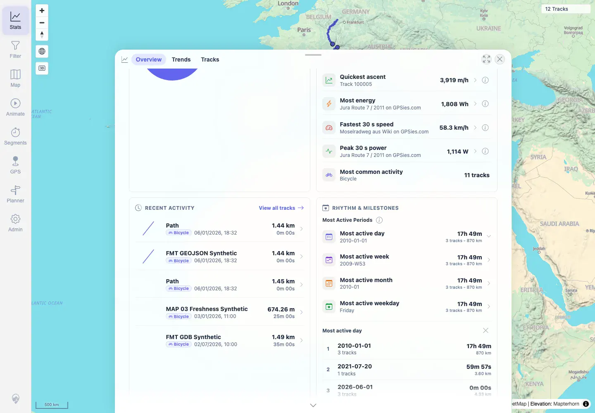
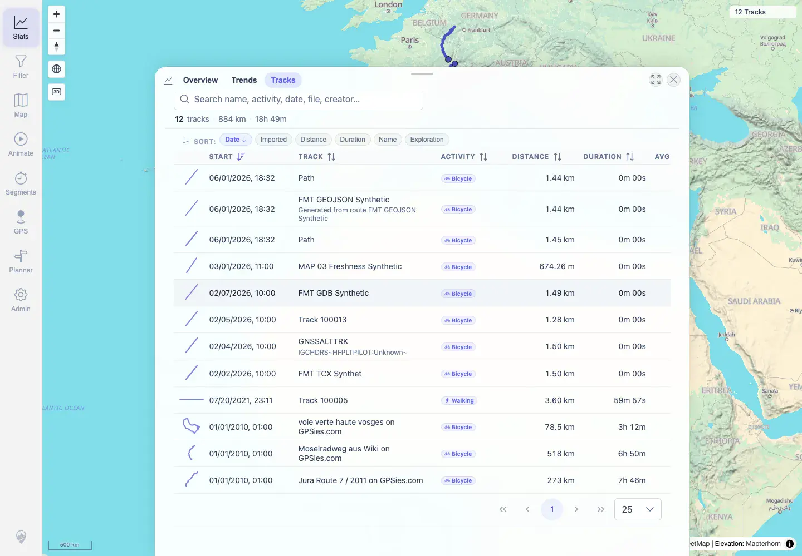
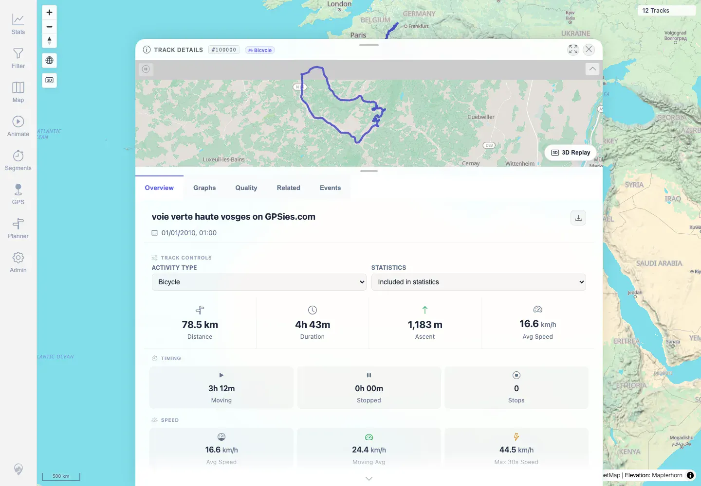

# Packet: TBS_10

## Scope

- Coverage source: `documentation/testing/frontend-regression-test-plan.md`
- Coverage ID or run packet: TBS_10
- In scope: Stats Overview entry clicks that expand, navigate, or switch stats views.
- Out of scope: Highlight drilldown list and exclusion-count behavior, covered by TBS_11.

## Prerequisites

- Required previous coverage IDs or run packets: RUN_SETUP through TBS_09 terminal.
- Required app/data state: Filter off; 12 visible tracks loaded.
- Required browser context: Authenticated desktop Chromium context against `http://167.233.16.201:18080/mtl/`.

## Allowed Mutations

- Allowed: Click Stats Overview rows and switch Stats tabs.
- Not allowed: Change track source files, filters, or statistics curation.

## Actions And Results

| Coverage ID | Action | Expected result | Actual result | Status | Evidence |
|---|---|---|---|---|---|
| TBS_10 | Clicked a Most Active Period row, clicked Recent Activity > View all tracks, then clicked the First activity milestone. | Stats entries navigate, filter, expand, or highlight as designed. | The period row expanded an in-place drilldown list; View all tracks switched to the Tracks tab with the All view and 12 rows; the milestone opened track detail `#100000` for `voie verte haute vosges on GPSies.com`. | PASS | [assets/TBS_10-stats-entry-clicks.txt](../assets/TBS_10-stats-entry-clicks.txt), [assets/TBS_10-period-drilldown.webp](../assets/TBS_10-period-drilldown.webp), [assets/TBS_10-view-all-tracks.webp](../assets/TBS_10-view-all-tracks.webp), [assets/TBS_10-milestone-detail.webp](../assets/TBS_10-milestone-detail.webp) |

## Issues

| ID | Severity | Summary | Reproduction | Expected | Actual | Evidence | Release impact |
|---|---|---|---|---|---|---|---|
|  |  |  |  |  |  |  |  |

## Evidence Files

| File | Purpose |
|---|---|
| [assets/TBS_10-stats-entry-clicks.txt](../assets/TBS_10-stats-entry-clicks.txt) | Compact log of clicked Stats entries and resulting UI state. |
| [assets/TBS_10-period-drilldown.webp](../assets/TBS_10-period-drilldown.webp) | Most Active Period drilldown rendering. |
| [assets/TBS_10-view-all-tracks.webp](../assets/TBS_10-view-all-tracks.webp) | Recent Activity View all tracks result on Tracks tab. |
| [assets/TBS_10-milestone-detail.webp](../assets/TBS_10-milestone-detail.webp) | Milestone click opening track detail. |

## Screenshot Evidence

**Most Active Period drilldown rendering.**

**Recent Activity View all tracks result on Tracks tab.**

**Milestone click opening track detail.**

## Timings

| Step | Timing |
|---|---:|
| Stats entry interaction pass | 2026-06-01T22:24:00+0200 |

## Handoff Notes

- Completed: TBS_10 is terminal PASS.
- Remaining unfinished coverage: TBS_11 onward.
- Blocked or not applicable: None for this packet.
- State left for the next packet: Browser may remain on track detail `#100000`; no data changed.
