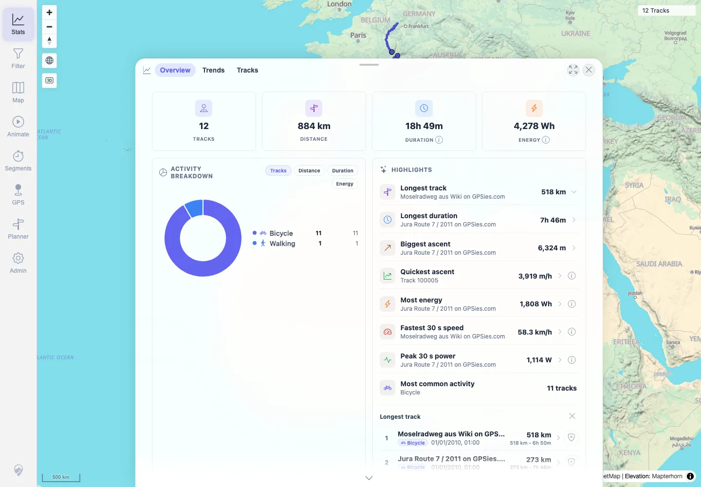
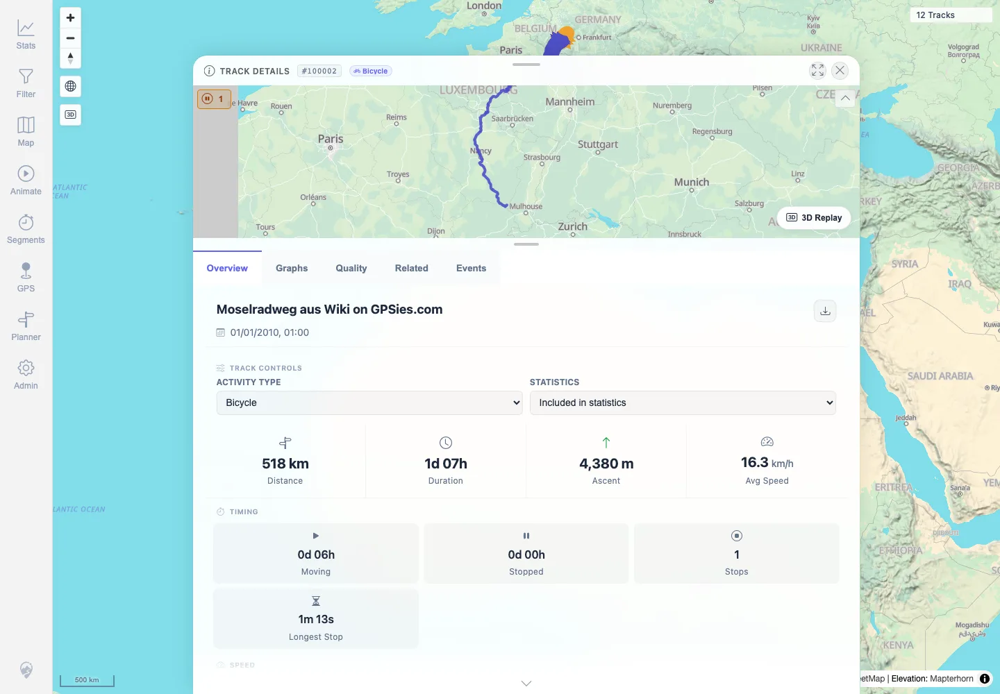
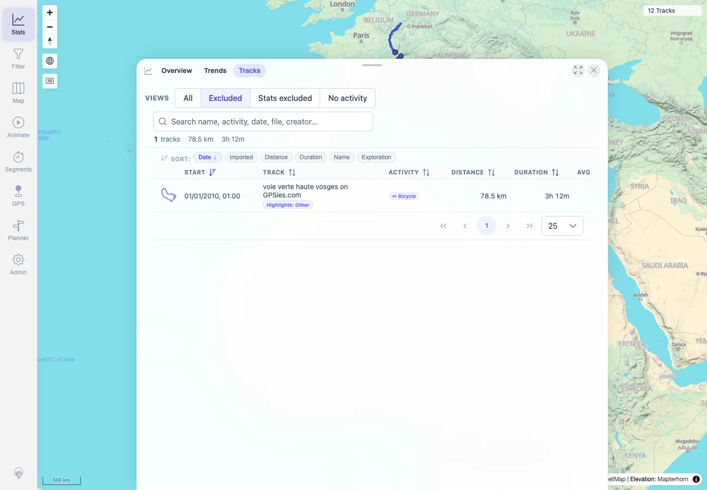

# Packet: TBS_11

## Scope

- Coverage source: `documentation/testing/frontend-regression-test-plan.md`
- Coverage ID or run packet: TBS_11
- In scope: Stats highlight drilldowns, opening a highlighted track, and excluded-highlight count/list behavior.
- Out of scope: General Stats entry navigation covered by TBS_10.

## Prerequisites

- Required previous coverage IDs or run packets: RUN_SETUP through TBS_10 terminal.
- Required app/data state: Filter off; 12 visible tracks loaded; track `#100000` curation restored after test.
- Required browser context: Authenticated desktop Chromium context against `http://167.233.16.201:18080/mtl/`.

## Allowed Mutations

- Allowed: Temporarily set one track highlight-exclusion reason to make the excluded-count path applicable.
- Not allowed: Leave curation changed after packet execution.

## Actions And Results

| Coverage ID | Action | Expected result | Actual result | Status | Evidence |
|---|---|---|---|---|---|
| TBS_11 | Opened the Longest track highlight drilldown, opened the top drilldown row, temporarily marked track `#100000` as highlight-excluded, clicked the excluded-count note, and restored original curation. | Highlight drilldowns show the expected ranked track list, opening a row opens the selected track, and excluded-highlight counts expose the matching track list where applicable. | Longest track drilldown listed ranked tracks; opening rank 1 navigated to detail `#100002`; a temporary exclusion showed `1 track excluded`, and the excluded view listed `#100000` with `Highlights: Other`; direct API check confirmed curation restored to null/null. | PASS | [assets/TBS_11-highlight-drilldowns.txt](../assets/TBS_11-highlight-drilldowns.txt), [assets/TBS_11-highlight-drilldown.webp](../assets/TBS_11-highlight-drilldown.webp), [assets/TBS_11-highlight-track-detail.webp](../assets/TBS_11-highlight-track-detail.webp), [assets/TBS_11-highlight-exclusions-list.webp](../assets/TBS_11-highlight-exclusions-list.webp) |

## Issues

| ID | Severity | Summary | Reproduction | Expected | Actual | Evidence | Release impact |
|---|---|---|---|---|---|---|---|
|  |  |  |  |  |  |  |  |

## Evidence Files

| File | Purpose |
|---|---|
| [assets/TBS_11-highlight-drilldowns.txt](../assets/TBS_11-highlight-drilldowns.txt) | Compact log of highlight drilldown, navigation, temporary curation, excluded count, and restoration. |
| [assets/TBS_11-highlight-drilldown.webp](../assets/TBS_11-highlight-drilldown.webp) | Ranked highlight drilldown list. |
| [assets/TBS_11-highlight-track-detail.webp](../assets/TBS_11-highlight-track-detail.webp) | Opening a selected highlighted row in track details. |
| [assets/TBS_11-highlight-exclusions-list.webp](../assets/TBS_11-highlight-exclusions-list.webp) | Excluded-highlight count action showing the excluded track list. |

## Screenshot Evidence

**Ranked highlight drilldown list.**

**Opening a selected highlighted row in track details.**

**Excluded-highlight count action showing the excluded track list.**

## Timings

| Step | Timing |
|---|---:|
| Highlight drilldown and exclusion-count pass | 2026-06-01T22:29:00+0200 |

## Handoff Notes

- Completed: TBS_11 is terminal PASS.
- Remaining unfinished coverage: PLN_01 onward.
- Blocked or not applicable: None for this packet.
- State left for the next packet: Track `#100000` highlight/statistics curation verified restored to null/null; browser may remain in Stats Tracks view.
