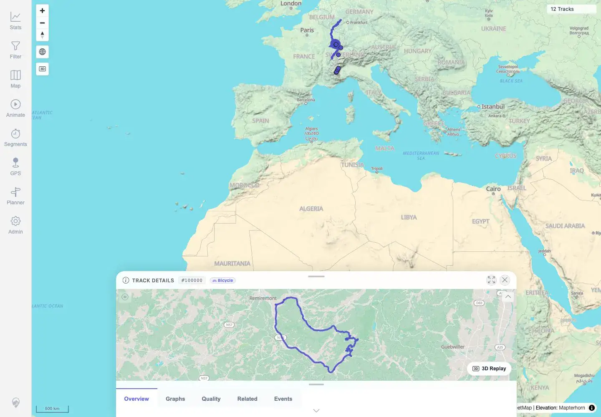
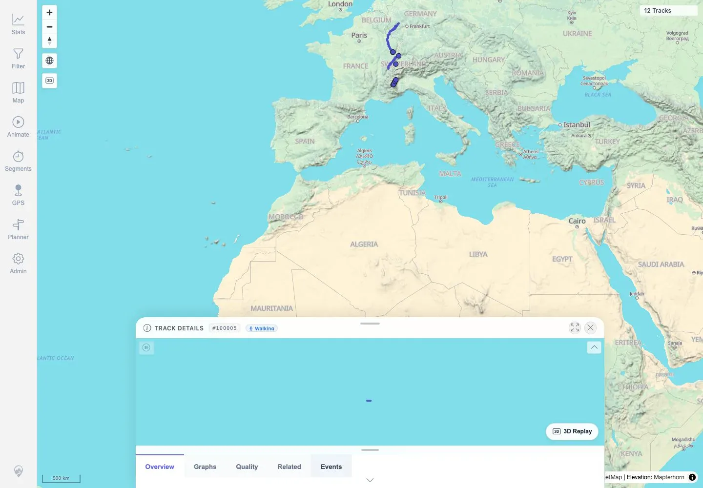

# Packet: TRD_01

## Scope

- Coverage source: `documentation/testing/frontend-regression-test-plan.md`
- Coverage ID or run packet: TRD_01
- In scope: Open one GPX-backed and one FIT-backed track from user-facing navigation and record IDs/source filenames.
- Out of scope: Detailed tab/content validation; covered by TRD_02 onward.

## Prerequisites

- Required previous coverage IDs or run packets: MAP_15.
- Required app/data state: Twelve visible tracks, including GPX track 100000 and FIT track 100005.
- Required browser context: Authenticated desktop browser context.

## Allowed Mutations

- Allowed: Open track details from map navigation.
- Not allowed: Change app data or metadata.

## Actions And Results

| Coverage ID | Action | Expected result | Actual result | Status | Evidence |
|---|---|---|---|---|---|
| TRD_01 | Opened GPX-backed `#100000` through the map overlap selector, then closed it and clicked the FIT track dot to open `#100005`. | At least one GPX-backed and one FIT-backed track open from user-facing navigation; IDs/source filenames are recorded. | GPX details opened for `#100000`, source `VoieVerteHauteVosges.gpx`, title `voie verte haute vosges on GPSies.com`; FIT details opened for `#100005`, source/title `Activity.fit`, activity `Walking`. | PASS | [assets/TRD_01-gpx-fit-opened.txt](../assets/TRD_01-gpx-fit-opened.txt), [assets/TRD_01-gpx-details.webp](../assets/TRD_01-gpx-details.webp), [assets/TRD_01-fit-details.webp](../assets/TRD_01-fit-details.webp) |

## Issues

| ID | Severity | Summary | Reproduction | Expected | Actual | Evidence | Release impact |
|---|---|---|---|---|---|---|---|

## Evidence Files

| File | Purpose |
|---|---|
| [assets/TRD_01-gpx-fit-opened.txt](../assets/TRD_01-gpx-fit-opened.txt) | Opened-track IDs, source filenames, and navigation path. |
| [assets/TRD_01-gpx-details.webp](../assets/TRD_01-gpx-details.webp) | GPX-backed track details screenshot. |
| [assets/TRD_01-fit-details.webp](../assets/TRD_01-fit-details.webp) | FIT-backed track details screenshot. |

## Screenshot Evidence

**GPX-backed track details screenshot.**

**FIT-backed track details screenshot.**

## Timings

| Step | Timing |
|---|---:|
| Open GPX and FIT details from map | ~20 seconds |

## Handoff Notes

- Completed: TRD_01 terminal as `PASS`.
- Remaining unfinished coverage: Continue with TRD_02.
- Blocked or not applicable: None.
- State left for the next packet: App data unchanged.
