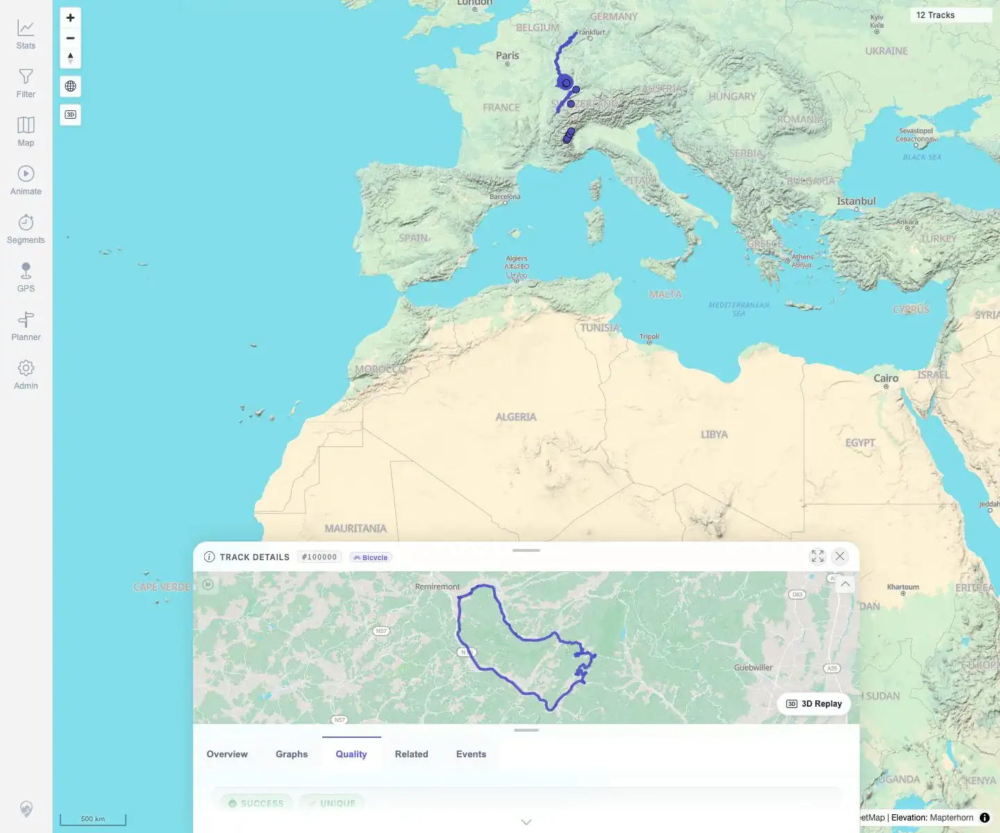
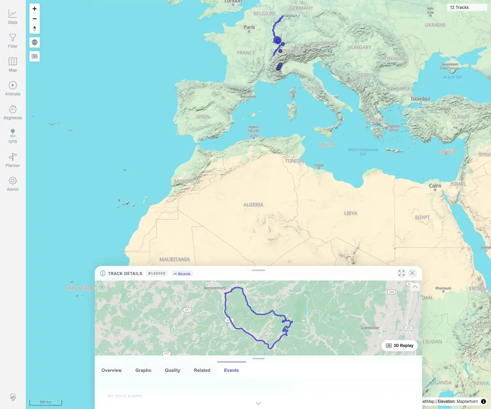

# Packet: TRD_02

## Scope

- Coverage source: `documentation/testing/frontend-regression-test-plan.md`
- Coverage ID or run packet: TRD_02
- In scope: Open a GPX-backed track and verify overview, charts, related tracks, events, mini-map, and quality info load.
- Out of scope: Detailed chart controls, downloads, statistics exclusion, and event highlighting, covered by later TRD packets.

## Prerequisites

- Required previous coverage IDs or run packets: RUN_SETUP, DAT, IMP, DEL, FIT, FMT, SGN, MAP, TRD_01.
- Required app/data state: 12 visible tracks, including GPX track `#100000` from `VoieVerteHauteVosges.gpx`.
- Required browser context: Desktop Chromium context logged in as README quick-start user.

## Allowed Mutations

- Allowed: Open track details and switch details tabs.
- Not allowed: Import, delete, edit, or reclassify tracks.

## Actions And Results

| Coverage ID | Action | Expected result | Actual result | Status | Evidence |
|---|---|---|---|---|---|
| TRD_02 | Opened GPX-backed track `#100000` from the map overlap selector, then selected Overview, Graphs, Quality, Related, and Events tabs. | Track details load overview, charts, related-tracks list, event list, mini-map, and quality info without blank panels. | Track details opened at `/mtl/track/100000`; active tab-panel assertions passed for all five tabs. Overview showed statistics plus mini-map; Graphs showed 12 chart containers and elevation/speed/gain/distance text; Quality showed point quality and metadata; Related showed previous/current/next tracks; Events showed `No track events`. | PASS | [assets/TRD_02-details-content.txt](../assets/TRD_02-details-content.txt); [assets/TRD_02-overview.webp](../assets/TRD_02-overview.webp); [assets/TRD_02-graphs.webp](../assets/TRD_02-graphs.webp); [assets/TRD_02-quality.webp](../assets/TRD_02-quality.webp); [assets/TRD_02-related.webp](../assets/TRD_02-related.webp); [assets/TRD_02-events.webp](../assets/TRD_02-events.webp) |

## Issues

| ID | Severity | Summary | Reproduction | Expected | Actual | Evidence | Release impact |
|---|---|---|---|---|---|---|---|
| MTL-FR-002 | P3 | Highcharts accessibility module warning appears when rendering detail graphs. | Open track details and render Graphs. | Charts render without avoidable console warnings. | Existing warning remains logged during graph rendering; charts still render and coverage passed. | [assets/TRD_02-details-content.txt](../assets/TRD_02-details-content.txt) | Low: console noise only observed so far. |

## Evidence Files

| File | Purpose |
|---|---|
| [assets/TRD_02-details-content.txt](../assets/TRD_02-details-content.txt) | Compact active-tab assertions, text excerpts, mini-map and graph counts. |
| [assets/TRD_02-overview.webp](../assets/TRD_02-overview.webp) | Overview tab visible with detail sheet and mini-map. |
| [assets/TRD_02-graphs.webp](../assets/TRD_02-graphs.webp) | Graphs tab selected. |
| [assets/TRD_02-quality.webp](../assets/TRD_02-quality.webp) | Quality tab selected. |
| [assets/TRD_02-related.webp](../assets/TRD_02-related.webp) | Related tab selected. |
| [assets/TRD_02-events.webp](../assets/TRD_02-events.webp) | Events tab selected. |

## Screenshot Evidence

**Overview tab visible with detail sheet and mini-map.**

**Graphs tab selected.**

**Quality tab selected.**

**Related tab selected.**

**Events tab selected.**

## Timings

| Step | Timing |
|---|---:|
| Desktop details load and tab assertions | ~45 s |

## Handoff Notes

- Completed: TRD_02 passed with replacement evidence; previous invalid TRD_02 screenshots were overwritten.
- Remaining unfinished coverage: Continue with TRD_03.
- Blocked or not applicable: None.
- State left for the next packet: Track data unchanged; app remains at 12 visible tracks.
