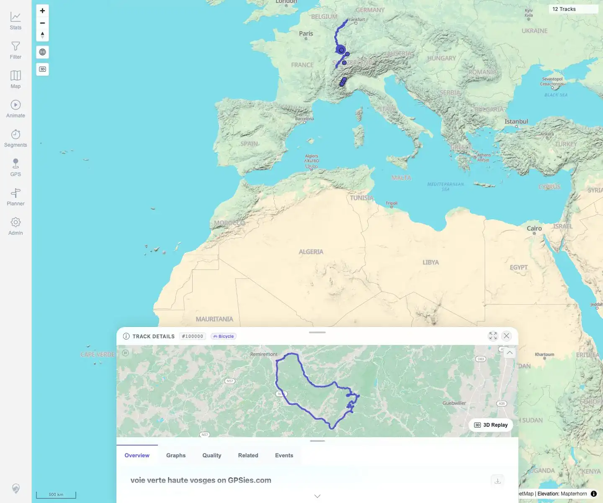

# Packet: TRD_03

## Scope

- Coverage source: `documentation/testing/frontend-regression-test-plan.md`
- Coverage ID or run packet: TRD_03
- In scope: Repeatedly switch Track Details tabs and check active state, nonblank panels, and request stability.
- Out of scope: Individual graph control behavior and downloads.

## Prerequisites

- Required previous coverage IDs or run packets: TRD_01, TRD_02.
- Required app/data state: GPX-backed track `#100000` available.
- Required browser context: Desktop Chromium, logged in as README quick-start user.

## Allowed Mutations

- Allowed: Open details and switch tabs.
- Not allowed: Change track metadata, downloads, imports, or deletes.

## Actions And Results

| Coverage ID | Action | Expected result | Actual result | Status | Evidence |
|---|---|---|---|---|---|
| TRD_03 | Opened track `#100000` from the map selection UI and switched tabs in sequence: Overview, Graphs, Quality, Related, Events, then repeated several tabs. Captured request counts during the switch loop. | Tabs switch without blank panels, lost active state, or repeated refetch loops. | All 11 switches selected the expected active tab and showed nonblank active panels. Only 3 requests occurred during the switch loop, all `/mtl/api/map/status`; no repeated details API loop was observed. | PASS | [assets/TRD_03-tab-switching.txt](../assets/TRD_03-tab-switching.txt); [assets/TRD_03-tabs.webp](../assets/TRD_03-tabs.webp) |

## Issues

| ID | Severity | Summary | Reproduction | Expected | Actual | Evidence | Release impact |
|---|---|---|---|---|---|---|---|
|  |  |  |  |  |  |  |  |

## Evidence Files

| File | Purpose |
|---|---|
| [assets/TRD_03-tab-switching.txt](../assets/TRD_03-tab-switching.txt) | Per-switch active tab, text length, request counts, and loop check. |
| [assets/TRD_03-tabs.webp](../assets/TRD_03-tabs.webp) | Final tabbed Track Details UI after repeated switching. |

## Screenshot Evidence

**Final tabbed Track Details UI after repeated switching.**

## Timings

| Step | Timing |
|---|---:|
| Desktop tab switching loop | ~30 s |

## Handoff Notes

- Completed: TRD_03 passed.
- Remaining unfinished coverage: Continue with TRD_04.
- Blocked or not applicable: None.
- State left for the next packet: Track data unchanged; app remains at 12 visible tracks.
