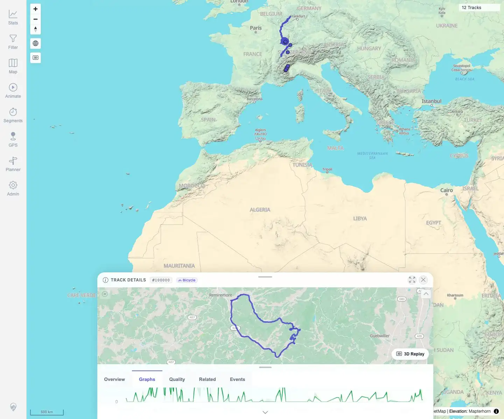

# Packet: TRD_04

## Scope

- Coverage source: `documentation/testing/frontend-regression-test-plan.md`
- Coverage ID or run packet: TRD_04
- In scope: Verify elevation, speed, distance, and gain charts render with readable values.
- Out of scope: Graph control mutations and hover synchronization.

## Prerequisites

- Required previous coverage IDs or run packets: TRD_01 through TRD_03.
- Required app/data state: GPX-backed track `#100000` available.
- Required browser context: Desktop Chromium, logged in as README quick-start user.

## Allowed Mutations

- Allowed: Open Graphs tab and inspect rendered charts.
- Not allowed: Change persistent track settings or data.

## Actions And Results

| Coverage ID | Action | Expected result | Actual result | Status | Evidence |
|---|---|---|---|---|---|
| TRD_04 | Opened track `#100000`, selected Graphs, and extracted rendered Highcharts containers, dimensions, axis/tick text, and visible graph labels. | Elevation, speed, distance, and gain charts render with readable numeric values. | Six graph containers rendered at `924x240`; Speed, Elevation, Elevation Gain Rate, Distance Over Time, Cumulative Mechanical Energy, and Estimated Power all showed readable axis values and units. Required speed/elevation/gain/distance checks all passed. | PASS | [assets/TRD_04-graph-readability.txt](../assets/TRD_04-graph-readability.txt); [assets/TRD_04-graphs-viewport.webp](../assets/TRD_04-graphs-viewport.webp); [assets/TRD_04-graphs-scrolled.webp](../assets/TRD_04-graphs-scrolled.webp) |

## Issues

| ID | Severity | Summary | Reproduction | Expected | Actual | Evidence | Release impact |
|---|---|---|---|---|---|---|---|
| MTL-FR-002 | P3 | Highcharts accessibility module warning appears when rendering detail graphs. | Open track details and render Graphs. | Charts render without avoidable console warnings. | Existing warning remains logged during graph rendering; charts still render and coverage passed. | [assets/TRD_04-graph-readability.txt](../assets/TRD_04-graph-readability.txt) | Low: console noise only observed so far. |

## Evidence Files

| File | Purpose |
|---|---|
| [assets/TRD_04-graph-readability.txt](../assets/TRD_04-graph-readability.txt) | Chart count, dimensions, labels, units, and check results. |
| [assets/TRD_04-graphs-viewport.webp](../assets/TRD_04-graphs-viewport.webp) | Graphs tab selected in the details sheet. |
| [assets/TRD_04-graphs-scrolled.webp](../assets/TRD_04-graphs-scrolled.webp) | Scrolled viewport with graph line rendering visible. |

## Screenshot Evidence

**Graphs tab selected in the details sheet.**

**Scrolled viewport with graph line rendering visible.**

## Timings

| Step | Timing |
|---|---:|
| Graph rendering/readability check | ~35 s |

## Handoff Notes

- Completed: TRD_04 passed.
- Remaining unfinished coverage: Continue with TRD_05.
- Blocked or not applicable: None.
- State left for the next packet: Track data unchanged; app remains at 12 visible tracks.
