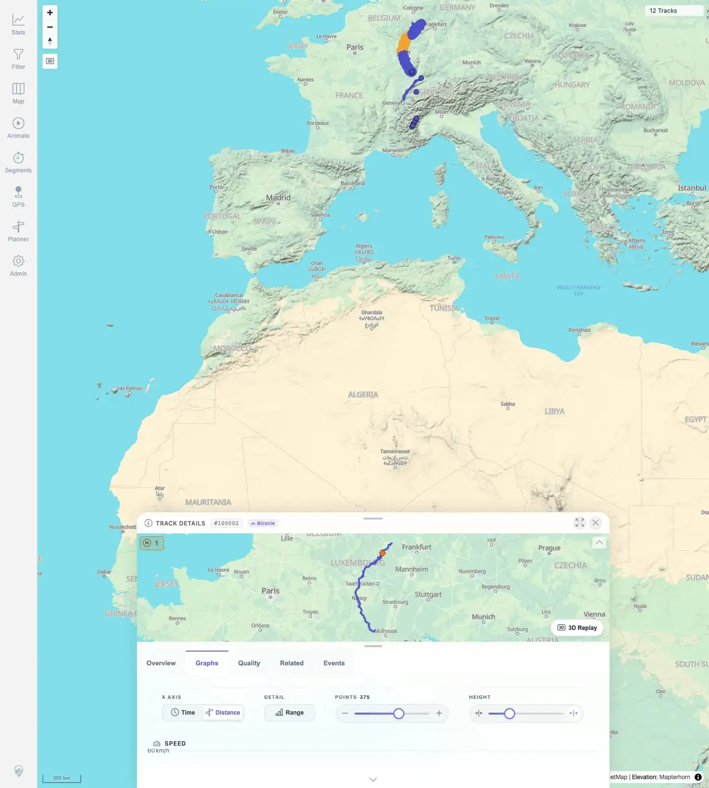

# Packet: TRD_05

## Scope

- Coverage source: `documentation/testing/frontend-regression-test-plan.md`
- Coverage ID or run packet: TRD_05
- In scope: Verify graph controls update charts without layout breakage.
- Out of scope: Hover synchronization and chart value accuracy beyond control response.

## Prerequisites

- Required previous coverage IDs or run packets: TRD_01 through TRD_04.
- Required app/data state: Imported tracks available; map selection can open a track with chart data.
- Required browser context: Desktop Chromium, logged in as README quick-start user.

## Allowed Mutations

- Allowed: Change non-persistent graph display controls in the details UI.
- Not allowed: Change saved track metadata or imported data.

## Actions And Results

| Coverage ID | Action | Expected result | Actual result | Status | Evidence |
|---|---|---|---|---|---|
| TRD_05 | Opened Graphs for map-selected track `#100002`, then used visible controls for Distance x-axis, Range toggle, Load more chart points, and Make graphs bigger. Restored Time, Range, and point count afterward. | Time/distance toggle, range band toggle, point-count slider/control, and graph-height slider/control update charts without layout breakage. | Distance x-axis became active and chart ticks switched to km. Range toggled off. Point count changed from 350 to 375. Chart heights changed from 240 to 250 while remaining readable and within layout bounds. Time/range/points restored afterward. | PASS | [assets/TRD_05-graph-controls.txt](../assets/TRD_05-graph-controls.txt); [assets/TRD_05-controls-updated.webp](../assets/TRD_05-controls-updated.webp) |

## Issues

| ID | Severity | Summary | Reproduction | Expected | Actual | Evidence | Release impact |
|---|---|---|---|---|---|---|---|
|  |  |  |  |  |  |  |  |

## Evidence Files

| File | Purpose |
|---|---|
| [assets/TRD_05-graph-controls.txt](../assets/TRD_05-graph-controls.txt) | Control clicks, state transitions, chart heights, point counts, and assertions. |
| [assets/TRD_05-controls-updated.webp](../assets/TRD_05-controls-updated.webp) | Graphs tab after controls were changed. |

## Screenshot Evidence

**Graphs tab after controls were changed.**

## Timings

| Step | Timing |
|---|---:|
| Graph control interaction pass | ~50 s |

## Handoff Notes

- Completed: TRD_05 passed.
- Remaining unfinished coverage: Continue with TRD_06.
- Blocked or not applicable: None.
- State left for the next packet: Track data unchanged. The test used a fresh browser context and restored Time, Range, and point-count controls before closing it.
