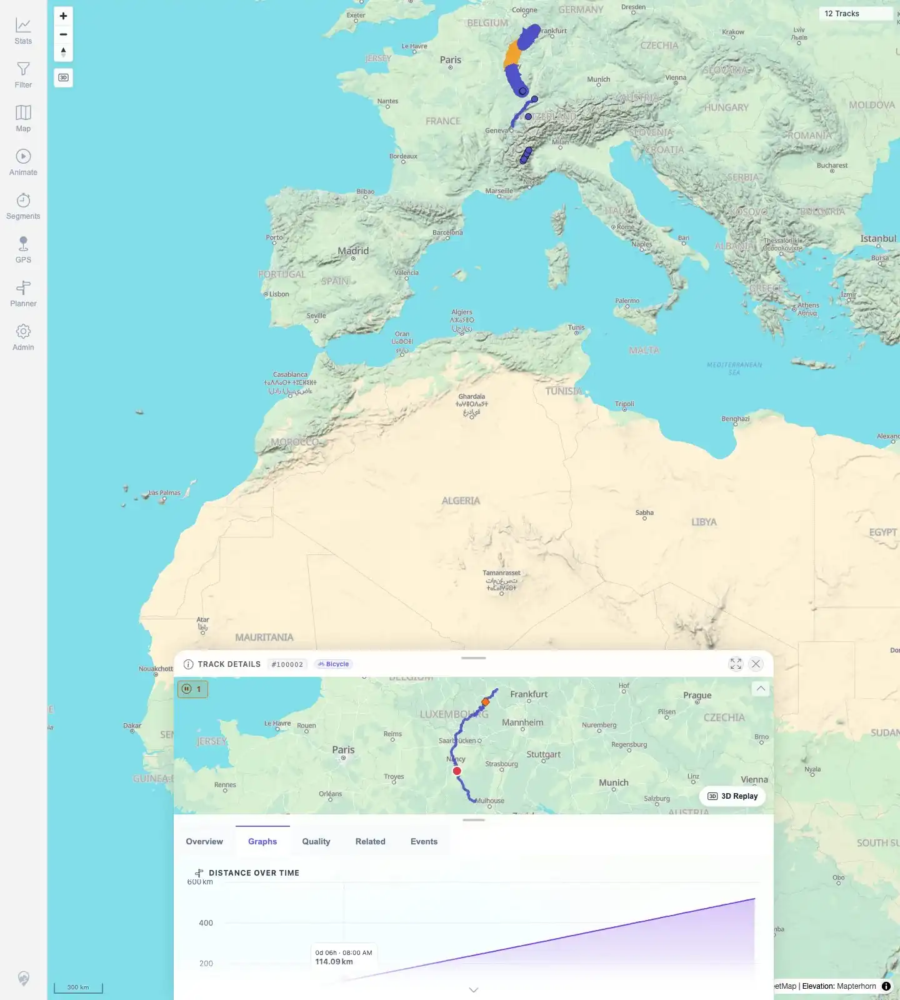
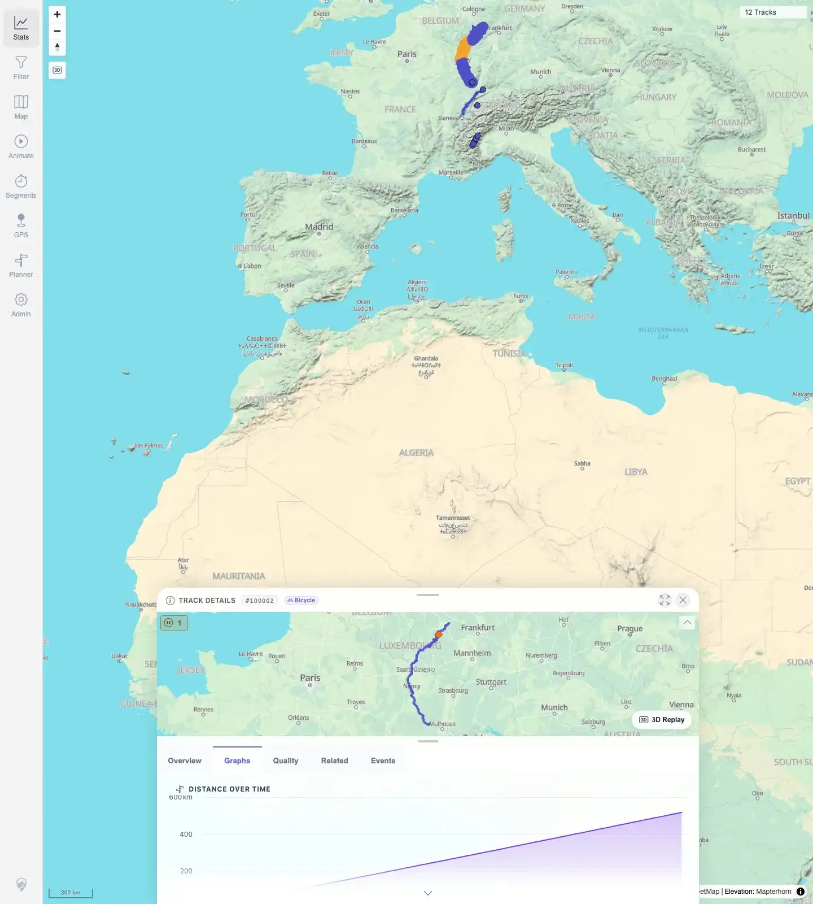

# Packet: TRD_06

## Scope

- Coverage source: `documentation/testing/frontend-regression-test-plan.md`
- Coverage ID or run packet: TRD_06
- In scope: Verify chart hover and mini-map hover synchronization in Track Details.
- Out of scope: Chart control behavior, covered by TRD_05.

## Prerequisites

- Required previous coverage IDs or run packets: TRD_01 through TRD_05.
- Required app/data state: Imported track with Graphs and mini-map available.
- Required browser context: Desktop Chromium, logged in as README quick-start user.

## Allowed Mutations

- Allowed: Hover chart and mini-map surfaces.
- Not allowed: Change persistent track settings or data.

## Actions And Results

| Coverage ID | Action | Expected result | Actual result | Status | Evidence |
|---|---|---|---|---|---|
| TRD_06 | Opened Graphs for track `#100002`, scrolled the details sheet so the mini-map and graph were visible, hovered the chart, moved away, then hovered sampled route points on the mini-map. Retested locally on 2026-06-04 with track `#100001` Graphs tab and the same chart/mini-map hover flow. | Hovering a chart highlights the matching point on the mini-map; hovering the mini-map highlights the chart; cursors clear after leaving either surface. | Original remote run did not show mini-map-to-chart hover. Local retest could not reproduce `MTL-FR-003`: chart hover showed tooltip/crosshair plus mini-map cursor, and mini-map hover moved the chart tooltip/cursor to the matching point. | PASS | [assets/TRD_06-hover-sync.txt](../assets/TRD_06-hover-sync.txt); [assets/TRD_06-chart-hover.webp](../assets/TRD_06-chart-hover.webp); [assets/TRD_06-after-leave.webp](../assets/TRD_06-after-leave.webp); [assets/TRD_06-minimap-hover.webp](../assets/TRD_06-minimap-hover.webp) |

## Issues

| ID | Severity | Summary | Reproduction | Expected | Actual | Evidence | Release impact |
|---|---|---|---|---|---|---|---|
| MTL-FR-003 | P2 | Mini-map hover does not highlight the matching chart position. | Open Track Details, open Graphs, scroll details so the mini-map and chart are both visible, hover route points in the mini-map. | Hovering the mini-map route highlights the matching chart point/cursor. | NOT REPRODUCIBLE on 2026-06-04 local retest: mini-map hover moved the chart cursor/tooltip. Original remote evidence remains below for context. | [assets/TRD_06-hover-sync.txt](../assets/TRD_06-hover-sync.txt); [assets/TRD_06-minimap-hover.webp](../assets/TRD_06-minimap-hover.webp) | No current release blocker from retest; keep as watch item for future full regression. |

## Evidence Files

| File | Purpose |
|---|---|
| [assets/TRD_06-hover-sync.txt](../assets/TRD_06-hover-sync.txt) | Original remote hover coordinate samples plus 2026-06-04 local not-reproducible retest note. |
| [assets/TRD_06-chart-hover.webp](../assets/TRD_06-chart-hover.webp) | Chart hover showing tooltip/crosshair and mini-map point. |
| [assets/TRD_06-after-leave.webp](../assets/TRD_06-after-leave.webp) | Cursor state visually cleared after leaving chart hover. |
| [assets/TRD_06-minimap-hover.webp](../assets/TRD_06-minimap-hover.webp) | Original remote mini-map hover attempt without visible chart cursor. |

## Screenshot Evidence

**Chart hover showing tooltip/crosshair and mini-map point.**

**Cursor state visually cleared after leaving chart hover.**

**Original remote mini-map hover attempt without visible chart cursor.**

## Timings

| Step | Timing |
|---|---:|
| Hover synchronization pass | ~60 s |

## Handoff Notes

- Completed: TRD_06 terminal result updated to PASS after 2026-06-04 local retest; `MTL-FR-003` marked NOT REPRODUCIBLE.
- Remaining unfinished coverage: Continue with TRD_07.
- Blocked or not applicable: None.
- State left for the next packet: Track data unchanged.
