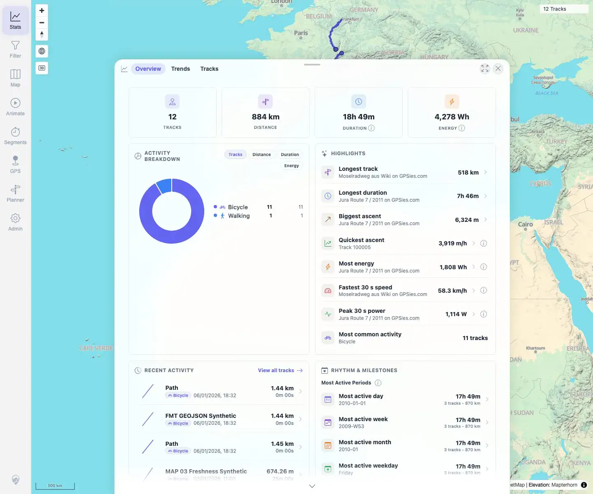
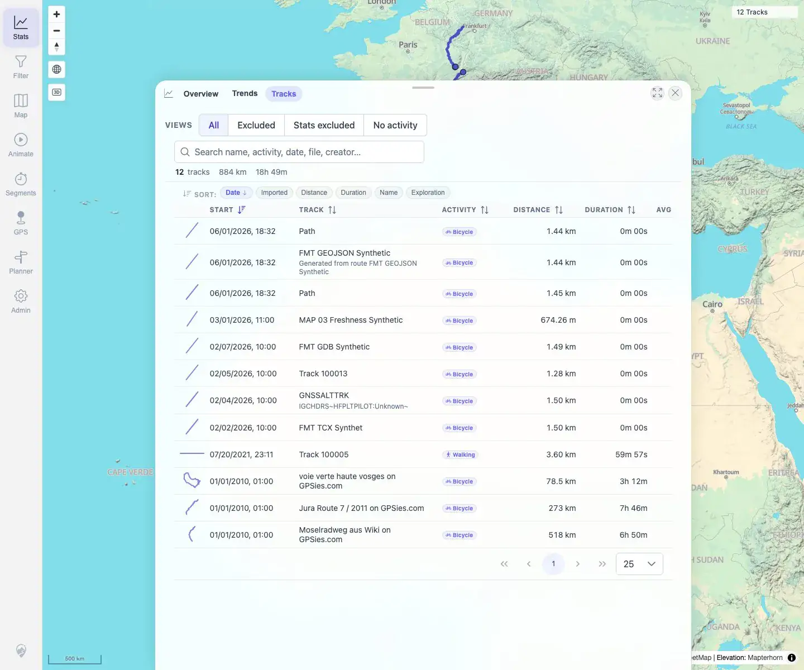
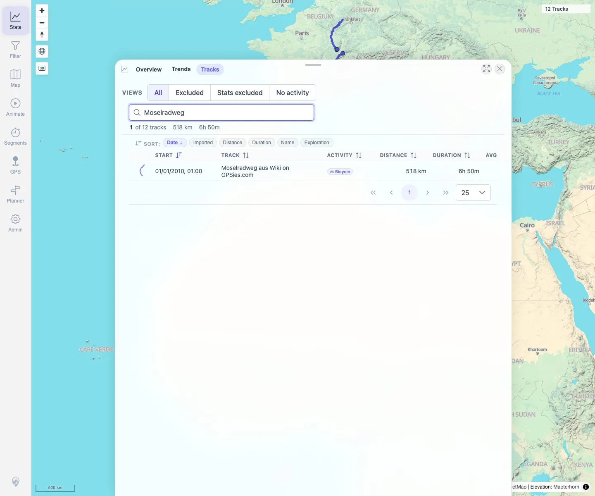
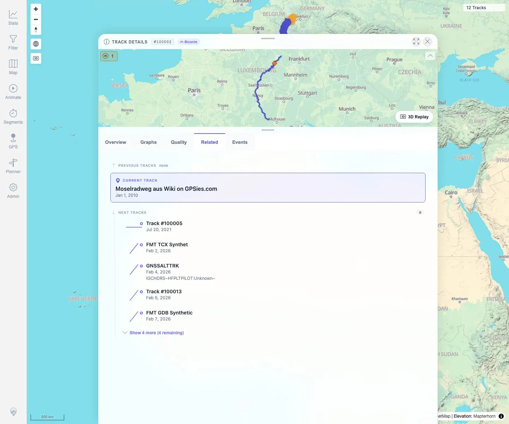
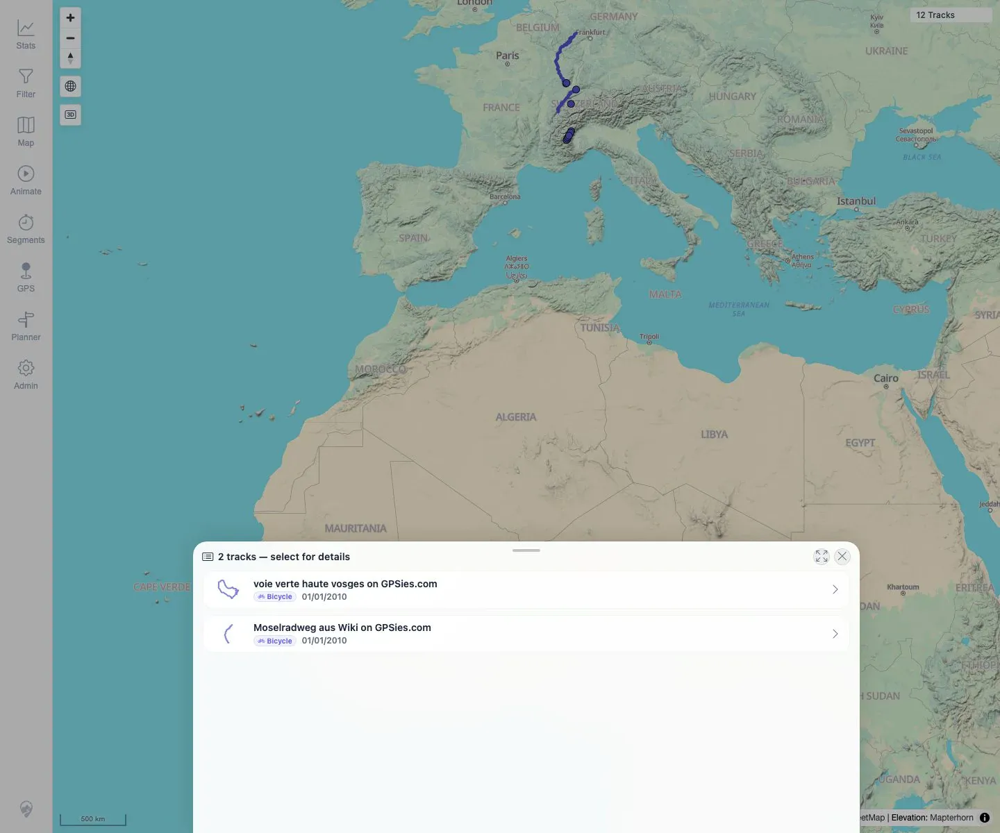

# Packet: TRD_07

## Scope

- Coverage source: `documentation/testing/frontend-regression-test-plan.md`
- Coverage ID or run packet: TRD_07
- In scope: Verify small track shape previews are visible in browser, filtered browser, stats, related tracks, and selection lists.
- Out of scope: Exact thumbnail geometry fidelity.

## Prerequisites

- Required previous coverage IDs or run packets: TRD_01 through TRD_06.
- Required app/data state: 12 visible tracks with stats, details, and map selection surfaces available.
- Required browser context: Desktop Chromium, logged in as README quick-start user.

## Allowed Mutations

- Allowed: Search/filter the track browser and open details/selection lists.
- Not allowed: Change imported data or persistent track metadata.

## Actions And Results

| Coverage ID | Action | Expected result | Actual result | Status | Evidence |
|---|---|---|---|---|---|
| TRD_07 | Checked `.track-shape-preview` instances in Stats overview recent activity, Stats → Tracks browser, searched/filtered track-browser results, Related tab track cards, and map overlap selection list. | Small track shape previews are visible in browser, filters, stats, related tracks, and selection lists. | Stats overview showed 5 recent-row previews; Track Browser showed 12 row previews; searched/filtered browser result for Moselradweg retained 1 preview; Related showed 5 track-card previews; overlap selector showed 2 pick-list previews. | PASS | [assets/TRD_07-shape-previews.txt](../assets/TRD_07-shape-previews.txt); [assets/TRD_07-stats-overview-shapes.webp](../assets/TRD_07-stats-overview-shapes.webp); [assets/TRD_07-track-browser-shapes.webp](../assets/TRD_07-track-browser-shapes.webp); [assets/TRD_07-filtered-browser-shapes.webp](../assets/TRD_07-filtered-browser-shapes.webp); [assets/TRD_07-related-shapes.webp](../assets/TRD_07-related-shapes.webp); [assets/TRD_07-selection-list-shapes.webp](../assets/TRD_07-selection-list-shapes.webp) |

## Issues

| ID | Severity | Summary | Reproduction | Expected | Actual | Evidence | Release impact |
|---|---|---|---|---|---|---|---|
|  |  |  |  |  |  |  |  |

## Evidence Files

| File | Purpose |
|---|---|
| [assets/TRD_07-shape-previews.txt](../assets/TRD_07-shape-previews.txt) | Per-surface thumbnail counts, classes, dimensions, and checks. |
| [assets/TRD_07-stats-overview-shapes.webp](../assets/TRD_07-stats-overview-shapes.webp) | Stats overview recent activity thumbnails. |
| [assets/TRD_07-track-browser-shapes.webp](../assets/TRD_07-track-browser-shapes.webp) | Track Browser thumbnails. |
| [assets/TRD_07-filtered-browser-shapes.webp](../assets/TRD_07-filtered-browser-shapes.webp) | Searched/filtered browser result retaining thumbnail. |
| [assets/TRD_07-related-shapes.webp](../assets/TRD_07-related-shapes.webp) | Related tab track-card thumbnails. |
| [assets/TRD_07-selection-list-shapes.webp](../assets/TRD_07-selection-list-shapes.webp) | Overlap selection list thumbnails. |

## Screenshot Evidence

**Stats overview recent activity thumbnails.**

**Track Browser thumbnails.**

**Searched/filtered browser result retaining thumbnail.**

**Related tab track-card thumbnails.**

**Overlap selection list thumbnails.**

## Timings

| Step | Timing |
|---|---:|
| Thumbnail surface pass | ~55 s |

## Handoff Notes

- Completed: TRD_07 passed.
- Remaining unfinished coverage: Continue with TRD_08.
- Blocked or not applicable: None.
- State left for the next packet: Track data unchanged.
