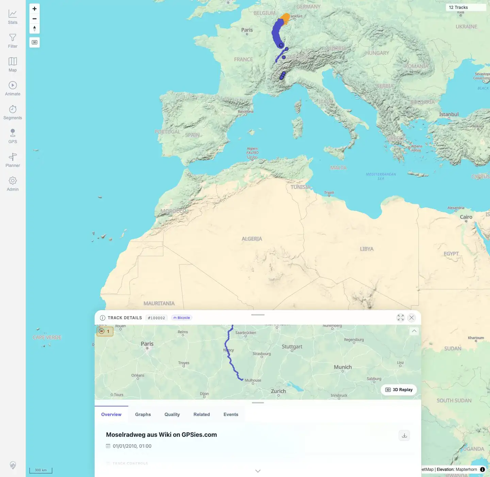

# Packet: TRD_08

## Scope

- Coverage source: `documentation/testing/frontend-regression-test-plan.md`
- Coverage ID or run packet: TRD_08
- In scope: Download original source file from Track Details and compare it to the uploaded public GPX.
- Out of scope: GPX conversion download, covered by TRD_09.

## Prerequisites

- Required previous coverage IDs or run packets: TRD_01 through TRD_07, DAT/IMP manifest evidence.
- Required app/data state: GPX-backed track `#100002` available with original source `MoselradwegAusWiki.gpx`.
- Required browser context: Desktop Chromium with downloads enabled, logged in as README quick-start user.

## Allowed Mutations

- Allowed: Download file to local temporary Playwright directory.
- Not allowed: Change track data or app configuration.

## Actions And Results

| Coverage ID | Action | Expected result | Actual result | Status | Evidence |
|---|---|---|---|---|---|
| TRD_08 | Opened `#100002` Track Details and clicked the visible `Download original` action. Compared downloaded SHA-256 to the manifest checksum for `MoselradwegAusWiki.gpx`. | Original source file downloads and matches the uploaded file. | Downloaded `MoselradwegAusWiki.gpx` with SHA-256 `0f5263dee95a345a42585bde148ec741af4ed4eeb7451702f59c9c7f9bf761c3`, matching the public source manifest. | PASS | [assets/TRD_08-original-download.txt](../assets/TRD_08-original-download.txt); [assets/TRD_08-download-original-button.webp](../assets/TRD_08-download-original-button.webp) |

## Issues

| ID | Severity | Summary | Reproduction | Expected | Actual | Evidence | Release impact |
|---|---|---|---|---|---|---|---|
|  |  |  |  |  |  |  |  |

## Evidence Files

| File | Purpose |
|---|---|
| [assets/TRD_08-original-download.txt](../assets/TRD_08-original-download.txt) | Downloaded filename, byte size, checksum, manifest comparison, and GPX header. |
| [assets/TRD_08-download-original-button.webp](../assets/TRD_08-download-original-button.webp) | Track Details with the original-download action visible. |

## Screenshot Evidence

**Track Details with the original-download action visible.**

## Timings

| Step | Timing |
|---|---:|
| Original download and checksum comparison | ~25 s |

## Handoff Notes

- Completed: TRD_08 passed.
- Remaining unfinished coverage: Continue with TRD_09.
- Blocked or not applicable: None.
- State left for the next packet: Track data unchanged; downloaded file is only in `/tmp/mtl-playwright-regression`.
