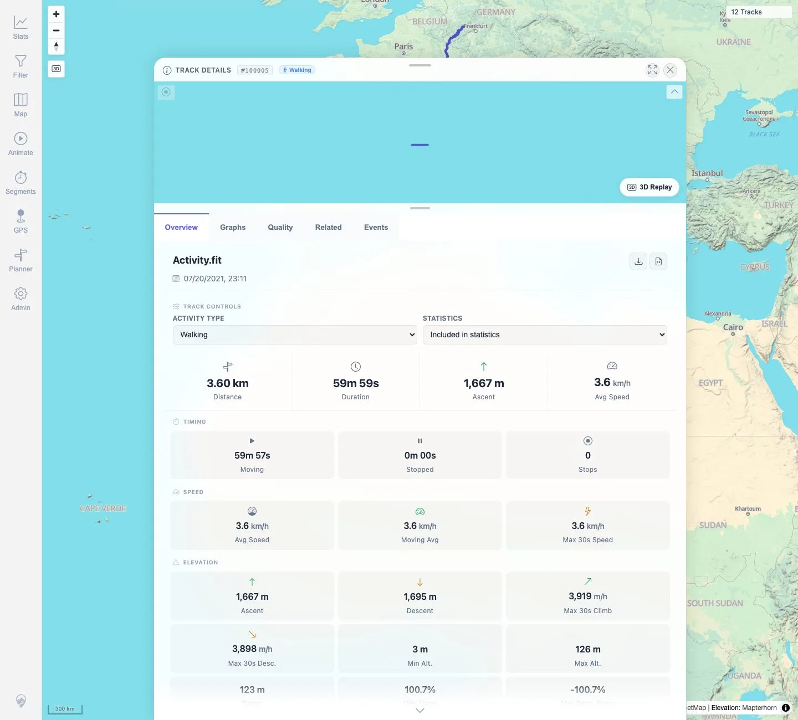

# Packet: TRD_09

## Scope

- Coverage source: `documentation/testing/frontend-regression-test-plan.md`
- Coverage ID or run packet: TRD_09
- In scope: Download a converted GPX from a non-GPX source track and validate the file.
- Out of scope: Original-source download, covered by TRD_08.

## Prerequisites

- Required previous coverage IDs or run packets: TRD_01 through TRD_08, FIT import packets.
- Required app/data state: FIT-backed track `#100005` available.
- Required browser context: Desktop Chromium with downloads enabled, logged in as README quick-start user.

## Allowed Mutations

- Allowed: Download converted GPX to local temporary Playwright directory.
- Not allowed: Change track data or app configuration.

## Actions And Results

| Coverage ID | Action | Expected result | Actual result | Status | Evidence |
|---|---|---|---|---|---|
| TRD_09 | Searched Stats → Tracks for `Activity.fit`, opened `#100005`, clicked `Download GPX`, and inspected the downloaded file. | Download as GPX returns a valid GPX file even when the source was FIT. | `Activity.gpx` downloaded with `<gpx>`, 1 `<trkseg>`, and 3,601 `<trkpt>` entries. | PASS | [assets/TRD_09-download-as-gpx.txt](../assets/TRD_09-download-as-gpx.txt); [assets/TRD_09-download-gpx-button.webp](../assets/TRD_09-download-gpx-button.webp) |

## Issues

| ID | Severity | Summary | Reproduction | Expected | Actual | Evidence | Release impact |
|---|---|---|---|---|---|---|---|
|  |  |  |  |  |  |  |  |

## Evidence Files

| File | Purpose |
|---|---|
| [assets/TRD_09-download-as-gpx.txt](../assets/TRD_09-download-as-gpx.txt) | Download target, filename, checksum, GPX structure, and trkpt counts. |
| [assets/TRD_09-download-gpx-button.webp](../assets/TRD_09-download-gpx-button.webp) | FIT-backed Track Details with GPX download action visible. |

## Screenshot Evidence

**FIT-backed Track Details with GPX download action visible.**

## Timings

| Step | Timing |
|---|---:|
| FIT details search, GPX download, validation | ~35 s |

## Handoff Notes

- Completed: TRD_09 passed.
- Remaining unfinished coverage: Continue with TRD_10.
- Blocked or not applicable: None.
- State left for the next packet: Track data unchanged; downloaded GPX is only in `/tmp/mtl-playwright-regression`.
