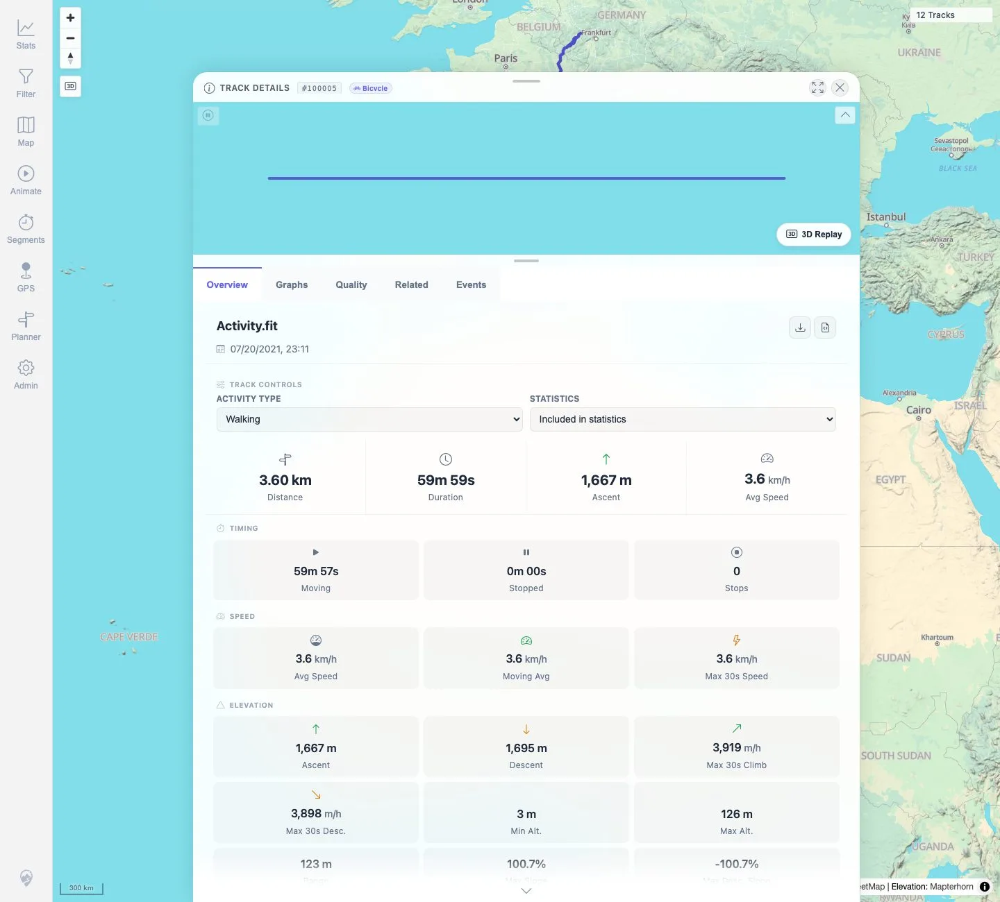

# Packet: TRD_10

## Scope

- Coverage source: `documentation/testing/frontend-regression-test-plan.md`
- Coverage ID or run packet: TRD_10
- In scope: Change a track activity type, verify save/persistence, energy recalculation, and restore original state.
- Out of scope: Temporary what-if recalculation, covered by TRD_11.

## Prerequisites

- Required previous coverage IDs or run packets: TRD_01 through TRD_09.
- Required app/data state: FIT-backed track `#100005` available.
- Required browser context: Desktop Chromium, logged in as README quick-start user.

## Allowed Mutations

- Allowed: Temporarily change track `#100005` activity type and restore it to `Walking`.
- Not allowed: Leave changed activity state behind.

## Actions And Results

| Coverage ID | Action | Expected result | Actual result | Status | Evidence |
|---|---|---|---|---|---|
| TRD_10 | Opened `#100005`, used the Activity Type select to change from Walking to Bicycle, reopened details to verify persistence, then restored Walking and verified a fresh reopen. | Activity type saves successfully; energy/calorie values update automatically. | Bicycle persisted after reopening; net energy changed from `346.7 Wh` to `395.1 Wh` and average power from `702 W` to `794 W`. Restoring Walking returned the values to `346.7 Wh` / `702 W`; a final fresh reopen showed Walking selected. | PASS | [assets/TRD_10-activity-change.txt](../assets/TRD_10-activity-change.txt); [assets/TRD_10-before-walking.webp](../assets/TRD_10-before-walking.webp); [assets/TRD_10-after-bicycle.webp](../assets/TRD_10-after-bicycle.webp); [assets/TRD_10-restored-walking.webp](../assets/TRD_10-restored-walking.webp); [assets/TRD_10-final-reopened-walking.webp](../assets/TRD_10-final-reopened-walking.webp) |

## Issues

| ID | Severity | Summary | Reproduction | Expected | Actual | Evidence | Release impact |
|---|---|---|---|---|---|---|---|
|  |  |  |  |  |  |  |  |

## Evidence Files

| File | Purpose |
|---|---|
| [assets/TRD_10-activity-change.txt](../assets/TRD_10-activity-change.txt) | Activity values, energy values, persistence check, and final restore check. |
| [assets/TRD_10-before-walking.webp](../assets/TRD_10-before-walking.webp) | Walking state before the tested change. |
| [assets/TRD_10-after-bicycle.webp](../assets/TRD_10-after-bicycle.webp) | Bicycle state after change. |
| [assets/TRD_10-restored-walking.webp](../assets/TRD_10-restored-walking.webp) | Walking selected after restore. |
| [assets/TRD_10-final-reopened-walking.webp](../assets/TRD_10-final-reopened-walking.webp) | Fresh reopen proving the restored Walking state persisted. |

## Screenshot Evidence

**Walking state before the tested change.**

**Bicycle state after change.**

**Walking selected after restore.**

**Fresh reopen proving the restored Walking state persisted.**

## Timings

| Step | Timing |
|---|---:|
| Activity change, persistence, and restore | ~75 s |

## Handoff Notes

- Completed: TRD_10 passed and restored `#100005` to Walking.
- Remaining unfinished coverage: Continue with TRD_11.
- Blocked or not applicable: None.
- State left for the next packet: Track `#100005` is Walking again.
