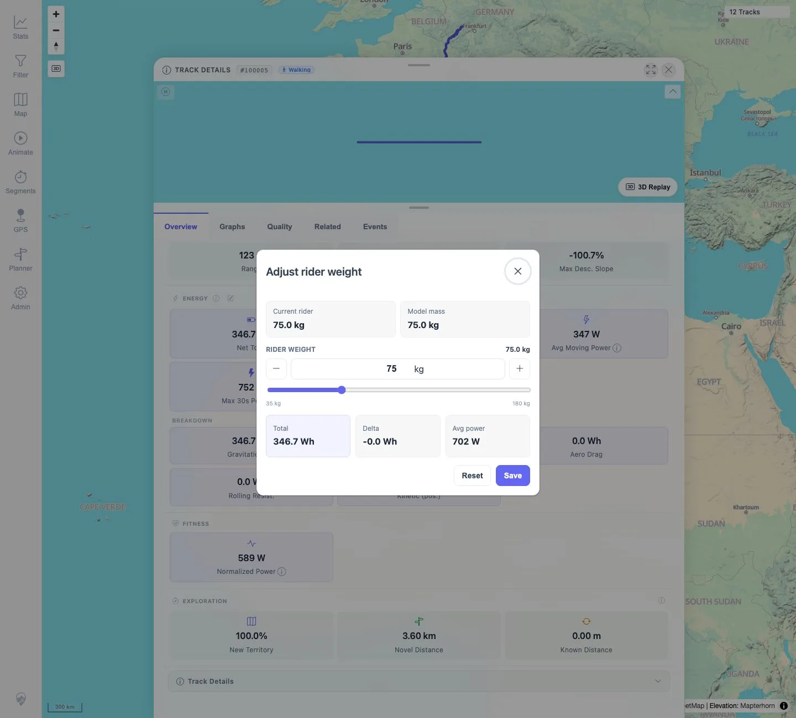
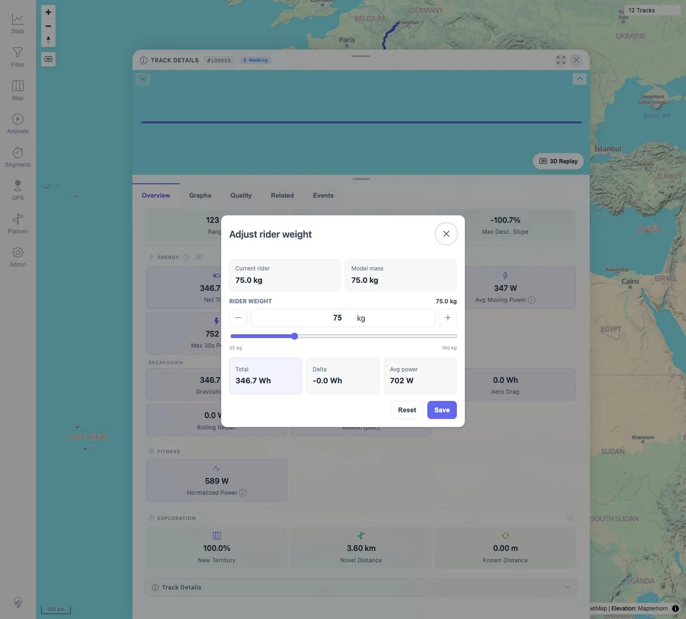

# Packet: TRD_11

## Scope

- Coverage source: `documentation/testing/frontend-regression-test-plan.md`
- Coverage ID or run packet: TRD_11
- In scope: Energy what-if recalculation using rider weight.
- Out of scope: Permanent activity-type save, covered by TRD_10.

## Prerequisites

- Required previous coverage IDs or run packets: TRD_01 through TRD_10.
- Required app/data state: Track `#100005` restored to Walking.
- Required browser context: Desktop Chromium, logged in as README quick-start user.

## Allowed Mutations

- Allowed: Temporarily edit rider weight in the what-if dialog.
- Not allowed: Click Save or permanently change rider weight.

## Actions And Results

| Coverage ID | Action | Expected result | Actual result | Status | Evidence |
|---|---|---|---|---|---|
| TRD_11 | Opened the Adjust rider weight dialog for `#100005`, changed rider weight from 75 kg to 95 kg, then closed without Save and reopened. | What-if values update without permanently saving. | Total energy changed from `346.7 Wh` to `439.1 Wh` and average power from `702 W` to `889 W`; reopening without Save returned to 75 kg and `346.7 Wh` / `702 W`. | PASS | [assets/TRD_11-energy-what-if.txt](../assets/TRD_11-energy-what-if.txt); [assets/TRD_11-before-weight.webp](../assets/TRD_11-before-weight.webp); [assets/TRD_11-changed-weight.webp](../assets/TRD_11-changed-weight.webp); [assets/TRD_11-reopened-unsaved.webp](../assets/TRD_11-reopened-unsaved.webp) |

## Issues

| ID | Severity | Summary | Reproduction | Expected | Actual | Evidence | Release impact |
|---|---|---|---|---|---|---|---|
|  |  |  |  |  |  |  |  |

## Evidence Files

| File | Purpose |
|---|---|
| [assets/TRD_11-energy-what-if.txt](../assets/TRD_11-energy-what-if.txt) | Rider-weight values, energy preview values, and no-save verification. |
| [assets/TRD_11-before-weight.webp](../assets/TRD_11-before-weight.webp) | Baseline 75 kg dialog. |
| [assets/TRD_11-changed-weight.webp](../assets/TRD_11-changed-weight.webp) | 95 kg what-if dialog. |
| [assets/TRD_11-reopened-unsaved.webp](../assets/TRD_11-reopened-unsaved.webp) | Reopened dialog back at saved 75 kg value. |

## Screenshot Evidence

**Baseline 75 kg dialog.**

**95 kg what-if dialog.**

**Reopened dialog back at saved 75 kg value.**

## Timings

| Step | Timing |
|---|---:|
| Rider-weight what-if check | ~45 s |

## Handoff Notes

- Completed: TRD_11 passed.
- Remaining unfinished coverage: Continue with TRD_12.
- Blocked or not applicable: None.
- State left for the next packet: Rider weight not saved; track data unchanged.
