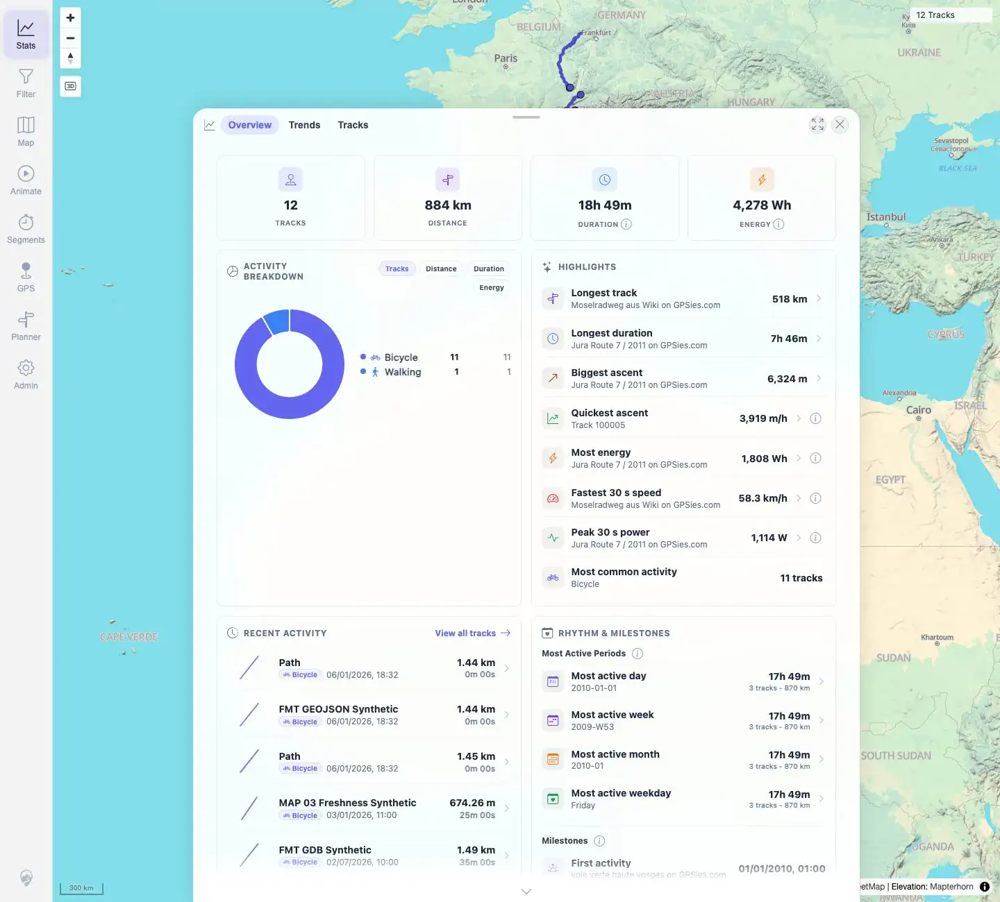
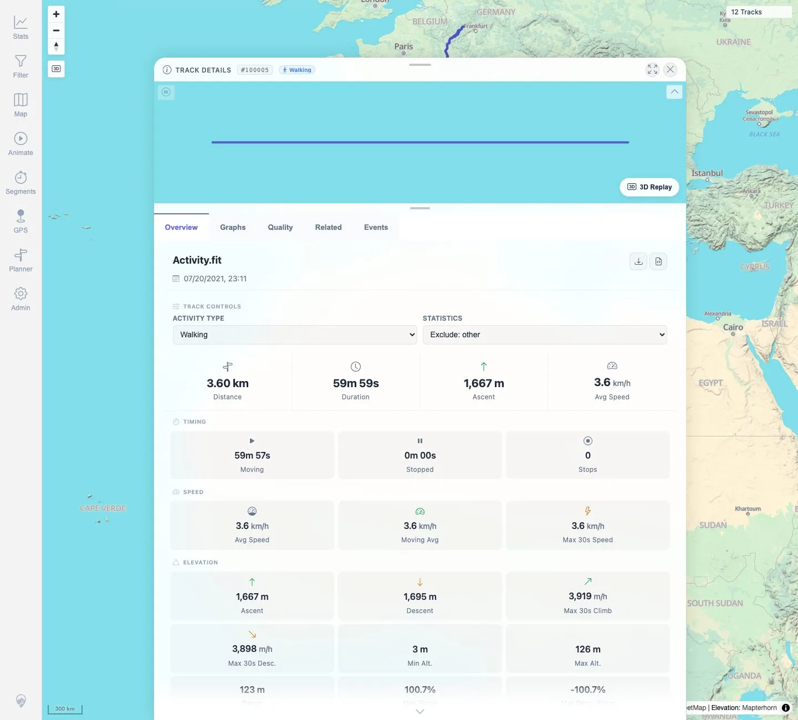
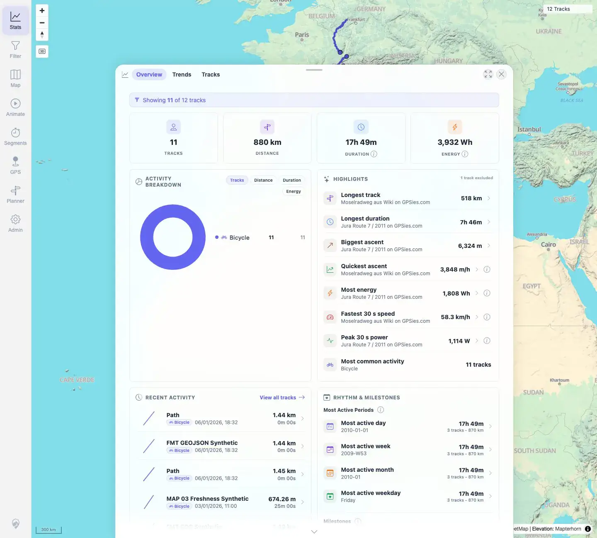
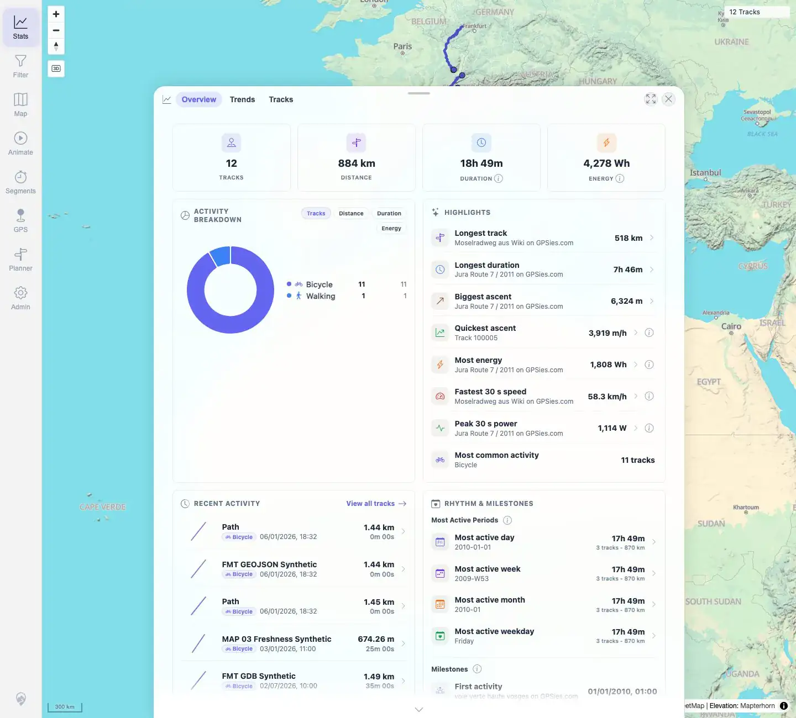

# Packet: TRD_12

## Scope

- Coverage source: `documentation/testing/frontend-regression-test-plan.md`
- Coverage ID or run packet: TRD_12
- In scope: Exclude one track from statistics, verify Stats updates, then re-include it.
- Out of scope: Other curation reasons beyond one exclusion value.

## Prerequisites

- Required previous coverage IDs or run packets: TRD_01 through TRD_11.
- Required app/data state: Track `#100005` included in statistics before test.
- Required browser context: Desktop Chromium, logged in as README quick-start user.

## Allowed Mutations

- Allowed: Temporarily set `#100005` statistics exclusion to `OTHER`, then restore included state.
- Not allowed: Leave the track excluded after the packet.

## Actions And Results

| Coverage ID | Action | Expected result | Actual result | Status | Evidence |
|---|---|---|---|---|---|
| TRD_12 | Captured baseline Stats, set `#100005` to `Exclude: other`, refreshed Stats, then restored `Included in statistics` and refreshed again. | Excluded track stops counting in Stats; re-including brings it back. | Stats changed from `12 TRACKS` to `11 TRACKS` with `1 track excluded` after exclusion; Walking activity disappeared. Restoring inclusion returned Stats to `12 TRACKS` and Walking `1`. | PASS | [assets/TRD_12-statistics-exclusion.txt](../assets/TRD_12-statistics-exclusion.txt); [assets/TRD_12-stats-baseline.webp](../assets/TRD_12-stats-baseline.webp); [assets/TRD_12-excluded-select.webp](../assets/TRD_12-excluded-select.webp); [assets/TRD_12-stats-after-exclude.webp](../assets/TRD_12-stats-after-exclude.webp); [assets/TRD_12-reincluded-select.webp](../assets/TRD_12-reincluded-select.webp); [assets/TRD_12-stats-after-reinclude.webp](../assets/TRD_12-stats-after-reinclude.webp) |

## Issues

| ID | Severity | Summary | Reproduction | Expected | Actual | Evidence | Release impact |
|---|---|---|---|---|---|---|---|
|  |  |  |  |  |  |  |  |

## Evidence Files

| File | Purpose |
|---|---|
| [assets/TRD_12-statistics-exclusion.txt](../assets/TRD_12-statistics-exclusion.txt) | Baseline, exclusion, and re-inclusion values. |
| [assets/TRD_12-stats-baseline.webp](../assets/TRD_12-stats-baseline.webp) | Baseline Stats overview. |
| [assets/TRD_12-excluded-select.webp](../assets/TRD_12-excluded-select.webp) | Details exclusion select set to `Exclude: other`. |
| [assets/TRD_12-stats-after-exclude.webp](../assets/TRD_12-stats-after-exclude.webp) | Stats overview after exclusion. |
| [assets/TRD_12-reincluded-select.webp](../assets/TRD_12-reincluded-select.webp) | Details exclusion select restored. |
| [assets/TRD_12-stats-after-reinclude.webp](../assets/TRD_12-stats-after-reinclude.webp) | Stats overview after re-inclusion. |

## Screenshot Evidence

**Baseline Stats overview.**

**Details exclusion select set to Exclude: other.**

**Stats overview after exclusion.**

**Details exclusion select restored.**

**Stats overview after re-inclusion.**

## Timings

| Step | Timing |
|---|---:|
| Exclusion, stats refresh, and restore | ~90 s |

## Handoff Notes

- Completed: TRD_12 passed and restored `#100005` to included-in-statistics state.
- Remaining unfinished coverage: Continue with TRD_13.
- Blocked or not applicable: None.
- State left for the next packet: Track `#100005` is included in statistics.
