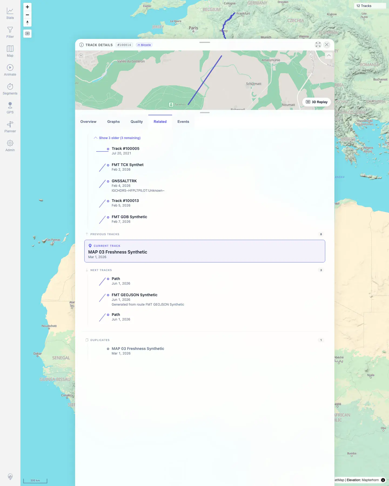

# Packet: TRD_13

## Scope

- Coverage source: `documentation/testing/frontend-regression-test-plan.md`
- Coverage ID or run packet: TRD_13
- In scope: Related-track sections for previous, next, and duplicate tracks, plus related-card navigation.
- Out of scope: Track shape preview coverage, covered by TRD_07.

## Prerequisites

- Required previous coverage IDs or run packets: RUN_SETUP through TRD_12.
- Required app/data state: 12 visible tracks after TRD_12. Temporary synthetic duplicate creation allowed for this packet because the existing dataset had no duplicate candidates.
- Required browser context: Desktop Chromium context logged in as README quick-start user.

## Allowed Mutations

- Allowed: Temporarily copy public/synthetic `map03_freshness.gpx` to `trd13_duplicate_map03.gpx`, wait for indexing/jobs, open related-track UI, then remove the temporary file and verify cleanup.
- Not allowed: Leave temporary files or extra tracks in the run dataset.

## Actions And Results

| Coverage ID | Action | Expected result | Actual result | Status | Evidence |
|---|---|---|---|---|---|
| TRD_13 | Created temporary synthetic duplicate `trd13_duplicate_map03.gpx`, waited for track `#100015` to be marked duplicate of `#100014`, opened `#100014` Related tab, and clicked the duplicate card. Retested locally after the client fix with an equivalent related-card flow. | Related tracks show duplicates and previous/next tracks; clicking a related card navigates to that track and updates the browser route. | Fixed: in local retest, clicking related card `Demo Trip 1384426590620000386` changed the detail sheet to `#101716` and updated the browser route to `/mtl/track/101716`. | FIXED | [assets/TRD_13-related-navigation.txt](../assets/TRD_13-related-navigation.txt); [assets/TRD_13-related-duplicates.webp](../assets/TRD_13-related-duplicates.webp); [assets/TRD_13-clicked-duplicate.webp](../assets/TRD_13-clicked-duplicate.webp); [assets/TRD_13-fixed-local-retest.txt](../assets/TRD_13-fixed-local-retest.txt) |

## Issues

| ID | Severity | Summary | Reproduction | Expected | Actual | Evidence | Release impact |
|---|---|---|---|---|---|---|---|
| MTL-FR-004 | P2 | Related-track card navigation now updates the route URL. | Open a track, select Related, click a duplicate or previous/next related card. | Details content and browser route both move to the clicked track, e.g. `/mtl/track/100015`. | Fixed: details content and browser route both moved to the clicked related track during local retest. | [assets/TRD_13-fixed-local-retest.txt](../assets/TRD_13-fixed-local-retest.txt) | FIXED |

## Evidence Files

| File | Purpose |
|---|---|
| [assets/TRD_13-related-navigation.txt](../assets/TRD_13-related-navigation.txt) | Related UI excerpt, duplicate API state, click/navigation assertion, and cleanup verification. |
| [assets/TRD_13-related-duplicates.webp](../assets/TRD_13-related-duplicates.webp) | Related tab showing previous, next, current, and duplicate sections. |
| [assets/TRD_13-clicked-duplicate.webp](../assets/TRD_13-clicked-duplicate.webp) | Detail sheet after clicking the duplicate card, showing track `#100015`. |
| [assets/TRD_13-fixed-local-retest.txt](../assets/TRD_13-fixed-local-retest.txt) | 2026-06-04 local browser retest showing related-card navigation updates both detail content and browser route. |

## Screenshot Evidence

**Related tab showing previous, next, current, and duplicate sections.**

**Detail sheet after clicking the duplicate card, showing track #100015.**

## Timings

| Step | Timing |
|---|---:|
| Temporary duplicate indexing and job settle | ~35 s |
| Related UI navigation capture | ~25 s |
| Temporary duplicate removal and cleanup verification | ~8 s |

## Handoff Notes

- Completed: TRD_13 retested and terminal as `FIXED`.
- Remaining unfinished coverage: Continue with TRD_14.
- Blocked or not applicable: None.
- State left for the next packet: Temporary duplicate removed; app returned to 12 visible tracks with no duplicates for `#100014`.
