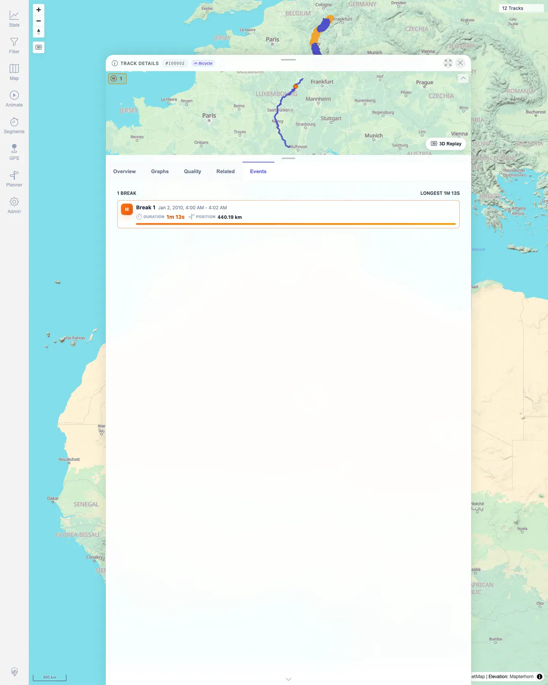
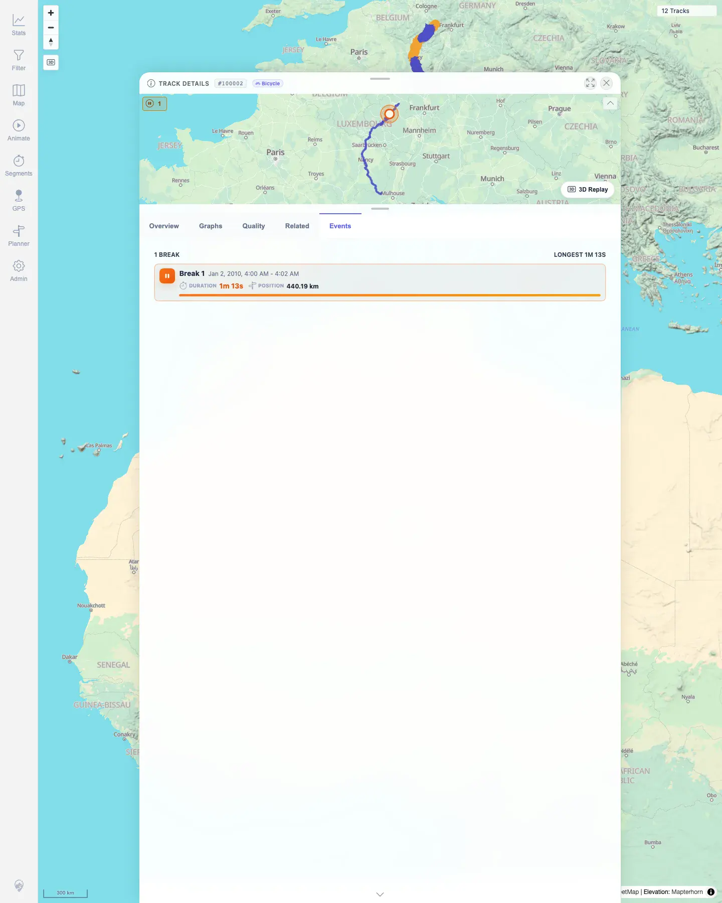
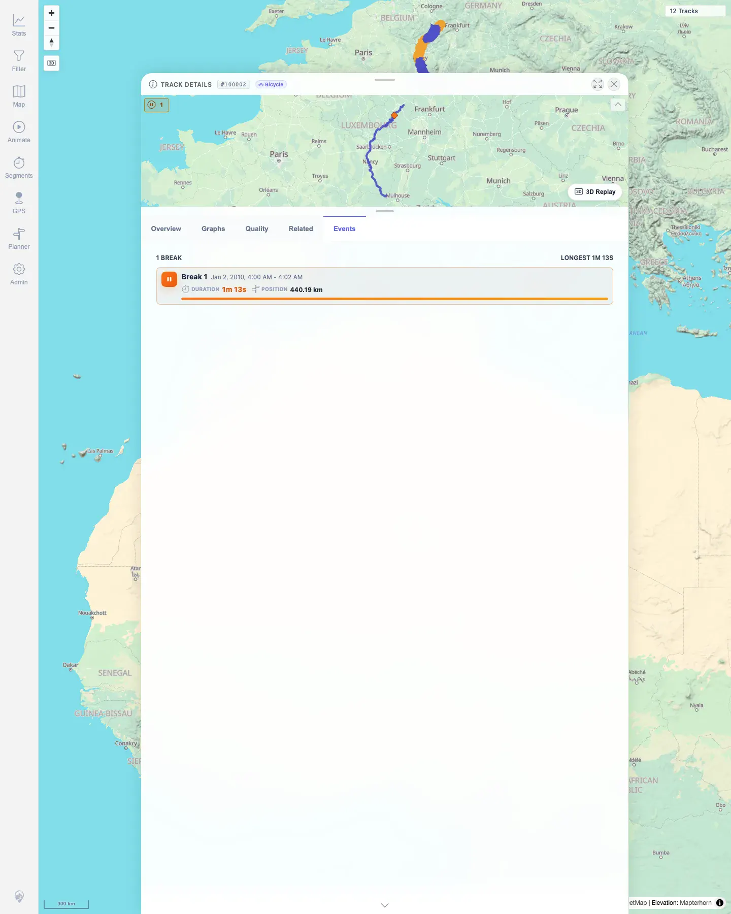

# Packet: TRD_14

## Scope

- Coverage source: `documentation/testing/frontend-regression-test-plan.md`
- Coverage ID or run packet: TRD_14
- In scope: Events tab for tracks with detected stops/GPS gaps, event selection, mini-map highlight, and deselection.
- Out of scope: Event detection algorithm correctness beyond verifying existing detected event data is surfaced.

## Prerequisites

- Required previous coverage IDs or run packets: RUN_SETUP through TRD_13.
- Required app/data state: 12 visible tracks; Moselradweg track `#100002` has one detected stop event.
- Required browser context: Desktop Chromium context logged in as README quick-start user.

## Allowed Mutations

- Allowed: Open track details, switch to Events, select and deselect an event.
- Not allowed: Import, delete, reclassify, or edit track metadata.

## Actions And Results

| Coverage ID | Action | Expected result | Actual result | Status | Evidence |
|---|---|---|---|---|---|
| TRD_14 | Opened track `#100002` from Stats Tracks, selected the Events tab, clicked the detected `Break 1` event, then clicked it again to deselect. | Events tab shows detected stops/GPS gaps where present; selecting an event highlights the matching mini-map position and deselects cleanly. | API exposed one `STOP`/`SHORT_STOP` event at 440.19 km. Events tab displayed `1 BREAK` with duration `1m 13s`. First click added `event-row--selected` and displayed the orange highlight ring at the event location on the mini-map. Second click removed `event-row--selected` and returned the mini-map to the normal event marker. | PASS | [assets/TRD_14-events-selection.txt](../assets/TRD_14-events-selection.txt); [assets/TRD_14-events-before.webp](../assets/TRD_14-events-before.webp); [assets/TRD_14-events-selected.webp](../assets/TRD_14-events-selected.webp); [assets/TRD_14-events-deselected.webp](../assets/TRD_14-events-deselected.webp) |

## Issues

| ID | Severity | Summary | Reproduction | Expected | Actual | Evidence | Release impact |
|---|---|---|---|---|---|---|---|

## Evidence Files

| File | Purpose |
|---|---|
| [assets/TRD_14-events-selection.txt](../assets/TRD_14-events-selection.txt) | Event API summary and before/selected/deselected UI state assertions. |
| [assets/TRD_14-events-before.webp](../assets/TRD_14-events-before.webp) | Events tab before event selection. |
| [assets/TRD_14-events-selected.webp](../assets/TRD_14-events-selected.webp) | Selected event row and matching mini-map highlight ring. |
| [assets/TRD_14-events-deselected.webp](../assets/TRD_14-events-deselected.webp) | Event deselected with selected class and large highlight removed. |

## Screenshot Evidence

**Events tab before event selection.**

**Selected event row and matching mini-map highlight ring.**

**Event deselected with selected class and large highlight removed.**

## Timings

| Step | Timing |
|---|---:|
| Event discovery and UI verification | ~25 s |

## Handoff Notes

- Completed: TRD_14 terminal as `PASS`.
- Remaining unfinished coverage: Continue with FLT_01.
- Blocked or not applicable: None.
- State left for the next packet: Track data unchanged; UI selection cleared.
