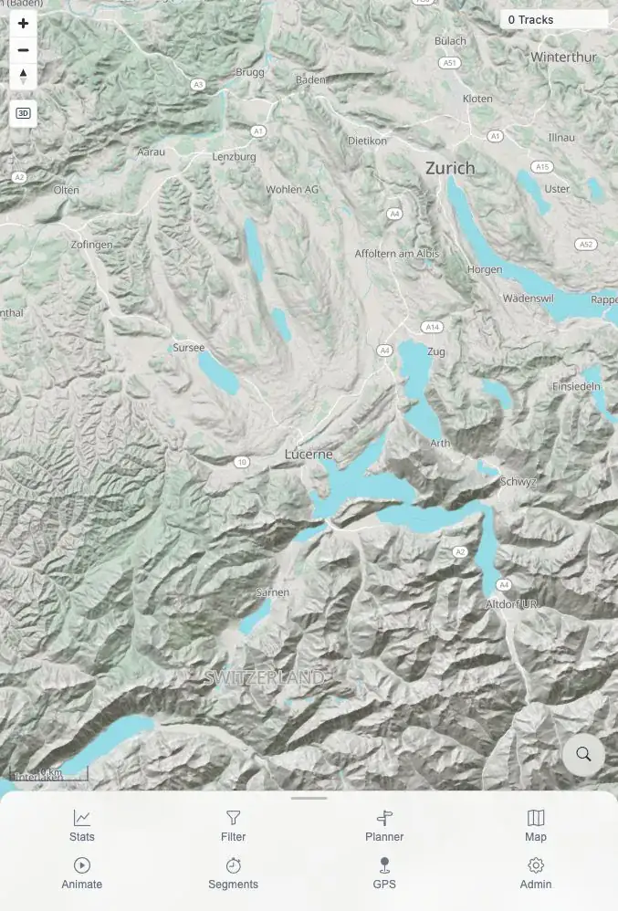
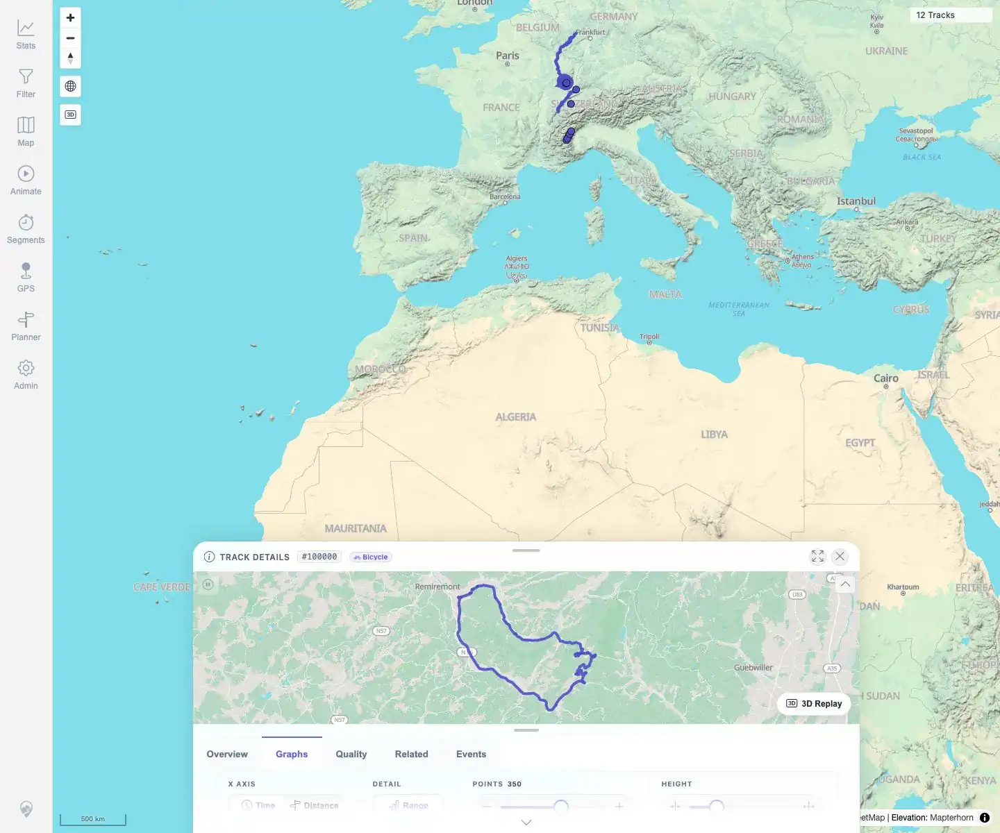
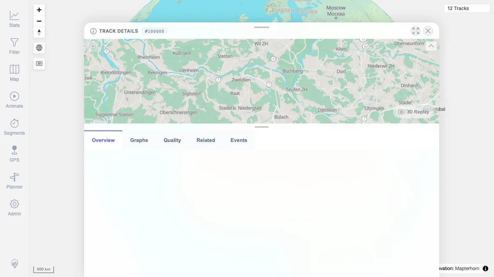
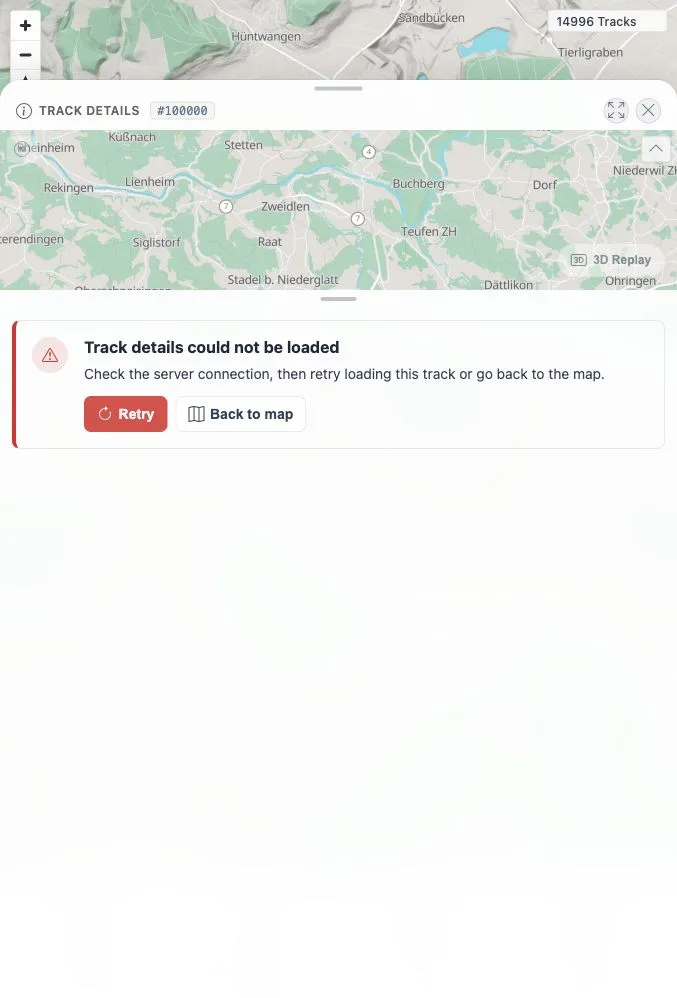
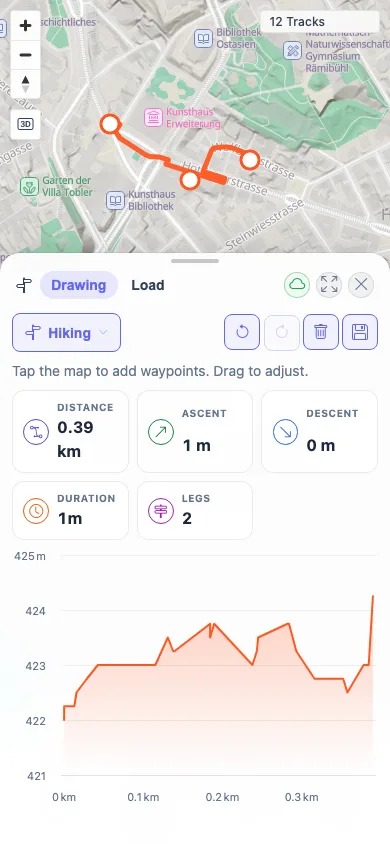
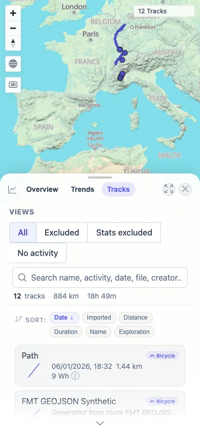

> **RESULT: FAIL - quick install and cleanup passed, but regression still has open P2/P3 product failures after GPS_04, TRD_13, SYN_07, and ERR_01 were fixed and MTL-FR-003 was not reproducible**

# MTL Explorer Full Regression Report

## Goal

Validate the README quick-install flow and full user-facing regression queue for MTL Explorer on the remote beta Docker image `wauwau0977/mytraillog:beta`, using the resumable packet workflow.

## Scope And Environment

| Field | Value |
|---|---|
| Run id | 2026-06-01_1727-beta-201 |
| Target | 167.233.16.201 |
| App URL tested | http://167.233.16.201:18080/mtl/ |
| Docker image | `wauwau0977/mytraillog:beta` |
| Run folder | `documentation/testing/full-regression/test_runs/2026-06-01_1727-beta-201/` |
| Coverage source | `documentation/testing/frontend-regression-test-plan.md` |
| Finalization gate | PASS (171 coverage IDs terminal) |
| Cleanup | PASS |

## README / Setup Facts

- README quick install uses Docker Engine plus Compose, `docker compose up -d`, app path `/mtl/`, login `mtl` / `change-me`, and import folder `./data/gpx/`.
- Missing Docker prerequisites were installed on the disposable target host.
- The compose app service was configured to use `MTL_APP_IMAGE=wauwau0977/mytraillog:beta` per the user request.
- Setup verified HTTP 200 locally and remotely, then browser login reached the map.

## Result Summary

| Status | Coverage IDs |
|---|---:|
| PASS | 155 |
| FAIL | 0 |
| FIXED | 4 |
| BLOCKED | 0 |
| NOT APPLICABLE | 12 |

Run packets: [RUN_SETUP](packets/RUN_SETUP.md)=PASS, [RUN_CLEANUP](packets/RUN_CLEANUP.md)=PASS.

The full queue ran to terminal status with no remaining `NOT STARTED`, `IN PROGRESS`, `PARTIAL`, or `NOT COVERED` coverage IDs. The final result remains `FAIL` because `MTL-FR-001` and `MTL-FR-002` remain open. `GPS_04` / `MTL-FR-005`, `TRD_13` / `MTL-FR-004`, `SYN_07` / `MTL-FR-006`, and `ERR_01` / `MTL-FR-007` were retested and marked fixed on 2026-06-04. `TRD_06` / `MTL-FR-003` was retested locally on 2026-06-04 and marked not reproducible.

## Issues

| ID | Severity | Coverage | Summary | Status |
|---|---|---|---|---|
| MTL-FR-001 | P2 | [IMP_04](packets/IMP_04.md) | Admin subroute hard-load returns Spring Whitelabel 404. | Open |
| MTL-FR-002 | P3 | [FIT_03](packets/FIT_03.md) | Highcharts accessibility module warning appears when rendering detail graphs. | Open |
| MTL-FR-003 | P2 | [TRD_06](packets/TRD_06.md) | Mini-map hover does not highlight the matching chart position. | NOT REPRODUCIBLE |
| MTL-FR-004 | P2 | [TRD_13](packets/TRD_13.md) | Related-track card navigation now updates the route URL. | FIXED |
| MTL-FR-005 | P2 | [GPS_04](packets/GPS_04.md) | GPS insecure-origin failure now shows `GPS unavailable` with HTTPS/localhost guidance instead of `GPS started`. | FIXED |
| MTL-FR-006 | P3 | [SYN_07](packets/SYN_07.md) | Admin Jobs tile now surfaces visible GPS indexer work while Admin is open. | FIXED |
| MTL-FR-007 | P2 | [ERR_01](packets/ERR_01.md) | Failed track-detail API load now shows actionable recovery. | FIXED |

## Coverage Matrix

| Coverage ID | Status | Packet | Actual result summary |
|---|---|---|---|
| RUN_SETUP | PASS | [packets/RUN_SETUP.md](packets/RUN_SETUP.md) | Docker Engine 29.5.2 and Compose v5.1.4 were installed as missing prerequisites; stack started with app image 'wauwau0977/mytraillog:beta' digest 'sha256:a42f29e01cf11c343bcd876d0fc2aebf7bcd9334b3cefae31cf8492d773c488... |
| ACC_01 | PASS | [packets/ACC_01.md](packets/ACC_01.md) | Confirmed 'run-state.md' contains one row for every 171 coverage IDs parsed from 'documentation/testing/frontend-regression-test-plan.md', plus run setup/cleanup rows. |
| ACC_02 | PASS | [packets/ACC_02.md](packets/ACC_02.md) | Run-state tracks every child coverage ID independently; no parent section rows are used as substitutes for child packet results. |
| ACC_03 | PASS | [packets/ACC_03.md](packets/ACC_03.md) | Packet template is instantiated per coverage ID and run-state points each ID to 'packets/<id>.md'; final report will be assembled from packet statuses only. |
| ACC_04 | PASS | [packets/ACC_04.md](packets/ACC_04.md) | Screenshot evidence capture is active; setup captured a compact post-login map WebP and later user-facing packets will add function-specific assets under the same assets folder. |
| ACC_05 | PASS | [packets/ACC_05.md](packets/ACC_05.md) | Run-state shared facts and RUN_SETUP handoff already record known plain-HTTP geolocation and installed-PWA constraints for later terminal packet handling. |
| DAT_01 | PASS | [packets/DAT_01.md](packets/DAT_01.md) | Downloaded and staged five public GPX files, each with real trackpoints: JuraRoute72011.gpx 1414 trkpt/1414 time; MoselradwegAusWiki.gpx 2954 trkpt/2954 time; Vitry-le-Francois_Langres.gpx 1688 trkpt/1688 time; VoieVe... |
| DAT_02 | PASS | [packets/DAT_02.md](packets/DAT_02.md) | All five selected GPX files are timestamped; timestamp counts equal trkpt counts for every file: JuraRoute72011.gpx 1414 trkpt/1414 time; MoselradwegAusWiki.gpx 2954 trkpt/2954 time; Vitry-le-Francois_Langres.gpx 1688... |
| DAT_03 | PASS | [packets/DAT_03.md](packets/DAT_03.md) | Source URL, source/license note, destination filename, SHA-256, byte size, trkpt count, timestamp count, source track names, imported track id(s), and imported track name(s) are recorded in the manifest after post-imp... |
| DAT_04 | PASS | [packets/DAT_04.md](packets/DAT_04.md) | All five GPX files came from the suggested 'gps-touring/sample-gpx' raw GitHub URLs listed in the plan. |
| DAT_05 | PASS | [packets/DAT_05.md](packets/DAT_05.md) | Downloaded and staged Garmin FIT SDK 'Activity.fit' from the suggested source; checksum 949a238e1bb75c3684479785f76fa9a16888bb394518844248f488171d591387 and byte size 94096 recorded. GPS display/conversion will be ver... |
| DAT_06 | PASS | [packets/DAT_06.md](packets/DAT_06.md) | No waypoint-only GPX or non-GPS FIT files were counted as positive data. Every positive GPX has 'trkpt'; the FIT source is reserved for subsequent FIT conversion/display verification. |
| IMP_01 | PASS | [packets/IMP_01.md](packets/IMP_01.md) | Map displayed '0 Tracks'; stats panel showed no tracks match current filters; Admin Jobs showed Duplicate Finder, Activity Classifier, Exploration Score done/100% with '0 total', hosted vector map service done, locati... |
| IMP_02 | PASS | [packets/IMP_02.md](packets/IMP_02.md) | Five GPX files were copied to '/root/mtl-regression-2026-06-01_1727-beta-201/mtl-explorer/data/gpx/'; watched-folder byte sizes and SHA-256 values match the public data manifest. |
| IMP_03 | PASS | [packets/IMP_03.md](packets/IMP_03.md) | Live watcher detected CREATE events for all five GPX files at '15:39:24Z'; each file completed with 'status=SUCCESS' by '15:39:38Z'; duplicate finder settled for 5 tracks at '15:39:56Z'; Rescan GPS was not needed. |
| IMP_04 | PASS | [packets/IMP_04.md](packets/IMP_04.md) | Freshness changed from baseline 'index:0', 'track_geometry:0', 'tracks:0' to token 'index:15', 'track_geometry:30', 'tracks:30'; GPS indexer status is 'total:5 completed:5 failed:0 progressPercent:100'; Duplicate Find... |
| IMP_05 | PASS | [packets/IMP_05.md](packets/IMP_05.md) | Helper reload returned 'Done'; map displayed '5 Tracks'; Stats → Tracks showed '5 tracks', '1,043 km', '23h 31m', and all five imported GPX names; Filter panel opened with filtering off while the global visible count ... |
| IMP_06 | PASS | [packets/IMP_06.md](packets/IMP_06.md) | Each filename query returned '1 of 5 tracks' with the corresponding imported track name; Stats summary listed all five names and totals; map/global visible count stayed '5 Tracks'; filter panel opened with filtering o... |
| IMP_07 | PASS | [packets/IMP_07.md](packets/IMP_07.md) | The map rendered five visible imported geometries. Clicks opened details for '#100004', '#100001', '#100002', and '#100003' directly. The '#100000' click produced a two-track overlap selector ('voie verte' and 'Moselr... |
| IMP_08 | PASS | [packets/IMP_08.md](packets/IMP_08.md) | Baseline map/stat count was '0'; post-import map and Stats → Tracks showed '5 Tracks' / '5 tracks'; imported mapping has five source files and five track IDs ('100000'-'100004'), so no source split occurred. |
| IMP_09 | PASS | [packets/IMP_09.md](packets/IMP_09.md) | Stats showed '5 TRACKS', '1,043 km', '23h 31m', '4,527 Wh'; API summary showed 'trackCount=5', 'distanceM=1042712.01', 'durationMs=84660000', 'BICYCLE tracks=5', positive rankings for distance/duration/ascent/energy, ... |
| DEL_01 | PASS | [packets/DEL_01.md](packets/DEL_01.md) | The two target files were removed; watched folder now contains 'JuraRoute72011.gpx', 'MoselradwegAusWiki.gpx', and 'VoieVerteHauteVosges.gpx'. |
| DEL_02 | PASS | [packets/DEL_02.md](packets/DEL_02.md) | Automatic processing removed track '100004' for 'Lannion_Plestin_parcours24.4RE.gpx' and track '100001' for 'Vitry-le-Francois_Langres.gpx'; no Rescan GPS was needed. Indexer status is 'total=5 completed=3 removed=2 f... |
| DEL_03 | PASS | [packets/DEL_03.md](packets/DEL_03.md) | Clean UI showed '3 Tracks'; Stats → Tracks showed only VoieVerte, JuraRoute, and Moselradweg with '3 tracks · 870 km · 17h 49m'; Filter panel global count remained '3 Tracks'; heatmap rendered over remaining tracks; d... |
| DEL_04 | PASS | [packets/DEL_04.md](packets/DEL_04.md) | Remaining tracks '#100000' VoieVerte, '#100003' JuraRoute, and '#100002' Moselradweg all opened details with expected title, activity, distance, duration, ascent, and statistics values. |
| DEL_05 | PASS | [packets/DEL_05.md](packets/DEL_05.md) | DEL_03/DEL_04 verified the required user-visible surfaces; no deleted-track direct URL/API probe was used as a pass/fail criterion. |
| FIT_01 | PASS | [packets/FIT_01.md](packets/FIT_01.md) | 'Activity.fit' was copied to '/root/mtl-regression-2026-06-01_1727-beta-201/mtl-explorer/data/gpx/Activity.fit'; checksum matches DAT manifest ('949a238e...'). |
| FIT_02 | PASS | [packets/FIT_02.md](packets/FIT_02.md) | 'Activity.fit' converted through GPSBabel and indexed as track '100005' with 'COMPLETED_WITH_SUCCESS' / 'SUCCESS', 3,600 points and 3.60 km. Map showed '4 Tracks'; Stats Overview showed '4 TRACKS', 873 km, 18h 49m, an... |
| FIT_03 | PASS | [packets/FIT_03.md](packets/FIT_03.md) | Details opened at '/mtl/track/100005'. Overview showed 'Activity.fit', Walking, 3.60 km, 59m 59s, 1,667 m ascent, and the mini-map. Graphs showed Time/Distance axis controls, Range, Points, Height, Speed, Elevation, E... |
| FIT_04 | PASS | [packets/FIT_04.md](packets/FIT_04.md) | Download suggested filename 'Activity.fit', size '94,096' bytes, SHA-256 '949a238e1bb75c3684479785f76fa9a16888bb394518844248f488171d591387', matching the DAT manifest. Header bytes 8-11 are '.FIT'. |
| FIT_05 | PASS | [packets/FIT_05.md](packets/FIT_05.md) | Download suggested filename 'Activity.gpx', size '479,844' bytes, XML/GPX root present, 'trkCount=1', 'trksegCount=1', 'trkptCount=3601', 'wptCount=0'. First trackpoint includes lat/lon, elevation, and time. |
| FIT_06 | NOT APPLICABLE | [packets/FIT_06.md](packets/FIT_06.md) | GPSBabel was available. 'Activity.fit' converted and indexed successfully as track '100005'; original FIT and converted GPX downloads also passed. There is no exposed black-box quick-install control to safely disable ... |
| FMT_01 | PASS | [packets/FMT_01.md](packets/FMT_01.md) | All listed formats were accepted in this run. Existing GPX and FIT imports passed earlier. Synthetic TCX, KML, IGC, GeoJSON, KMZ, GDB, and corrected valid-fix NMEA samples indexed successfully as tracks '100006', '100... |
| FMT_02 | PASS | [packets/FMT_02.md](packets/FMT_02.md) | Map showed '11 Tracks'. Each format search returned one Stats result; details opened; 'Included in statistics' was present; Graphs tab rendered; original download checksum matched the generated sample; GPX download co... |
| SGN_01 | PASS | [packets/SGN_01.md](packets/SGN_01.md) | Browser landed on '/mtl/login'; sign-in screen was displayed. |
| SGN_02 | PASS | [packets/SGN_02.md](packets/SGN_02.md) | Browser returned to '/mtl/'; map shell showed '11 Tracks', Stats, Filter, Map, Animate, Segments, GPS, Planner, and Admin controls. |
| SGN_03 | PASS | [packets/SGN_03.md](packets/SGN_03.md) | URL remained '/mtl/login'; message 'Invalid username or password.' appeared; login screen stayed visible. |
| SGN_04 | NOT APPLICABLE | [packets/SGN_04.md](packets/SGN_04.md) | Demo mode was not active in this quick-install run; login screen had no demo credentials banner. |
| SGN_05 | PASS | [packets/SGN_05.md](packets/SGN_05.md) | Logout returned to '/mtl/login' with Sign In visible. Re-login returned to '/mtl/' and map showed '11 Tracks'. |
| SGN_06 | PASS | [packets/SGN_06.md](packets/SGN_06.md) | Startup text showed 'LOADING YOUR TRAILS'; later map text no longer had loading text and showed '11 Tracks'. |
| SGN_07 | PASS | [packets/SGN_07.md](packets/SGN_07.md) | App showed 'Unable to load tracks — no server connection and no cached data available.' plus a visible 'Retry' control; map shell remained responsive with '0 Tracks'. |
| SGN_08 | PASS | [packets/SGN_08.md](packets/SGN_08.md) | About dialog showed 'MTL Explorer', license/source details, and project source URL. |
| SGN_09 | PASS | [packets/SGN_09.md](packets/SGN_09.md) | Start map, Stats, details, back to Stats, back to map, forward to Stats, and forward to details all restored expected URLs/content. No navigation-blocking errors occurred; only the previously recorded Highcharts acces... |
| MAP_01 | PASS | [packets/MAP_01.md](packets/MAP_01.md) | Map loaded with OSM/Mapterhorn attribution, navigation controls, app tool overlays, '11 Tracks', remote raster responses, track API responses, and local PMTiles map-proxy range responses. |
| MAP_02 | PASS | [packets/MAP_02.md](packets/MAP_02.md) | Map showed '11 Tracks'; '/mtl/api/tracks/get-simplified' returned 'standardFilterCount=11' and 'numberOfFilteredMatchedTracks=11'. |
| MAP_03 | PASS | [packets/MAP_03.md](packets/MAP_03.md) | Prompt 'New data available' appeared with 'Reload'; after clicking it, the same browser showed '12 Tracks'. |
| MAP_04 | PASS | [packets/MAP_04.md](packets/MAP_04.md) | Current API returned 12 tracks with deleted ids/names absent. Searches for both deleted filenames returned '0 of 12 tracks' and no selectable rows. DEL_03 already verified deleted tracks absent from map/list/filter/he... |
| MAP_05 | PASS | [packets/MAP_05.md](packets/MAP_05.md) | Scale changed from '500 km' to '10 km'; visible track geometry/points were closer and continuous, with no duplicate/broken line artifacts or loading spinner. |
| MAP_06 | PASS | [packets/MAP_06.md](packets/MAP_06.md) | Settled view still showed '12 Tracks', controls remained visible, no loading text/spinner remained, and screenshot showed base map without stale overlay. Tile aborts were limited to expected in-flight cancellations du... |
| MAP_07 | PASS | [packets/MAP_07.md](packets/MAP_07.md) | The 10 m map view showed multiple in-viewport circular GPS point markers with direction arrows on the rendered track line; evidence used public GPX track 100000 ('VoieVerteHauteVosges.gpx', 629 simplified points), not... |
| MAP_08 | PASS | [packets/MAP_08.md](packets/MAP_08.md) | The clicked route changed to highlighted blue/orange styling and the Track Details sheet opened for '#100000' with Overview, Graphs, Quality, Related, and Events tabs visible. |
| MAP_09 | PASS | [packets/MAP_09.md](packets/MAP_09.md) | A '3 tracks - select for details' chooser appeared with 'voie verte haute vosges', 'Jura Route 7 / 2011', and 'Moselradweg aus Wiki'; choosing Moselradweg opened Track Details for '#100002'. |
| MAP_10 | PASS | [packets/MAP_10.md](packets/MAP_10.md) | The selection sheet closed cleanly; no Track Details sheet remained open; the normal map was visible with '12 Tracks' at the 500 km overview. |
| MAP_11 | PASS | [packets/MAP_11.md](packets/MAP_11.md) | A 'Track #100000' popup opened with point index, time, lat/lng, altitude, speed, distance, previous-point distance/time, duration, ascent/descent, slope, energy, and power metrics. |
| MAP_12 | PASS | [packets/MAP_12.md](packets/MAP_12.md) | The map showed '© SchweizMobil'; clicking the Swiss route overlay opened a 'NEARBY ROUTES' popup with 'BIKE', 'Arc jurassien (Le Locle - Tramelan)', and '#54'; closing the popup removed it while the map remained visib... |
| MAP_13 | PASS | [packets/MAP_13.md](packets/MAP_13.md) | Config returned 'tileMode: remote', style keys 'dark', 'light', and 'light-topo', and 'remoteTileUrl: null'. OSM Light requested 'tile.openstreetmap.org', OSM Topo requested 'tile.opentopomap.org', OSM Dark requested ... |
| MAP_14 | PASS | [packets/MAP_14.md](packets/MAP_14.md) | Config showed 'tileMode: local'; blocked PMTiles requests produced the console warning 'Local vector map tiles failed; switched base map to raster fallback'; remote OpenTopoMap tiles loaded with attribution, '12 Track... |
| MAP_15 | PASS | [packets/MAP_15.md](packets/MAP_15.md) | Config remained 'tileMode: local'. Remote source became active and showed only OSM Topo, OSM Light, OSM Gray, and OSM Dark; Swiss Color/Light were absent. Remote mode requested 'tile.opentopomap.org' with '0' '/api/ma... |
| TRD_01 | PASS | [packets/TRD_01.md](packets/TRD_01.md) | GPX details opened for '#100000', source 'VoieVerteHauteVosges.gpx', title 'voie verte haute vosges on GPSies.com'; FIT details opened for '#100005', source/title 'Activity.fit', activity 'Walking'. |
| TRD_02 | PASS | [packets/TRD_02.md](packets/TRD_02.md) | Track details opened at '/mtl/track/100000'; active tab-panel assertions passed for all five tabs. Overview showed statistics plus mini-map; Graphs showed 12 chart containers and elevation/speed/gain/distance text; Qu... |
| TRD_03 | PASS | [packets/TRD_03.md](packets/TRD_03.md) | All 11 switches selected the expected active tab and showed nonblank active panels. Only 3 requests occurred during the switch loop, all '/mtl/api/map/status'; no repeated details API loop was observed. |
| TRD_04 | PASS | [packets/TRD_04.md](packets/TRD_04.md) | Six graph containers rendered at '924x240'; Speed, Elevation, Elevation Gain Rate, Distance Over Time, Cumulative Mechanical Energy, and Estimated Power all showed readable axis values and units. Required speed/elevat... |
| TRD_05 | PASS | [packets/TRD_05.md](packets/TRD_05.md) | Distance x-axis became active and chart ticks switched to km. Range toggled off. Point count changed from 350 to 375. Chart heights changed from 240 to 250 while remaining readable and within layout bounds. Time/range... |
| TRD_06 | PASS | [packets/TRD_06.md](packets/TRD_06.md) | Retested locally on 2026-06-04; chart hover produced tooltip/crosshair plus mini-map cursor, and mini-map hover moved the chart cursor/tooltip to the matching point. |
| TRD_07 | PASS | [packets/TRD_07.md](packets/TRD_07.md) | Stats overview showed 5 recent-row previews; Track Browser showed 12 row previews; searched/filtered browser result for Moselradweg retained 1 preview; Related showed 5 track-card previews; overlap selector showed 2 p... |
| TRD_08 | PASS | [packets/TRD_08.md](packets/TRD_08.md) | Downloaded 'MoselradwegAusWiki.gpx' with SHA-256 '0f5263dee95a345a42585bde148ec741af4ed4eeb7451702f59c9c7f9bf761c3', matching the public source manifest. |
| TRD_09 | PASS | [packets/TRD_09.md](packets/TRD_09.md) | 'Activity.gpx' downloaded with '<gpx>', 1 '<trkseg>', and 3,601 '<trkpt>' entries. |
| TRD_10 | PASS | [packets/TRD_10.md](packets/TRD_10.md) | Bicycle persisted after reopening; net energy changed from '346.7 Wh' to '395.1 Wh' and average power from '702 W' to '794 W'. Restoring Walking returned the values to '346.7 Wh' / '702 W'; a final fresh reopen showed... |
| TRD_11 | PASS | [packets/TRD_11.md](packets/TRD_11.md) | Total energy changed from '346.7 Wh' to '439.1 Wh' and average power from '702 W' to '889 W'; reopening without Save returned to 75 kg and '346.7 Wh' / '702 W'. |
| TRD_12 | PASS | [packets/TRD_12.md](packets/TRD_12.md) | Stats changed from '12 TRACKS' to '11 TRACKS' with '1 track excluded' after exclusion; Walking activity disappeared. Restoring inclusion returned Stats to '12 TRACKS' and Walking '1'. |
| TRD_13 | FIXED | [packets/TRD_13.md](packets/TRD_13.md) | Retested after fix on local Vite frontend; clicking a related card changed the detail sheet to the clicked track and updated the browser route to the clicked track URL. |
| TRD_14 | PASS | [packets/TRD_14.md](packets/TRD_14.md) | API exposed one 'STOP'/'SHORT_STOP' event at 440.19 km. Events tab displayed '1 BREAK' with duration '1m 13s'. First click added 'event-row--selected' and displayed the orange highlight ring at the event location on t... |
| FLT_01 | PASS | [packets/FLT_01.md](packets/FLT_01.md) | Root app showed active funnel chip '1 / 12 Tracks' with 'BICYCLE 1' legend. Reopened Filter panel showed toggle 'On', active row 'Activities by keyword', keyword input 'MAP 03', and action bar '1 matching tracks'. API... |
| FLT_02 | PASS | [packets/FLT_02.md](packets/FLT_02.md) | Catalog showed 18 filters with chips 'Core 1', 'Activity 4', 'Date & Time 5', 'Performance 4', 'Quality 4'. Activity chip narrowed list to 4 Activity filters. Search 'gradient' returned the 4 Performance gradient filt... |
| FLT_03 | PASS | [packets/FLT_03.md](packets/FLT_03.md) | The keyword parameter was visible and editing it live-filtered the map to '1 / 12 Tracks' with 'BICYCLE 1' in the legend. Stats showed 'Showing 1 of 12 tracks', Moselradweg-only totals, and Moselradweg highlights. Cle... |
| FLT_04 | PASS | [packets/FLT_04.md](packets/FLT_04.md) | Before reload, Filter showed keyword 'Moselradweg', From date '2010-01-01', rectangle summary 'Rectangle (42.280...48.535, 1.807...13.475)', and a '1 / 12 Tracks' chip. After root reload, the map re-applied to '1 / 12... |
| FLT_05 | PASS | [packets/FLT_05.md](packets/FLT_05.md) | Persisted rectangle was visible at packet start. Clearing removed all geo shapes. Circle cancel left no saved circle; circle and rectangle draw created their summaries and storage entries. Polygon Undo was enabled wit... |
| FLT_06 | PASS | [packets/FLT_06.md](packets/FLT_06.md) | The map started at '1 / 12 Tracks' with legend 'BICYCLE 1'. Clearing the keyword live-updated the same page to '12 / 12 Tracks' with legend 'BICYCLE 11' and 'WALKING 1'. Stats then showed 12 tracks, 884 km, activity b... |
| FLT_07 | PASS | [packets/FLT_07.md](packets/FLT_07.md) | The legend showed 'BICYCLE 11' and 'WALKING 1'. Hiding Walking changed the chip to '11 / 12 Tracks' and disabled the Walking row. Collapsing hid the legend body while preserving the '11 / 12' filtered map state. Resto... |
| FLT_08 | PASS | [packets/FLT_08.md](packets/FLT_08.md) | Before clearing, the map showed the filtered chip '12 / 12 Tracks' and Bicycle/Walking legend. Toggling Filter to 'Off' showed the off-card. The map then showed the plain '12 Tracks' chip with no filter legend, and St... |
| TBS_01 | PASS | [packets/TBS_01.md](packets/TBS_01.md) | Tracks tab showed '12 tracks · 884 km · 18h 49m', quick views, sort controls, and rows with 'START', 'TRACK', 'ACTIVITY', 'DISTANCE', 'DURATION', 'AVG KM/H', 'ENERGY', 'EXPLORATION', and 'IMPORTED' columns. Visible ro... |
| TBS_02 | PASS | [packets/TBS_02.md](packets/TBS_02.md) | Each search returned one matching row: Jura by name, IGC header text by description, FIT row by date/distance/duration/activity, and the same FIT row by source file 'Activity.fit'. Clearing search restored 12 rows. |
| TBS_03 | PASS | [packets/TBS_03.md](packets/TBS_03.md) | Sortable headers and sort chips changed the first visible row and/or active sort state. Distance and Duration chips surfaced the longest-distance and longest-duration rows respectively. Searching 'Walking' reduced the... |
| TBS_04 | PASS | [packets/TBS_04.md](packets/TBS_04.md) | 'All' showed 12 tracks. 'Excluded', 'Stats excluded', and 'No activity' showed controlled empty states for this dataset. Returning to 'All', search for 'Jura' returned the Jura row and Distance sorting remained usable... |
| TBS_05 | PASS | [packets/TBS_05.md](packets/TBS_05.md) | The row 'MAP 03 Freshness Synthetic' opened details for track '#100014'; the URL became '/mtl/track/100014' and the sheet showed Track Details tabs and the MAP 03 overview. |
| TBS_06 | PASS | [packets/TBS_06.md](packets/TBS_06.md) | Overview showed 12 tracks, 884 km, 18h49m duration, 4,278 Wh energy, Bicycle/Walking breakdown, highlight rankings, recent activity, Most active day/week/month/weekday period summaries, milestones, and overall date ra... |
| TBS_07 | PASS | [packets/TBS_07.md](packets/TBS_07.md) | Empty baseline was captured before imports. The one-track filtered state showed Moselradweg-only Stats at '1 / 12'. The many-track overview showed 12 tracks, 884 km, 18h49m, 4,278 Wh, Bicycle/Walking breakdown, highli... |
| TBS_08 | PASS | [packets/TBS_08.md](packets/TBS_08.md) | Five-GPX evidence showed imported-track Stats totals, activity breakdown, period summaries, rankings, browser/map context, and heatmap density. Post-delete evidence showed the dataset dropped to three visible GPX trac... |
| TBS_09 | PASS | [packets/TBS_09.md](packets/TBS_09.md) | Daily ('YYYY-MM-DD'), weekly ('YYYY-WW'), and monthly ('YYYY-MM') selections all rendered 8 Highcharts containers; period counts and x-axis labels changed to match the selected grouping. |
| TBS_10 | PASS | [packets/TBS_10.md](packets/TBS_10.md) | The period row expanded an in-place drilldown list; View all tracks switched to the Tracks tab with the All view and 12 rows; the milestone opened track detail '#100000' for 'voie verte haute vosges on GPSies.com'. |
| TBS_11 | PASS | [packets/TBS_11.md](packets/TBS_11.md) | Longest track drilldown listed ranked tracks; opening rank 1 navigated to detail '#100002'; a temporary exclusion showed '1 track excluded', and the excluded view listed '#100000' with 'Highlights: Other'; direct API ... |
| PLN_01 | PASS | [packets/PLN_01.md](packets/PLN_01.md) | Planner opened on Drawing tab with profiles Hiking, Road Bike, Mountain Hiking, and Car; Road Bike was selected. |
| PLN_02 | PASS | [packets/PLN_02.md](packets/PLN_02.md) | Planner drew the route and showed live stats: 0.83 km distance, 11 m ascent, 2 min duration, 1 leg, with Save enabled. |
| PLN_03 | PASS | [packets/PLN_03.md](packets/PLN_03.md) | Planner changed from 1 leg / 0.83 km to 2 legs / 0.94 km and displayed the selected waypoint delete marker. |
| PLN_04 | PASS | [packets/PLN_04.md](packets/PLN_04.md) | Move changed stats to 0.89 km / 2 legs; delete returned to 0.83 km / 1 leg; undo/redo toggled those states; clear set stats to 0.00 km and disabled Save; undo restored the route. |
| PLN_05 | PASS | [packets/PLN_05.md](packets/PLN_05.md) | Stats changed from 0.83 km / 1 leg to 0.94 km / 2 legs after insert, 0.89 km / 2 legs after move, 0.00 km / 0 legs after clear, and restored to 0.83 km / 1 leg after undo. |
| PLN_06 | PASS | [packets/PLN_06.md](packets/PLN_06.md) | Elevation profile rendered; focused hover at '377,662' showed a Highcharts tooltip and one '.planner-hover-marker' on the map. |
| PLN_07 | PASS | [packets/PLN_07.md](packets/PLN_07.md) | Saved plan 'FR PLN 2026-06-01 1780346251979' as id '100016', listed it in Load tab, loaded it back with the saved-route notice and route stats, then deleted it; API cleanup found no remaining prefixed plans. |
| PLN_08 | PASS | [packets/PLN_08.md](packets/PLN_08.md) | Downloaded 'FR PLN 2026-06-01 1780346251979.gpx'; it was 4,080 bytes, contained '<gpx>', '<trk>', and 56 '<trkpt>' entries. |
| PLN_09 | PASS | [packets/PLN_09.md](packets/PLN_09.md) | Planner displayed 'Routing data for this area is being downloaded. Please retry in about 30 seconds. (auto-retry 1/6)' in its notice area. |
| PLN_10 | PASS | [packets/PLN_10.md](packets/PLN_10.md) | The loaded route remained visible with stats 0.83 km / 11 m ascent / 1 leg and the elevation profile stayed rendered while the segment-downloading notice was shown. |
| PLN_11 | PASS | [packets/PLN_11.md](packets/PLN_11.md) | Two taps created a 0.53 km / 1-leg Hiking route with elevation chart; touch drag recomputed the route to 0.28 km / 1 leg with chart still rendered and no errors. |
| MCT_01 | PASS | [packets/MCT_01.md](packets/MCT_01.md) | Before Analyze the overlay showed 'A1trackB1track1sharedtrack'; Analyze returned HTTP 200 and the result sheet listed 'MoselradwegAusWiki.gpx' with Compare/Race enabled. UI displayed speed '16.27'; the same request re... |
| MCT_02 | PASS | [packets/MCT_02.md](packets/MCT_02.md) | The URL changed from '/mtl/segments' to '/mtl/track/100002'; Track Details opened for 'Moselradweg aus Wiki on GPSies.com' with overview content, stats, 9 chart containers, and mini-map content visible. |
| MCT_03 | PASS | [packets/MCT_03.md](packets/MCT_03.md) | Before closing, Segments was active with 2 flow nodes and Analyze enabled. After closing, URL returned to '/mtl/', Segments was not active, visible Segment Analyzer text was gone, flow nodes were '0', and the overlay ... |
| MCT_04 | PASS | [packets/MCT_04.md](packets/MCT_04.md) | Zones showed 'A2tracksB2tracks2sharedtracks'. Result sheet listed 'VoieVerteHauteVosges.gpx' and 'MoselradwegAusWiki.gpx'; Compare opened with A-B/B-A chips, minimap present, 3 Highcharts containers, and one racer car... |
| MCT_05 | PASS | [packets/MCT_05.md](packets/MCT_05.md) | Endpoint returned HTTP 200 with 269 points. First ID was '607105', last ID was '607373', point indexes and timestamps were monotonic, and extracted line distance was '21867.8 m', close to the crossing metric '21906.7 m'. |
| AVR_01 | PASS | [packets/AVR_01.md](packets/AVR_01.md) | Animate opened with 12/12 tracks. Playback advanced from '1 / 12' to '3 / 12' and playhead moved from '0%' to '18.1818%'. Pause changed the button back to Play and held the playhead stable. Speed changed from '20ms' t... |
| AVR_02 | PASS | [packets/AVR_02.md](packets/AVR_02.md) | Race preview showed '2 racers' with ranks 1/2 for 'VoieVerteHauteVosges.gpx' and 'MoselradwegAusWiki.gpx'. Playback changed the start icon to Pause and updated cards from '0%' to '22%'/'16%' with distance progress. Pa... |
| AVR_03 | PASS | [packets/AVR_03.md](packets/AVR_03.md) | Before stop, playhead was '9.09091%' and Stop was enabled. After stop, playhead was gone and Stop was disabled. Map zoom controls still worked: scale changed from '500 km' to '300 km' and back to '500 km'. Stats opene... |
| MED_01 | NOT APPLICABLE | [packets/MED_01.md](packets/MED_01.md) | No indexed media exists in this configured run: both media APIs returned HTTP 200 with '[]', and the target data folder contains GPX/routing/database files but no media/photo inputs. |
| MED_02 | NOT APPLICABLE | [packets/MED_02.md](packets/MED_02.md) | No media exists to load in any viewport; world-bounds query returned zero items, so viewport-scoped loading cannot be exercised in this run. |
| MED_03 | NOT APPLICABLE | [packets/MED_03.md](packets/MED_03.md) | No pins exist because the media APIs returned zero indexed media; preview navigation cannot be exercised without media records. |
| MED_04 | NOT APPLICABLE | [packets/MED_04.md](packets/MED_04.md) | No media files are indexed, and no HEIC media exists in the configured run. |
| MED_05 | NOT APPLICABLE | [packets/MED_05.md](packets/MED_05.md) | No media records exist in this configured run, so there is no media preview path to break safely. |
| HMO_01 | PASS | [packets/HMO_01.md](packets/HMO_01.md) | Heatmap toggled from off to on, exposed its opacity slider, persisted 'heatmapVisible=true', and updated opacity to '40'. GPS Tracks stayed enabled at opacity '100'; screenshots show colored tracks still visible with ... |
| HMO_02 | PASS | [packets/HMO_02.md](packets/HMO_02.md) | Every overlay toggled from off to on, accepted a distinct opacity target, then toggled back off. GPS Tracks remained enabled in all seven checks. Worldwide overlays requested 'tile.waymarkedtrails.org'; Swiss overlays... |
| HMO_03 | PASS | [packets/HMO_03.md](packets/HMO_03.md) | The unfiltered map showed '12 Tracks' with Heatmap enabled. After applying 'ActivitiesByKeyword' / 'MAP 03', the root map and Maps and data panel both showed '1 / 12 Tracks', Heatmap remained enabled, and track reques... |
| GPS_01 | PASS | [packets/GPS_01.md](packets/GPS_01.md) | Browser reported 'isSecureContext=false' for 'http://167.233.16.201:18080'; geolocation failed with Chrome error 'Only secure origins are allowed'; this run cannot exercise real GPS marker/follow behavior on the targe... |
| GPS_02 | NOT APPLICABLE | [packets/GPS_02.md](packets/GPS_02.md) | Chrome rejected geolocation before a usable position/marker flow with 'Only secure origins are allowed'; no live locate marker can be validated on this target origin. |
| GPS_03 | NOT APPLICABLE | [packets/GPS_03.md](packets/GPS_03.md) | No live position is available on the remote HTTP origin because Chrome blocks geolocation outside secure contexts; follow/drift behavior cannot be exercised in this run. |
| GPS_04 | FIXED | [packets/GPS_04.md](packets/GPS_04.md) | Retested after fix on plain HTTP non-loopback local URL; clicking GPS showed `GPS unavailable` with HTTPS/localhost guidance, did not show `GPS started`, and did not leave the GPS tool in the enabled state. |
| GPS_05 | NOT APPLICABLE | [packets/GPS_05.md](packets/GPS_05.md) | No live position stream or locate marker can be created on remote HTTP because Chrome blocks geolocation outside secure contexts; marker removal/update-stop behavior cannot be exercised in this run. |
| SRC_01 | PASS | [packets/SRC_01.md](packets/SRC_01.md) | Search sheet opened with 'Importance' and 'Near map' sort controls. Query 'Bern' returned results including 'Bern, Switzerland', 'Berngjæret', 'Bernartice', and others; no console warnings or errors were captured. |
| SRC_02 | PASS | [packets/SRC_02.md](packets/SRC_02.md) | Search sheet closed, map scale changed from '500 km' to '100 m', and one '.mtl-location-search-marker' with a clear button was present. Selected result was 'Bern / Bern, Switzerland'. |
| SRC_03 | PASS | [packets/SRC_03.md](packets/SRC_03.md) | Marker count changed from '1' to '0'; marker clear button count changed from '1' to '0'; no console warnings or errors were captured. |
| SRC_04 | PASS | [packets/SRC_04.md](packets/SRC_04.md) | Short query displayed 'Keep typing'; no-match query displayed 'No matches' and no result rows; no console warnings or errors were captured. |
| GLB_01 | PASS | [packets/GLB_01.md](packets/GLB_01.md) | Scale changed from '500 km' to '1000 km'; globe control class changed to 'mtl-globe-active'; console logged '[zoom] 2.360 - globe'; 12-track map remained visible. |
| GLB_02 | PASS | [packets/GLB_02.md](packets/GLB_02.md) | Scale stepped from '1000 km' to '300 km'; globe control became inactive/hidden; console logged '[zoom] 4.360 - mercator'; 12-track map remained visible. |
| GLB_03 | PASS | [packets/GLB_03.md](packets/GLB_03.md) | At '1000 km', globe was active. After clicking Globe mode, the control became inactive. Further low-zoom zoom-out reached '3000 km' with globe still inactive; console logs showed mercator after the manual disable. |
| GLB_04 | PASS | [packets/GLB_04.md](packets/GLB_04.md) | Repeated zoom-out remained interactive with 12 tracks visible and globe active at low zoom. Repeated zoom-in reached '1 km' scale, globe inactive/hidden, with no console warnings/errors. |
| ADM_01 | PASS | [packets/ADM_01.md](packets/ADM_01.md) | Admin workspace opened over the 12-track map. The grouped tiles exposed Upload, Jobs, Freshness, Garmin Sync, Log, Helpers, About, Settings, Session, and Attribution with 'Open ...' aria labels. |
| ADM_02 | PASS | [packets/ADM_02.md](packets/ADM_02.md) | Upload panel listed '.gpx, .fit, .tcx, .kml, .kmz, .igc, .nmea, .geojson, .gdb'; unsupported '.txt' showed a clear accepted-format error; empty '.gpx' showed 'Upload failed'; valid synthetic GPX showed a green success... |
| ADM_03 | PASS | [packets/ADM_03.md](packets/ADM_03.md) | Jobs showed GPS indexer 'DONE', 12 completed, 16 total, 4 removed, 0 pending, 0 failed, 75% progress. This run has no media index rows because no media records exist. Refresh updated the visible timestamp from 'Update... |
| ADM_04 | PASS | [packets/ADM_04.md](packets/ADM_04.md) | GPS showed 'Manual GPS rescan has been queued'; Media showed 'Manual MEDIA rescan has been queued'. After settlement, indexer pending remained 0 and all jobs were 100%. Map zoom controls remained responsive after resc... |
| ADM_05 | PASS | [packets/ADM_05.md](packets/ADM_05.md) | Duplicate Finder, Activity Classifier, and Exploration Score were visible and settled at 'DONE' / 100%, each with 12 done, 0 pending, 12 total. |
| ADM_06 | PASS | [packets/ADM_06.md](packets/ADM_06.md) | Vector Map Tiles showed hosted map service / Protomaps archive 'public-default'; Location Search showed GeoNames ready with image/component/data details and 1,332,531 rows; Routing Segments showed ready with BRouter 1... |
| ADM_07 | PASS | [packets/ADM_07.md](packets/ADM_07.md) | Panel showed 'In sync', Refresh control, server/client tokens, latest change timestamp, six domains, revision sum, and polling healthy. API returned 'freshnessToken', 'changedAt', and domain items for config, filters,... |
| ADM_08 | PASS | [packets/ADM_08.md](packets/ADM_08.md) | Log panel loaded 200 visible lines with timestamped server entries and Refresh control. API returned status 200 with 49 non-empty lines; recent entries included track/data-freshness/server-log/map-status requests. |
| ADM_09 | PASS | [packets/ADM_09.md](packets/ADM_09.md) | Attribution listed MapLibre GL JS, OpenStreetMap, Protomaps Basemaps, PMTiles, Terrarium DEM, swisstopo, SchweizMobil, Waymarked Trails, Highcharts, GeoNames, GPSBabel, and BRouter. |
| ADM_10 | PASS | [packets/ADM_10.md](packets/ADM_10.md) | Helpers showed '2/2 READY'; API reported both exporter environments present. The 'gcexport' install/update action reported the existing venv was already present and updated the active version to 'v4.6.2' in DB. Garmin... |
| ADM_11 | PASS | [packets/ADM_11.md](packets/ADM_11.md) | Admin workspace disappeared after close and returned after reopen. The Helpers panel and recent command output were still present after reopening. |
| SYN_01 | PASS | [packets/SYN_01.md](packets/SYN_01.md) | Banner appeared with 'New data available', explanatory text, and 'Reload'. Baseline was '12 Tracks' before import. |
| SYN_02 | PASS | [packets/SYN_02.md](packets/SYN_02.md) | Map showed '13 Tracks' after Reload. Stats Overview showed '13 TRACKS' and included the synthetic 'SYN 01B Sync Reload Validation' recent activity. The disposable file was removed afterward and a fresh context returne... |
| SYN_03 | PASS | [packets/SYN_03.md](packets/SYN_03.md) | Five GPX files were imported, indexer/jobs settled, Helper Reload refreshed map/browser/stats/filter to five tracks, stats/heatmap reflected the imports, two source files were deleted, and map/stats/filter/heatmap/rel... |
| SYN_04 | PASS | [packets/SYN_04.md](packets/SYN_04.md) | 'Activity.fit' converted through GPSBabel, indexed successfully, appeared on the map, was searchable in Stats Tracks, contributed to Stats Overview as a Walking track, and opened details/graphs/mini-map/download flows... |
| SYN_05 | PASS | [packets/SYN_05.md](packets/SYN_05.md) | Banner appeared from a 12-track baseline. The first Dismiss click succeeded; banner was absent 6 seconds later and remained absent after the second wait. Cleanup removed the file and fresh context returned to '12 Trac... |
| SYN_06 | PASS | [packets/SYN_06.md](packets/SYN_06.md) | Logout removed the JWT and returned to '/mtl/login'. After signing in, the app remained responsive at '12 Tracks'; no 'New data available' banner and no loading text were visible after the wait. |
| SYN_07 | FIXED | [packets/SYN_07.md](packets/SYN_07.md) | Retested after fix on local Vite frontend: with clean idle jobs and GPS `pending=1`, visible Admin polling flipped the home chip to `Jobs active` and Jobs tile to `Live`; map zoom remained responsive. |
| APP_01 | PASS | [packets/APP_01.md](packets/APP_01.md) | 'data-theme' changed to 'light' after Light click and 'dark' after Dark click. Settings/Admin surfaces visibly re-themed. |
| APP_02 | PASS | [packets/APP_02.md](packets/APP_02.md) | Captured Settings/Admin surfaces showed readable nav labels, panel titles, tile labels, action labels, and hints in both modes; sampled computed colors did not show white-on-white or black-on-black text. |
| APP_03 | PASS | [packets/APP_03.md](packets/APP_03.md) | Highcharts text/axis color samples changed between light and dark contexts, and both chart screenshots rendered readable labels. |
| APP_04 | PASS | [packets/APP_04.md](packets/APP_04.md) | 'data-theme' remained 'dark' after hard reload and after credentials-only logout/login. |
| APP_05 | PASS | [packets/APP_05.md](packets/APP_05.md) | Final 'data-theme' after reload was 'dark'; the mutation log did not observe a 'light' theme value during startup. |
| APP_06 | PASS | [packets/APP_06.md](packets/APP_06.md) | All six map style tiles became active and persisted the expected 'mtl.map.settings.theme' code in both light and dark UI themes; no requested/active mismatches were recorded. |
| APP_07 | PASS | [packets/APP_07.md](packets/APP_07.md) | OSM Dark remained active after reload and 'mtl.map.settings.theme' remained 'dark'. |
| APP_08 | PASS | [packets/APP_08.md](packets/APP_08.md) | Slider ARIA values changed to 40 and 60; 'mtl.map.settings.layerOpacities' stored those values and still had them after reload. Reset restored 'light-topo', Auto source, and all layer opacities to 100. |
| LOC_01 | PASS | [packets/LOC_01.md](packets/LOC_01.md) | Settings showed auto-detected 'en-US' with preview '12,345.67'; Stats used en-US-style dates and decimal/group separators, including '06/01/2026', '1.44 km', and '4,278 Wh'. No 'NaN' or 'undefined' appeared. |
| LOC_02 | PASS | [packets/LOC_02.md](packets/LOC_02.md) | The preview changed to '02.06.2026 ... 12.345,67', 'mtl.locale' became 'de-DE', and Stats used German decimal/date formatting such as '58,3 km/h', '1.114 W', '06.07.2026', and '672,30 m'. No 'NaN', 'undefined', or 'In... |
| LOC_03 | PASS | [packets/LOC_03.md](packets/LOC_03.md) | After reload, 'mtl.locale' was still 'de-DE'; Settings still showed 'de-DE' and preview '02.06.2026 ... 12.345,67'. |
| LOC_04 | PASS | [packets/LOC_04.md](packets/LOC_04.md) | Three unique LOC tracks rendered in Stats with sane values, including 'LOC 04 Extreme Values', 'LOC 04 Null Elevation Distinct', and 'LOC 04 Boundary Flat'. The same-route no-elevation file imported successfully but w... |
| MOB_01 | PASS | [packets/MOB_01.md](packets/MOB_01.md) | Browser reported 'innerWidth=390', 'maxTouchPoints=1', 'ontouchstart=true', coarse pointer and no-hover media queries true. The app loaded the 12-track shell, mobile nav controls were visible, and document/body width ... |
| MOB_02 | PASS | [packets/MOB_02.md](packets/MOB_02.md) | Filter sheet opened at '607.7 px' high, dragged closed to an '8 px' strip, reopened, and stayed snapped at full height after upward drag. Navigation sheet collapsed from '132 px' to '46 px' and expanded back to '132 p... |
| MOB_03 | PASS | [packets/MOB_03.md](packets/MOB_03.md) | Stats Overview and Tracks list rendered usable mobile content; Trends rendered multiple '354 x 185' Highcharts charts; document/body width stayed 390 px. Long track description text was contained/ellipsized in the car... |
| MOB_04 | PASS | [packets/MOB_04.md](packets/MOB_04.md) | Two taps produced a 0.18 km, 1-leg route with an elevation chart. The third tap produced a 0.39 km, 2-leg route. Touch drag from '110,124' to '154,166' recomputed the route to 0.27 km with 2 legs and the chart still r... |
| MOB_05 | PASS | [packets/MOB_05.md](packets/MOB_05.md) | Every tool cycle reported 'dragChanged=true', double-tap scale changes, and pinch scale changes. Example scales changed between '1000 km', '500 km', '300 km', '200 km', and '1000 km' depending on the gesture sequence. |
| NET_01 | NOT APPLICABLE | [packets/NET_01.md](packets/NET_01.md) | Current context is a normal browser tab, not standalone/installed web-app mode. The test plan says normal browser-tab offline reload is not expected to pass and should be marked not applicable unless installed. |
| NET_02 | PASS | [packets/NET_02.md](packets/NET_02.md) | The app showed 'Unable to load tracks - no server connection and no cached data available.' with a visible 'Retry' button. The shell/nav/map remained visible with '0 Tracks'; the screen was not blank. |
| NET_03 | PASS | [packets/NET_03.md](packets/NET_03.md) | A 401 response from '/mtl/api/info/build' was captured; the app redirected to '/mtl/login?reason=expired' and showed the login form with Sign In. |
| NET_04 | NOT APPLICABLE | [packets/NET_04.md](packets/NET_04.md) | The remote plain-HTTP browser context reported no service-worker support/registrations, and no new client build was deployed during this fixed beta-target run. No update prompt event was applicable. |
| ERR_01 | FIXED | [packets/ERR_01.md](packets/ERR_01.md) | Retested after fix on local Vite frontend with the same aborted track-detail APIs; the panel now shows `Track details could not be loaded` with Retry and Back to map instead of a bare details shell. |
| ERR_02 | PASS | [packets/ERR_02.md](packets/ERR_02.md) | Final URL was '/mtl/map-settings'; only the Map settings sheet remained active. Planner, Segments, Animate, and GPS leftover flags were false before and after the post-switch map click; page width stayed at 1280 px. |
| RUN_CLEANUP | PASS | [packets/RUN_CLEANUP.md](packets/RUN_CLEANUP.md) | Gate passed with 171 terminal coverage IDs. Compose removed app, database, BRouter, location-search containers and the compose network. Running-container grep returned no matches. Disposable run directory removal veri... |

## Not Applicable / Blocked Areas

No coverage ID ended `BLOCKED`.

| Coverage ID | Packet | Reason |
|---|---|---|
| FIT_06 | [packets/FIT_06.md](packets/FIT_06.md) | GPSBabel was available. 'Activity.fit' converted and indexed successfully as track '100005'; original FIT and converted GPX downloads also passed. There is no exposed black-box ... |
| SGN_04 | [packets/SGN_04.md](packets/SGN_04.md) | Demo mode was not active in this quick-install run; login screen had no demo credentials banner. |
| MED_01 | [packets/MED_01.md](packets/MED_01.md) | No indexed media exists in this configured run: both media APIs returned HTTP 200 with '[]', and the target data folder contains GPX/routing/database files but no media/photo in... |
| MED_02 | [packets/MED_02.md](packets/MED_02.md) | No media exists to load in any viewport; world-bounds query returned zero items, so viewport-scoped loading cannot be exercised in this run. |
| MED_03 | [packets/MED_03.md](packets/MED_03.md) | No pins exist because the media APIs returned zero indexed media; preview navigation cannot be exercised without media records. |
| MED_04 | [packets/MED_04.md](packets/MED_04.md) | No media files are indexed, and no HEIC media exists in the configured run. |
| MED_05 | [packets/MED_05.md](packets/MED_05.md) | No media records exist in this configured run, so there is no media preview path to break safely. |
| GPS_02 | [packets/GPS_02.md](packets/GPS_02.md) | Chrome rejected geolocation before a usable position/marker flow with 'Only secure origins are allowed'; no live locate marker can be validated on this target origin. |
| GPS_03 | [packets/GPS_03.md](packets/GPS_03.md) | No live position is available on the remote HTTP origin because Chrome blocks geolocation outside secure contexts; follow/drift behavior cannot be exercised in this run. |
| GPS_05 | [packets/GPS_05.md](packets/GPS_05.md) | No live position stream or locate marker can be created on remote HTTP because Chrome blocks geolocation outside secure contexts; marker removal/update-stop behavior cannot be e... |
| NET_01 | [packets/NET_01.md](packets/NET_01.md) | Current context is a normal browser tab, not standalone/installed web-app mode. The test plan says normal browser-tab offline reload is not expected to pass and should be marked... |
| NET_04 | [packets/NET_04.md](packets/NET_04.md) | The remote plain-HTTP browser context reported no service-worker support/registrations, and no new client build was deployed during this fixed beta-target run. No update prompt ... |

## Timings

| Phase | Timing |
|---|---:|
| Docker prerequisite setup | ~6 seconds after apt metadata check |
| Compose pull and stack start | 28 seconds |
| Spring app startup | 14.542 seconds per server log |
| Browser login baseline | ~6 seconds |
| Full regression execution | 2026-06-01 17:27 to 2026-06-02 01:27 Europe/Zurich |
| Compose shutdown | ~11 seconds |
| Directory removal verification | <1 second |

Detailed per-packet timings are preserved in `packets/*.md`.

## Evidence Highlights

Setup and baseline login:

Import/map and admin surfaces:

Track details and failure evidence:

Planner, mobile, and network recovery:

Cleanup evidence: [assets/RUN_CLEANUP-cleanup.txt](assets/RUN_CLEANUP-cleanup.txt).

## Cleanup

Cleanup ran after the finalization gate passed. `docker compose down` removed the app, database, BRouter, location-search containers, and compose network. A running-container check for `mtl-explorer` / `mytraillog` returned no matches. The disposable remote directory `/root/mtl-regression-2026-06-01_1727-beta-201` was removed and verified absent.

## Conclusion

The beta quick-install stack installed, started, completed all required coverage packets, and cleaned up successfully. The release should not be considered fully passing for this regression because the run still has open P2/P3 user-facing issues. GPS insecure-origin misreporting (`MTL-FR-005`), related-card URL consistency (`MTL-FR-004`), Admin indexer-running visibility (`MTL-FR-006`), and failed track-detail API recovery (`MTL-FR-007`) were fixed and retested on 2026-06-04. Mini-map/chart hover sync (`MTL-FR-003`) was retested locally on 2026-06-04 and marked not reproducible.
