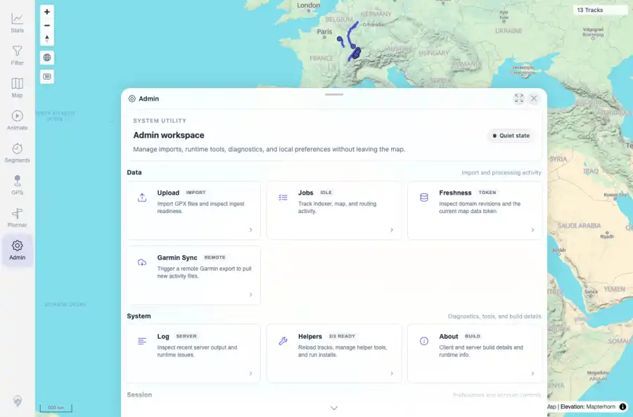

# Packet: ADM_01

## Scope

- Coverage source: `documentation/testing/frontend-regression-test-plan.md`
- Coverage ID or run packet: ADM_01
- In scope: Admin workspace opening and tile navigation reachability.
- Out of scope: Other coverage IDs except where noted as shared state/evidence.

## Prerequisites

- Required previous coverage IDs or run packets: Authenticated map session with prior queue rows terminal.
- Required app/data state: Current run-state and packet set for this run.
- Required browser context: As specified by the coverage action.

## Allowed Mutations

- Allowed: Open Admin, inspect visible tile navigation, capture evidence, and update ADM_01 packet/run-state.
- Not allowed: Collapse this ID into a parent row or skip required direct evidence.

## Actions And Results

| Coverage ID | Action | Expected result | Actual result | Status | Evidence |
|---|---|---|---|---|---|
| ADM_01 | Opened the Admin tool from the map navigation and inspected the workspace tile list. | Admin dialog opens and its tab/tile list is reachable and usable. | PASS: Admin workspace opened with reachable tiles for Upload, Jobs, Freshness, Garmin Sync, Log, Helpers, About, Settings, Session, and Attribution. | PASS | [assets/ADM_01-admin-home.webp](../assets/ADM_01-admin-home.webp); [assets/ADM_01-admin-home.txt](../assets/ADM_01-admin-home.txt) |

## Issues

| ID | Severity | Summary | Reproduction | Expected | Actual | Evidence | Release impact |
|---|---|---|---|---|---|---|---|

## Evidence Files

| File | Purpose |
|---|---|
| [assets/ADM_01-admin-home.webp](../assets/ADM_01-admin-home.webp) | Screenshot evidence |
| [assets/ADM_01-admin-home.txt](../assets/ADM_01-admin-home.txt) | Text/log evidence |

## Screenshot Evidence

## Timings

| Step | Timing |
|---|---:|
| Admin open and tile inspection | ~4 seconds |

## Handoff Notes

- Completed: This coverage ID is terminal.
- Remaining unfinished coverage: Continue with the next queue row.
- Blocked or not applicable: none.
- State left for the next packet: unchanged.
