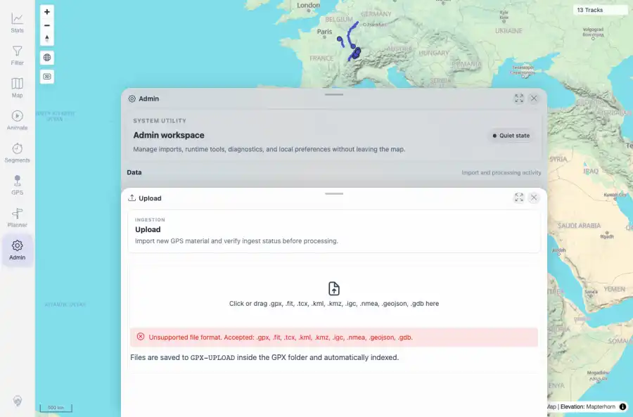
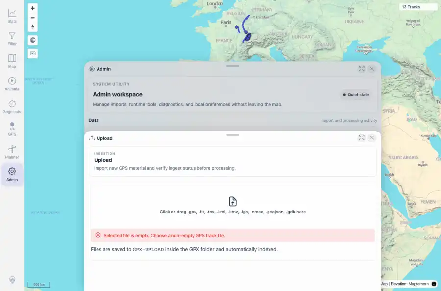
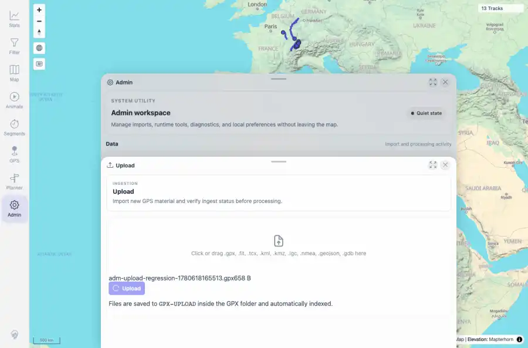
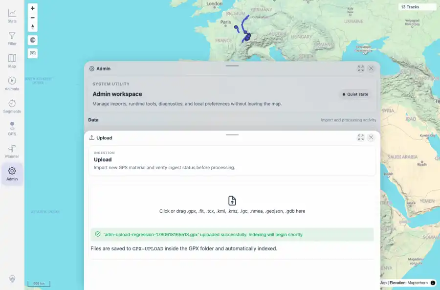

# Packet: ADM_02

## Scope

- Coverage source: `documentation/testing/frontend-regression-test-plan.md`
- Coverage ID or run packet: ADM_02
- In scope: Track file upload availability, accepted formats, progress/loading, success, unsupported-format error, and empty-file error.
- Out of scope: Other coverage IDs except where noted as shared state/evidence.

## Prerequisites

- Required previous coverage IDs or run packets: ADM_01 terminal; Upload tile reachable.
- Required app/data state: Current run-state and packet set for this run.
- Required browser context: As specified by the coverage action.

## Allowed Mutations

- Allowed: Use the upload UI with fully synthetic test files, upload one valid GPX, capture evidence, and update ADM_02 packet/run-state.
- Not allowed: Collapse this ID into a parent row or skip required direct evidence.

## Actions And Results

| Coverage ID | Action | Expected result | Actual result | Status | Evidence |
|---|---|---|---|---|---|
| ADM_02 | Opened Upload, selected an unsupported .txt file, selected an empty .gpx file, then uploaded a valid synthetic GPX while delaying the upload request briefly to observe loading state. | Upload availability, accepted formats, progress, success, unsupported-format errors, and empty-file errors are clear. | PASS: unsupported .txt showed accepted format guidance, empty .gpx showed the empty-file message, valid GPX showed a disabled/loading Upload button, and the final notice reported successful upload with indexing to begin shortly. | PASS | [assets/ADM_02-upload-unsupported.webp](../assets/ADM_02-upload-unsupported.webp); [assets/ADM_02-upload-empty.webp](../assets/ADM_02-upload-empty.webp); [assets/ADM_02-upload-loading.webp](../assets/ADM_02-upload-loading.webp); [assets/ADM_02-upload-success.webp](../assets/ADM_02-upload-success.webp); [assets/ADM_02-upload-flow.txt](../assets/ADM_02-upload-flow.txt) |

## Issues

| ID | Severity | Summary | Reproduction | Expected | Actual | Evidence | Release impact |
|---|---|---|---|---|---|---|---|

## Evidence Files

| File | Purpose |
|---|---|
| [assets/ADM_02-upload-unsupported.webp](../assets/ADM_02-upload-unsupported.webp) | Screenshot evidence |
| [assets/ADM_02-upload-empty.webp](../assets/ADM_02-upload-empty.webp) | Screenshot evidence |
| [assets/ADM_02-upload-loading.webp](../assets/ADM_02-upload-loading.webp) | Screenshot evidence |
| [assets/ADM_02-upload-success.webp](../assets/ADM_02-upload-success.webp) | Screenshot evidence |
| [assets/ADM_02-upload-flow.txt](../assets/ADM_02-upload-flow.txt) | Text/log evidence |

## Screenshot Evidence

## Timings

| Step | Timing |
|---|---:|
| Upload error and success flow | ~20 seconds |

## Handoff Notes

- Completed: This coverage ID is terminal.
- Remaining unfinished coverage: Continue with the next queue row.
- Blocked or not applicable: none.
- State left for the next packet: unchanged.
