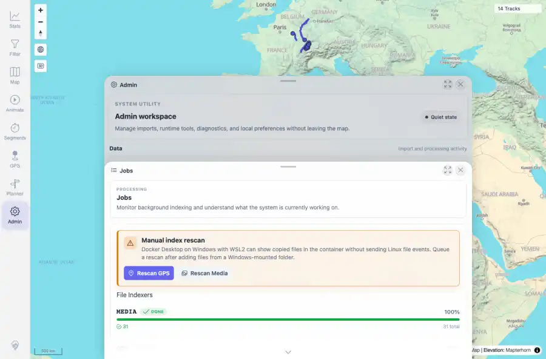
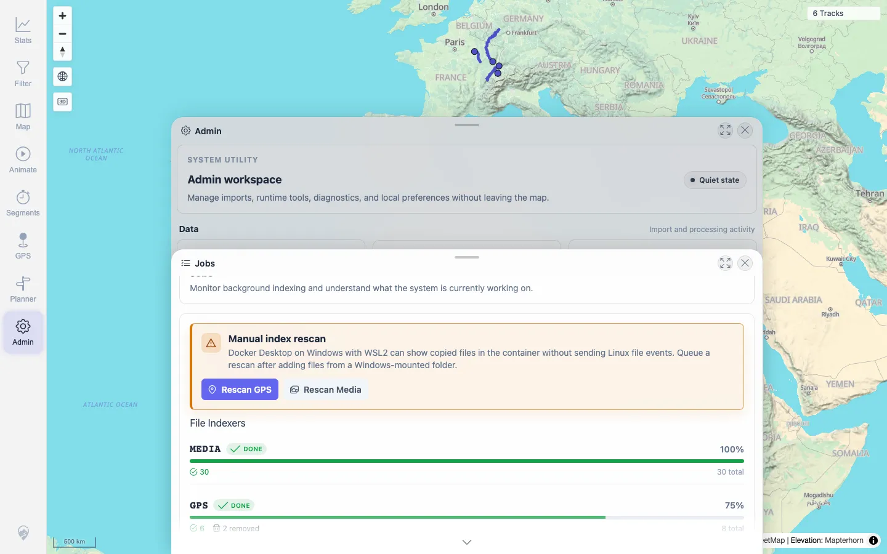

# Packet: ADM_03

## Scope

- Coverage source: `documentation/testing/frontend-regression-test-plan.md`
- Coverage ID or run packet: ADM_03
- In scope: Indexer status display for GPS/media pending, running, completed, failed, and removed state plus refresh behavior.
- Out of scope: Other coverage IDs except where noted as shared state/evidence.

## Prerequisites

- Required previous coverage IDs or run packets: ADM_02 terminal; Jobs tile reachable; earlier deletion coverage produced removed GPS files.
- Required app/data state: Current run-state and packet set for this run.
- Required browser context: As specified by the coverage action.

## Allowed Mutations

- Allowed: Open Jobs, refresh status, compare visible UI with black-box indexer API, capture evidence, and update ADM_03 packet/run-state.
- Not allowed: Collapse this ID into a parent row or skip required direct evidence.

## Actions And Results

| Coverage ID | Action | Expected result | Actual result | Status | Evidence |
|---|---|---|---|---|---|
| ADM_03 | Opened Jobs, captured File Indexers UI, refreshed status, and compared it to /mtl/api/indexer/status. Retested on beta image `1.300` built `2026-06-05T07:16:20Z`. | Indexer status shows GPS and media pending/running/completed/failed/removed state; refresh updates over time. | PASS: the indexer API reports GPS `removed=2`, and the Jobs GPS card shows `GPS DONE 75% 6 2 removed 8 total`. | PASS | [assets/RETEST_ADM_03-removed-count-fixed.webp](../assets/RETEST_ADM_03-removed-count-fixed.webp); [assets/RETEST_ADM_03-removed-count-fixed.txt](../assets/RETEST_ADM_03-removed-count-fixed.txt) |

## Issues

| ID | Severity | Summary | Reproduction | Expected | Actual | Evidence | Release impact |
|---|---|---|---|---|---|---|---|
| ADM_03-I01 | P2 | Jobs File Indexers UI omits removed GPS files. | Open Admin > Jobs after deletion coverage; compare visible GPS row to /mtl/api/indexer/status. | The Jobs UI should expose removed file state/count when the indexer reports removed files. | FIXED on beta image `1.300`: UI exposes `2 removed` on the GPS card while the API reports `removed=2`. | [assets/RETEST_ADM_03-removed-count-fixed.webp](../assets/RETEST_ADM_03-removed-count-fixed.webp); [assets/RETEST_ADM_03-removed-count-fixed.txt](../assets/RETEST_ADM_03-removed-count-fixed.txt) | Fixed in targeted beta retest. |

## Evidence Files

| File | Purpose |
|---|---|
| [assets/ADM_03-indexer-status.webp](../assets/ADM_03-indexer-status.webp) | Screenshot evidence |
| [assets/ADM_03-indexer-status.txt](../assets/ADM_03-indexer-status.txt) | Text/log evidence |
| [assets/RETEST_ADM_03-removed-count-fixed.webp](../assets/RETEST_ADM_03-removed-count-fixed.webp) | Targeted beta retest screenshot |
| [assets/RETEST_ADM_03-removed-count-fixed.txt](../assets/RETEST_ADM_03-removed-count-fixed.txt) | Targeted beta retest text evidence |

## Screenshot Evidence

## Timings

| Step | Timing |
|---|---:|
| Jobs status and refresh check | ~8 seconds |
| Targeted beta retest | ~8 seconds |

## Handoff Notes

- Completed: This coverage ID is terminal.
- Remaining unfinished coverage: Continue with the next queue row.
- Blocked or not applicable: none.
- State left for the next packet: unchanged.
