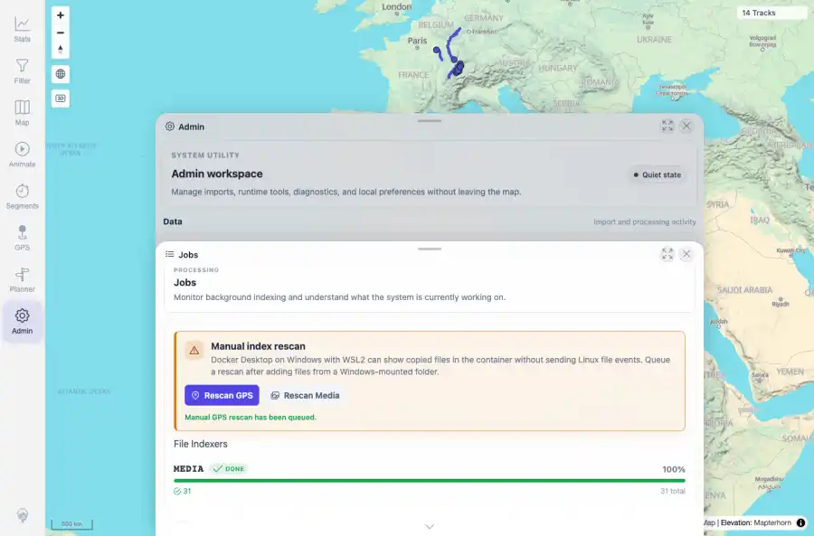

# Packet: ADM_04

## Scope

- Coverage source: `documentation/testing/frontend-regression-test-plan.md`
- Coverage ID or run packet: ADM_04
- In scope: Manual GPS and media rescan controls and continued map interaction.
- Out of scope: Other coverage IDs except where noted as shared state/evidence.

## Prerequisites

- Required previous coverage IDs or run packets: ADM_03 terminal; Jobs panel available.
- Required app/data state: Current run-state and packet set for this run.
- Required browser context: As specified by the coverage action.

## Allowed Mutations

- Allowed: Trigger Rescan GPS and Rescan Media, verify messages and map interaction, capture evidence, and update ADM_04 packet/run-state.
- Not allowed: Collapse this ID into a parent row or skip required direct evidence.

## Actions And Results

| Coverage ID | Action | Expected result | Actual result | Status | Evidence |
|---|---|---|---|---|---|
| ADM_04 | Clicked Rescan GPS, clicked Rescan Media, then closed Admin and used the map zoom control. | Rescan GPS and Rescan Media show queued/already-running/not-ready states without breaking map interaction. | PASS: GPS and MEDIA rescans both displayed queued messages, and the map remained interactive afterward with 14 Tracks visible. | PASS | [assets/ADM_04-rescan-gps.webp](../assets/ADM_04-rescan-gps.webp); [assets/ADM_04-rescan-media.webp](../assets/ADM_04-rescan-media.webp); [assets/ADM_04-manual-rescan.txt](../assets/ADM_04-manual-rescan.txt) |

## Issues

| ID | Severity | Summary | Reproduction | Expected | Actual | Evidence | Release impact |
|---|---|---|---|---|---|---|---|

## Evidence Files

| File | Purpose |
|---|---|
| [assets/ADM_04-rescan-gps.webp](../assets/ADM_04-rescan-gps.webp) | Screenshot evidence |
| [assets/ADM_04-rescan-media.webp](../assets/ADM_04-rescan-media.webp) | Screenshot evidence |
| [assets/ADM_04-manual-rescan.txt](../assets/ADM_04-manual-rescan.txt) | Text/log evidence |

## Screenshot Evidence

## Timings

| Step | Timing |
|---|---:|
| Manual rescan and map check | ~10 seconds |

## Handoff Notes

- Completed: This coverage ID is terminal.
- Remaining unfinished coverage: Continue with the next queue row.
- Blocked or not applicable: none.
- State left for the next packet: unchanged.
