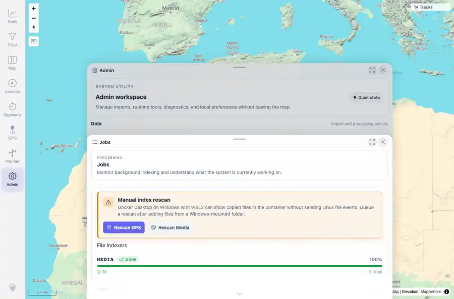

# Packet: ADM_05

## Scope

- Coverage source: `documentation/testing/frontend-regression-test-plan.md`
- Coverage ID or run packet: ADM_05
- In scope: Background processing job visibility and settled state after imports.
- Out of scope: Other coverage IDs except where noted as shared state/evidence.

## Prerequisites

- Required previous coverage IDs or run packets: ADM_04 terminal; synthetic upload and rescans completed or idle.
- Required app/data state: Current run-state and packet set for this run.
- Required browser context: As specified by the coverage action.

## Allowed Mutations

- Allowed: Inspect Jobs panel/API job summaries, capture evidence, and update ADM_05 packet/run-state.
- Not allowed: Collapse this ID into a parent row or skip required direct evidence.

## Actions And Results

| Coverage ID | Action | Expected result | Actual result | Status | Evidence |
|---|---|---|---|---|---|
| ADM_05 | Reviewed Track Processing Jobs for Duplicate Finder, Activity Classifier, and Exploration Score after the synthetic upload and rescans. | Duplicate Finder and Exploration Score progress is visible and settles after imports. | PASS: Duplicate Finder and Exploration Score were visible, and all job summaries settled at 0 pending / 14 done / 100%. | PASS | [assets/ADM_05-background-jobs.webp](../assets/ADM_05-background-jobs.webp); [assets/ADM_05-background-jobs.txt](../assets/ADM_05-background-jobs.txt) |

## Issues

| ID | Severity | Summary | Reproduction | Expected | Actual | Evidence | Release impact |
|---|---|---|---|---|---|---|---|

## Evidence Files

| File | Purpose |
|---|---|
| [assets/ADM_05-background-jobs.webp](../assets/ADM_05-background-jobs.webp) | Screenshot evidence |
| [assets/ADM_05-background-jobs.txt](../assets/ADM_05-background-jobs.txt) | Text/log evidence |

## Screenshot Evidence

## Timings

| Step | Timing |
|---|---:|
| Background job settle check | ~5 seconds |

## Handoff Notes

- Completed: This coverage ID is terminal.
- Remaining unfinished coverage: Continue with the next queue row.
- Blocked or not applicable: none.
- State left for the next packet: unchanged.
