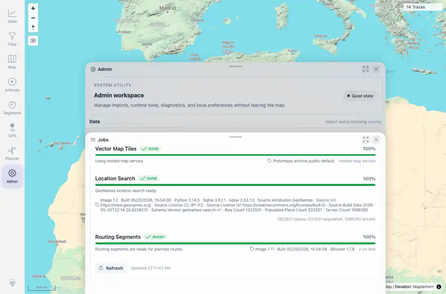

# Packet: ADM_06

## Scope

- Coverage source: `documentation/testing/frontend-regression-test-plan.md`
- Coverage ID or run packet: ADM_06
- In scope: Operational task rows for vector map tiles, location search, and routing segments.
- Out of scope: Other coverage IDs except where noted as shared state/evidence.

## Prerequisites

- Required previous coverage IDs or run packets: ADM_05 terminal; Jobs panel available.
- Required app/data state: Current run-state and packet set for this run.
- Required browser context: As specified by the coverage action.

## Allowed Mutations

- Allowed: Inspect operational task rows/API status, capture evidence, and update ADM_06 packet/run-state.
- Not allowed: Collapse this ID into a parent row or skip required direct evidence.

## Actions And Results

| Coverage ID | Action | Expected result | Actual result | Status | Evidence |
|---|---|---|---|---|---|
| ADM_06 | Scrolled Jobs to Map & Routing and inspected Vector Map Tiles, Location Search, and Routing Segments rows. | Operational tasks show ready/downloading/unavailable/disabled states with useful detail. | PASS: Vector Map Tiles, Location Search, and Routing Segments rows were visible with ready/done status and detailed source/version/metric text. | PASS | [assets/ADM_06-operational-tasks.webp](../assets/ADM_06-operational-tasks.webp); [assets/ADM_06-operational-tasks.txt](../assets/ADM_06-operational-tasks.txt) |

## Issues

| ID | Severity | Summary | Reproduction | Expected | Actual | Evidence | Release impact |
|---|---|---|---|---|---|---|---|

## Evidence Files

| File | Purpose |
|---|---|
| [assets/ADM_06-operational-tasks.webp](../assets/ADM_06-operational-tasks.webp) | Screenshot evidence |
| [assets/ADM_06-operational-tasks.txt](../assets/ADM_06-operational-tasks.txt) | Text/log evidence |

## Screenshot Evidence

## Timings

| Step | Timing |
|---|---:|
| Operational task inspection | ~5 seconds |

## Handoff Notes

- Completed: This coverage ID is terminal.
- Remaining unfinished coverage: Continue with the next queue row.
- Blocked or not applicable: none.
- State left for the next packet: unchanged.
