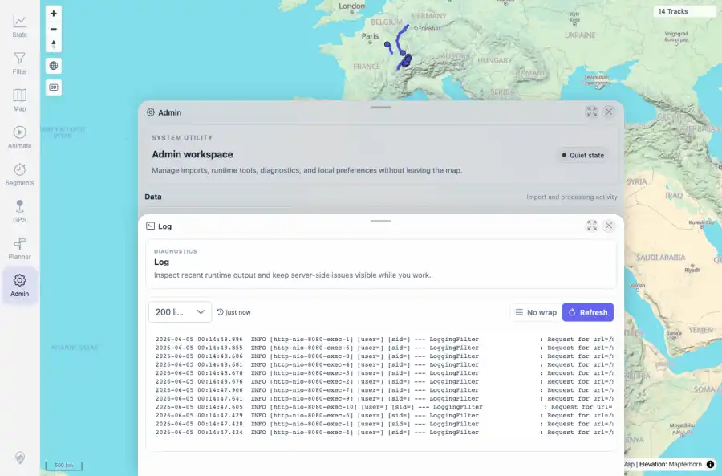

# Packet: ADM_08

## Scope

- Coverage source: `documentation/testing/frontend-regression-test-plan.md`
- Coverage ID or run packet: ADM_08
- In scope: Admin server log loading and refresh behavior.
- Out of scope: Other coverage IDs except where noted as shared state/evidence.

## Prerequisites

- Required previous coverage IDs or run packets: ADM_07 terminal; Log tile reachable.
- Required app/data state: Current run-state and packet set for this run.
- Required browser context: As specified by the coverage action.

## Allowed Mutations

- Allowed: Open Log, refresh logs, capture sanitized evidence, and update ADM_08 packet/run-state.
- Not allowed: Collapse this ID into a parent row or skip required direct evidence.

## Actions And Results

| Coverage ID | Action | Expected result | Actual result | Status | Evidence |
|---|---|---|---|---|---|
| ADM_08 | Opened Admin > Log, waited for log lines, clicked Refresh, and counted displayed log lines. | Server log lines load and refresh. | PASS: server log displayed 199 lines with toolbar controls, and refresh kept the timestamp at just now with updated log excerpts. | PASS | [assets/ADM_08-log-before.webp](../assets/ADM_08-log-before.webp); [assets/ADM_08-log-after.webp](../assets/ADM_08-log-after.webp); [assets/ADM_08-server-log.txt](../assets/ADM_08-server-log.txt) |

## Issues

| ID | Severity | Summary | Reproduction | Expected | Actual | Evidence | Release impact |
|---|---|---|---|---|---|---|---|

## Evidence Files

| File | Purpose |
|---|---|
| [assets/ADM_08-log-before.webp](../assets/ADM_08-log-before.webp) | Screenshot evidence |
| [assets/ADM_08-log-after.webp](../assets/ADM_08-log-after.webp) | Screenshot evidence |
| [assets/ADM_08-server-log.txt](../assets/ADM_08-server-log.txt) | Text/log evidence |

## Screenshot Evidence

## Timings

| Step | Timing |
|---|---:|
| Server log load and refresh | ~8 seconds |

## Handoff Notes

- Completed: This coverage ID is terminal.
- Remaining unfinished coverage: Continue with the next queue row.
- Blocked or not applicable: none.
- State left for the next packet: unchanged.
