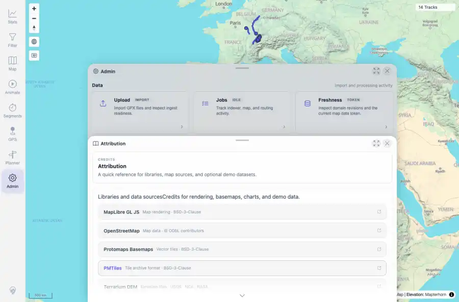

# Packet: ADM_09

## Scope

- Coverage source: `documentation/testing/frontend-regression-test-plan.md`
- Coverage ID or run packet: ADM_09
- In scope: Admin attribution sources.
- Out of scope: Other coverage IDs except where noted as shared state/evidence.

## Prerequisites

- Required previous coverage IDs or run packets: ADM_08 terminal; Attribution tile reachable.
- Required app/data state: Current run-state and packet set for this run.
- Required browser context: As specified by the coverage action.

## Allowed Mutations

- Allowed: Open Attribution, inspect entries, capture evidence, and update ADM_09 packet/run-state.
- Not allowed: Collapse this ID into a parent row or skip required direct evidence.

## Actions And Results

| Coverage ID | Action | Expected result | Actual result | Status | Evidence |
|---|---|---|---|---|---|
| ADM_09 | Opened Admin > Attribution and inspected the rendered source list. | Attribution shows expected map/data sources. | PASS: attribution entries included MapLibre GL JS, OpenStreetMap, swisstopo, Highcharts, GeoNames, GPSBabel, and BRouter/other expected sources. | PASS | [assets/ADM_09-attribution.webp](../assets/ADM_09-attribution.webp); [assets/ADM_09-attribution.txt](../assets/ADM_09-attribution.txt) |

## Issues

| ID | Severity | Summary | Reproduction | Expected | Actual | Evidence | Release impact |
|---|---|---|---|---|---|---|---|

## Evidence Files

| File | Purpose |
|---|---|
| [assets/ADM_09-attribution.webp](../assets/ADM_09-attribution.webp) | Screenshot evidence |
| [assets/ADM_09-attribution.txt](../assets/ADM_09-attribution.txt) | Text/log evidence |

## Screenshot Evidence

## Timings

| Step | Timing |
|---|---:|
| Attribution inspection | ~4 seconds |

## Handoff Notes

- Completed: This coverage ID is terminal.
- Remaining unfinished coverage: Continue with the next queue row.
- Blocked or not applicable: none.
- State left for the next packet: unchanged.
