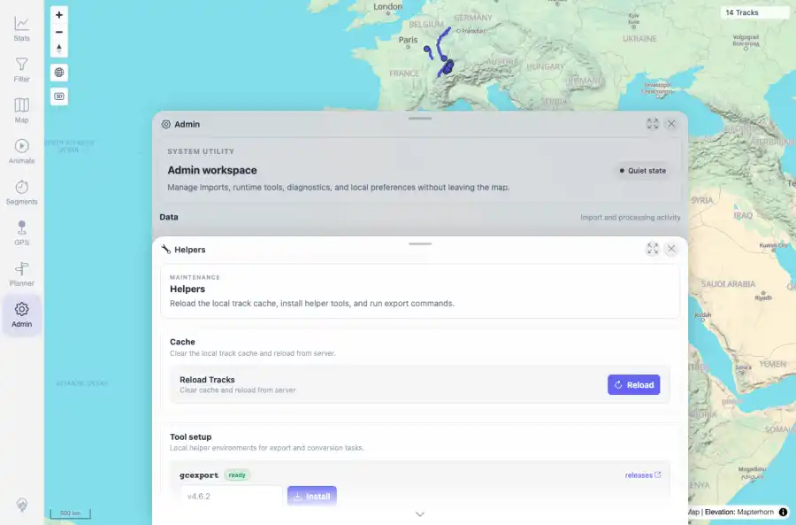
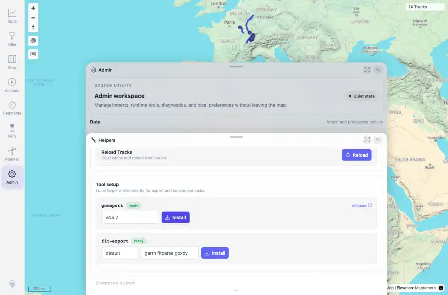

# Packet: ADM_10

## Scope

- Coverage source: `documentation/testing/frontend-regression-test-plan.md`
- Coverage ID or run packet: ADM_10
- In scope: Garmin/helper export tool status and install/update error reporting.
- Out of scope: Other coverage IDs except where noted as shared state/evidence.

## Prerequisites

- Required previous coverage IDs or run packets: ADM_09 terminal; Helpers tile reachable.
- Required app/data state: Current run-state and packet set for this run.
- Required browser context: As specified by the coverage action.

## Allowed Mutations

- Allowed: Inspect helper tool status, run a non-destructive invalid version install action, capture evidence, and update ADM_10 packet/run-state.
- Not allowed: Collapse this ID into a parent row or skip required direct evidence.

## Actions And Results

| Coverage ID | Action | Expected result | Actual result | Status | Evidence |
|---|---|---|---|---|---|
| ADM_10 | Opened Admin > Helpers, verified gcexport and fit-export status rows, entered an invalid gcexport version, and clicked Install. | Garmin export tools, if present, show installed exporter status; install/update actions report success or error. | PASS: gcexport and fit-export both showed ready status, install controls were enabled, and the invalid gcexport install action reported a clear validation error while leaving tool status visible. | PASS | [assets/ADM_10-helper-tools-ready.webp](../assets/ADM_10-helper-tools-ready.webp); [assets/ADM_10-install-result.webp](../assets/ADM_10-install-result.webp); [assets/ADM_10-garmin-tools.txt](../assets/ADM_10-garmin-tools.txt) |

## Issues

| ID | Severity | Summary | Reproduction | Expected | Actual | Evidence | Release impact |
|---|---|---|---|---|---|---|---|

## Evidence Files

| File | Purpose |
|---|---|
| [assets/ADM_10-helper-tools-ready.webp](../assets/ADM_10-helper-tools-ready.webp) | Screenshot evidence |
| [assets/ADM_10-install-result.webp](../assets/ADM_10-install-result.webp) | Screenshot evidence |
| [assets/ADM_10-garmin-tools.txt](../assets/ADM_10-garmin-tools.txt) | Text/log evidence |

## Screenshot Evidence

## Timings

| Step | Timing |
|---|---:|
| Helper status and invalid install action | ~10 seconds |

## Handoff Notes

- Completed: This coverage ID is terminal.
- Remaining unfinished coverage: Continue with the next queue row.
- Blocked or not applicable: none.
- State left for the next packet: unchanged.
