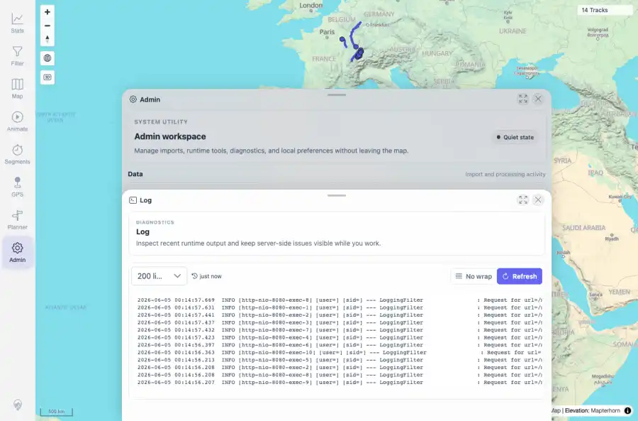

# Packet: ADM_11

## Scope

- Coverage source: `documentation/testing/frontend-regression-test-plan.md`
- Coverage ID or run packet: ADM_11
- In scope: Admin dialog close/reopen behavior during panel activity.
- Out of scope: Other coverage IDs except where noted as shared state/evidence.

## Prerequisites

- Required previous coverage IDs or run packets: ADM_10 terminal; Log panel reachable.
- Required app/data state: Current run-state and packet set for this run.
- Required browser context: As specified by the coverage action.

## Allowed Mutations

- Allowed: Refresh Log, close and reopen the panel, capture evidence, and update ADM_11 packet/run-state.
- Not allowed: Collapse this ID into a parent row or skip required direct evidence.

## Actions And Results

| Coverage ID | Action | Expected result | Actual result | Status | Evidence |
|---|---|---|---|---|---|
| ADM_11 | Clicked Log Refresh, closed the panel, then reopened Log from the still-open Admin workspace. | Closing/reopening the dialog does not lose state mid-action or leave the admin UI broken. | PASS: after close/reopen, the Log panel loaded again with refresh/log controls visible and no error or blank overlay. | PASS | [assets/ADM_11-close-reopen-log.webp](../assets/ADM_11-close-reopen-log.webp); [assets/ADM_11-close-reopen.txt](../assets/ADM_11-close-reopen.txt) |

## Issues

| ID | Severity | Summary | Reproduction | Expected | Actual | Evidence | Release impact |
|---|---|---|---|---|---|---|---|

## Evidence Files

| File | Purpose |
|---|---|
| [assets/ADM_11-close-reopen-log.webp](../assets/ADM_11-close-reopen-log.webp) | Screenshot evidence |
| [assets/ADM_11-close-reopen.txt](../assets/ADM_11-close-reopen.txt) | Text/log evidence |

## Screenshot Evidence

## Timings

| Step | Timing |
|---|---:|
| Close/reopen during log refresh | ~6 seconds |

## Handoff Notes

- Completed: This coverage ID is terminal.
- Remaining unfinished coverage: Continue with the next queue row.
- Blocked or not applicable: none.
- State left for the next packet: unchanged.
