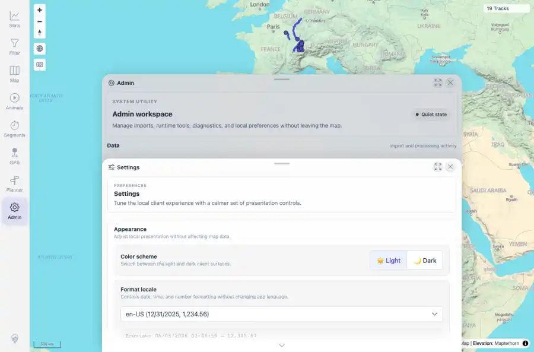
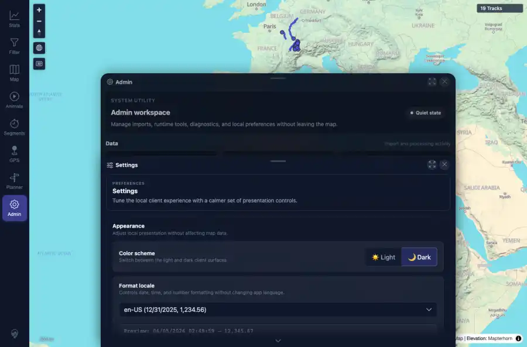

# Packet: APP_01

## Scope

- Coverage source: `documentation/testing/frontend-regression-test-plan.md`
- Coverage ID or run packet: APP_01
- In scope: Light/dark UI theme switching across app chrome and Admin/settings surfaces.
- Out of scope: Other coverage IDs except where noted as shared state/evidence.

## Prerequisites

- Required previous coverage IDs or run packets: Previous queue rows terminal or explicitly not required.
- Required app/data state: Current run-state and packet set for this run.
- Required browser context: As specified by the coverage action.

## Allowed Mutations

- Allowed: Read-only verification and packet/run-state updates.
- Not allowed: Collapse this ID into a parent row or skip required direct evidence.

## Actions And Results

| Coverage ID | Action | Expected result | Actual result | Status | Evidence |
|---|---|---|---|---|---|
| APP_01 | Used Admin > Settings color-scheme control to switch light then dark; captured both Settings surfaces and recorded document theme plus CSS token changes. | Whole UI re-themes immediately across text, panels, dialogs, sheets, dropdowns/tool controls, and chart tokens. | DOM data-theme changed to light then dark without reload; key text/chart/border tokens changed; Admin settings sheet and map chrome visually re-themed in both screenshots. Default light mode had no stored color-scheme value, which is expected because light is the fallback. | PASS | [assets/APP_01-light-settings.webp](../assets/APP_01-light-settings.webp); [assets/APP_01-dark-settings.webp](../assets/APP_01-dark-settings.webp); [assets/APP_01-theme-switch.txt](../assets/APP_01-theme-switch.txt) |

## Issues

| ID | Severity | Summary | Reproduction | Expected | Actual | Evidence | Release impact |
|---|---|---|---|---|---|---|---|

## Evidence Files

| File | Purpose |
|---|---|
| [assets/APP_01-light-settings.webp](../assets/APP_01-light-settings.webp) | Screenshot evidence |
| [assets/APP_01-dark-settings.webp](../assets/APP_01-dark-settings.webp) | Screenshot evidence |
| [assets/APP_01-theme-switch.txt](../assets/APP_01-theme-switch.txt) | Text/log evidence |

## Screenshot Evidence

## Timings

| Step | Timing |
|---|---:|
| Theme switch and capture | ~25 seconds |

## Handoff Notes

- Completed: This coverage ID is terminal.
- Remaining unfinished coverage: Continue with the next queue row.
- Blocked or not applicable: none.
- State left for the next packet: unchanged.
