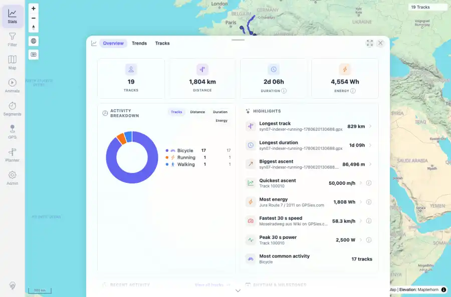
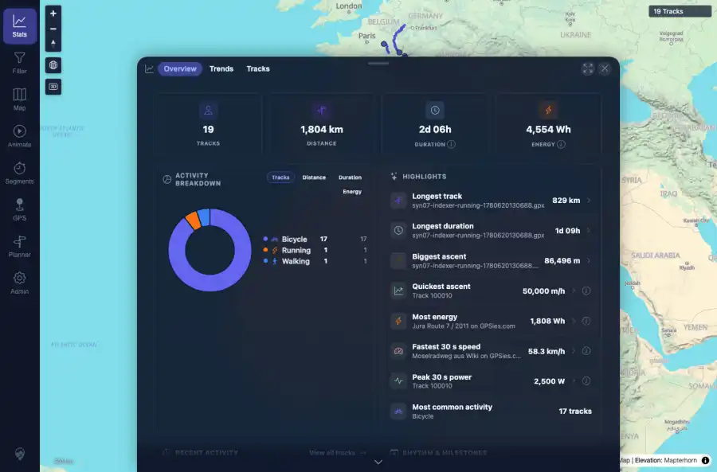

# Packet: APP_03

## Scope

- Coverage source: `documentation/testing/frontend-regression-test-plan.md`
- Coverage ID or run packet: APP_03
- In scope: Statistics chart color changes after UI theme switch without a browser reload.
- Out of scope: Other coverage IDs except where noted as shared state/evidence.

## Prerequisites

- Required previous coverage IDs or run packets: Previous queue rows terminal or explicitly not required.
- Required app/data state: Current run-state and packet set for this run.
- Required browser context: As specified by the coverage action.

## Allowed Mutations

- Allowed: Read-only verification and packet/run-state updates.
- Not allowed: Collapse this ID into a parent row or skip required direct evidence.

## Actions And Results

| Coverage ID | Action | Expected result | Actual result | Status | Evidence |
|---|---|---|---|---|---|
| APP_03 | Opened Stats charts in light mode, captured chart SVG/token colors, switched to dark mode through Settings without browser reload, reopened Stats in the same app session, and captured chart colors again. | Charts re-color for the selected theme without needing a page reload. | Stats rendered eight Highcharts containers in both states; chart text/grid/tooltip tokens changed from light to dark, and observed SVG text/path colors changed accordingly without a browser reload. | PASS | [assets/APP_03-chart-light.webp](../assets/APP_03-chart-light.webp); [assets/APP_03-chart-dark.webp](../assets/APP_03-chart-dark.webp); [assets/APP_03-chart-colors.txt](../assets/APP_03-chart-colors.txt) |

## Issues

| ID | Severity | Summary | Reproduction | Expected | Actual | Evidence | Release impact |
|---|---|---|---|---|---|---|---|

## Evidence Files

| File | Purpose |
|---|---|
| [assets/APP_03-chart-light.webp](../assets/APP_03-chart-light.webp) | Screenshot evidence |
| [assets/APP_03-chart-dark.webp](../assets/APP_03-chart-dark.webp) | Screenshot evidence |
| [assets/APP_03-chart-colors.txt](../assets/APP_03-chart-colors.txt) | Text/log evidence |

## Screenshot Evidence

## Timings

| Step | Timing |
|---|---:|
| Chart theme switch | ~35 seconds |

## Handoff Notes

- Completed: This coverage ID is terminal.
- Remaining unfinished coverage: Continue with the next queue row.
- Blocked or not applicable: none.
- State left for the next packet: unchanged.
