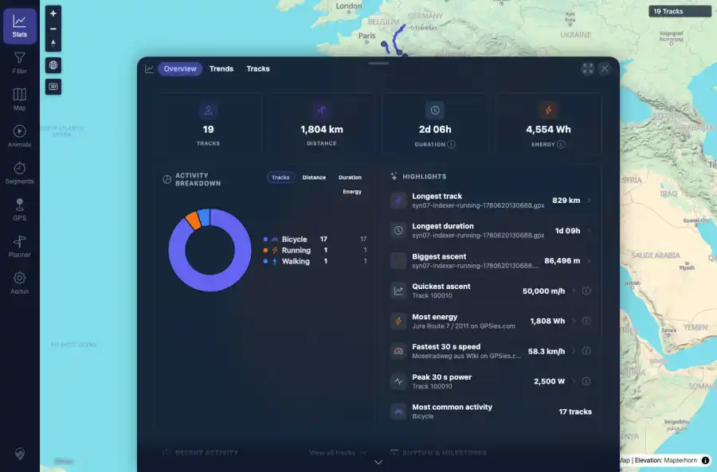
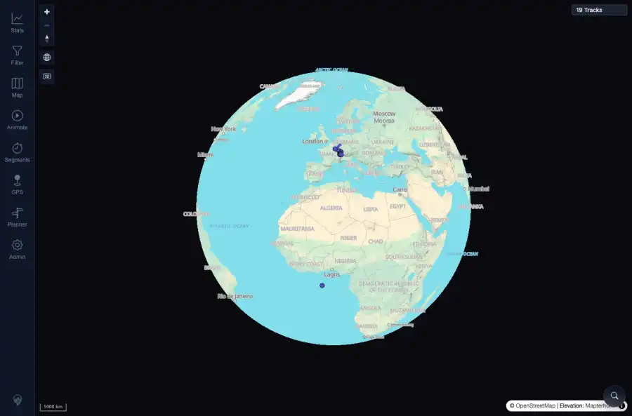

# Packet: APP_04

## Scope

- Coverage source: `documentation/testing/frontend-regression-test-plan.md`
- Coverage ID or run packet: APP_04
- In scope: Selected UI theme persistence across reload and login.
- Out of scope: Other coverage IDs except where noted as shared state/evidence.

## Prerequisites

- Required previous coverage IDs or run packets: Previous queue rows terminal or explicitly not required.
- Required app/data state: Current run-state and packet set for this run.
- Required browser context: As specified by the coverage action.

## Allowed Mutations

- Allowed: Read-only verification and packet/run-state updates.
- Not allowed: Collapse this ID into a parent row or skip required direct evidence.

## Actions And Results

| Coverage ID | Action | Expected result | Actual result | Status | Evidence |
|---|---|---|---|---|---|
| APP_04 | Set UI theme to dark, reloaded the app, captured the dark map/stats state, performed credentials-only logout, logged back in, and captured the post-login state. | Selected theme persists across reload and login. | After reload, before login, and after re-login, local preference remained dark and document data-theme stayed dark; screenshots confirm dark app surfaces after reload and after login. | PASS | [assets/APP_04-dark-after-reload.webp](../assets/APP_04-dark-after-reload.webp); [assets/APP_04-dark-after-login.webp](../assets/APP_04-dark-after-login.webp); [assets/APP_04-theme-persistence.txt](../assets/APP_04-theme-persistence.txt) |

## Issues

| ID | Severity | Summary | Reproduction | Expected | Actual | Evidence | Release impact |
|---|---|---|---|---|---|---|---|

## Evidence Files

| File | Purpose |
|---|---|
| [assets/APP_04-dark-after-reload.webp](../assets/APP_04-dark-after-reload.webp) | Screenshot evidence |
| [assets/APP_04-dark-after-login.webp](../assets/APP_04-dark-after-login.webp) | Screenshot evidence |
| [assets/APP_04-theme-persistence.txt](../assets/APP_04-theme-persistence.txt) | Text/log evidence |

## Screenshot Evidence

## Timings

| Step | Timing |
|---|---:|
| Reload and login persistence | ~1 minute |

## Handoff Notes

- Completed: This coverage ID is terminal.
- Remaining unfinished coverage: Continue with the next queue row.
- Blocked or not applicable: none.
- State left for the next packet: unchanged.
