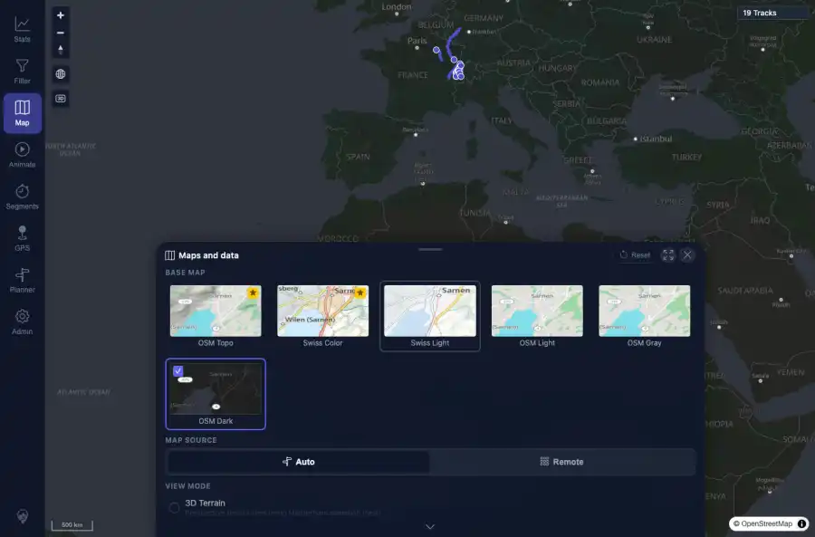

# Packet: APP_06

## Scope

- Coverage source: `documentation/testing/frontend-regression-test-plan.md`
- Coverage ID or run packet: APP_06
- In scope: Independence of UI theme and map base style selections.
- Out of scope: Other coverage IDs except where noted as shared state/evidence.

## Prerequisites

- Required previous coverage IDs or run packets: Previous queue rows terminal or explicitly not required.
- Required app/data state: Current run-state and packet set for this run.
- Required browser context: As specified by the coverage action.

## Allowed Mutations

- Allowed: Read-only verification and packet/run-state updates.
- Not allowed: Collapse this ID into a parent row or skip required direct evidence.

## Actions And Results

| Coverage ID | Action | Expected result | Actual result | Status | Evidence |
|---|---|---|---|---|---|
| APP_06 | Under light and dark UI themes, opened Map settings and selected all six base styles: OSM Topo, Swiss Color, Swiss Light, OSM Light, OSM Gray, and OSM Dark. | Each available map style can be selected under either UI theme without coupling the map style to the UI theme. | All six map style codes were selected under both light and dark UI themes; stored map theme changed independently while document data-theme stayed on the chosen UI theme. | PASS | [assets/APP_06-map-style-grid-dark.webp](../assets/APP_06-map-style-grid-dark.webp); [assets/APP_06-map-style-independence.txt](../assets/APP_06-map-style-independence.txt) |

## Issues

| ID | Severity | Summary | Reproduction | Expected | Actual | Evidence | Release impact |
|---|---|---|---|---|---|---|---|

## Evidence Files

| File | Purpose |
|---|---|
| [assets/APP_06-map-style-grid-dark.webp](../assets/APP_06-map-style-grid-dark.webp) | Screenshot evidence |
| [assets/APP_06-map-style-independence.txt](../assets/APP_06-map-style-independence.txt) | Text/log evidence |

## Screenshot Evidence

## Timings

| Step | Timing |
|---|---:|
| Map style matrix | ~2 minutes |

## Handoff Notes

- Completed: This coverage ID is terminal.
- Remaining unfinished coverage: Continue with the next queue row.
- Blocked or not applicable: none.
- State left for the next packet: unchanged.
