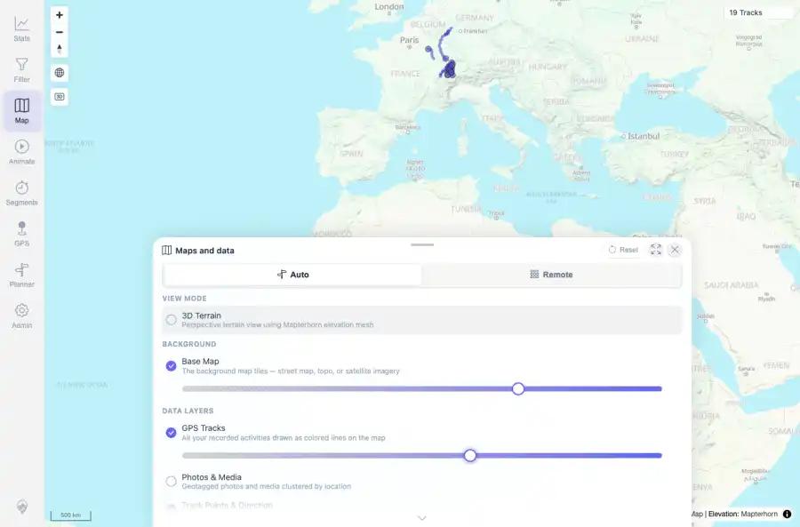
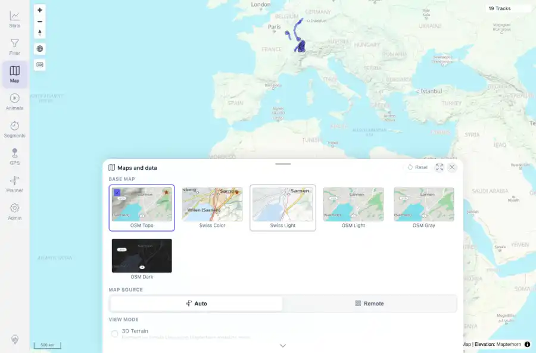
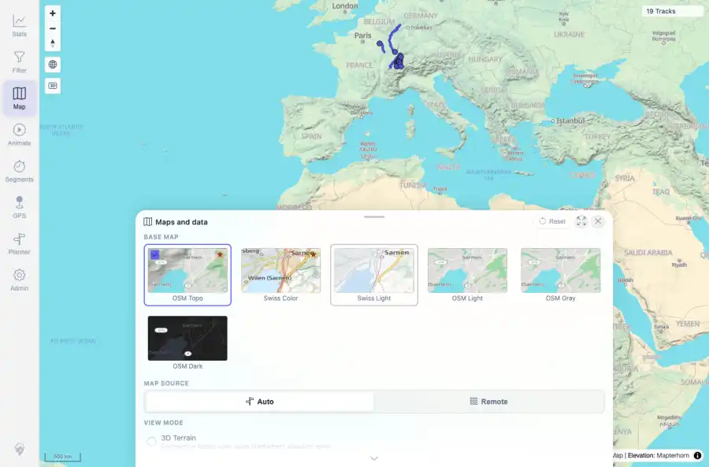

# Packet: APP_08

## Scope

- Coverage source: `documentation/testing/frontend-regression-test-plan.md`
- Coverage ID or run packet: APP_08
- In scope: Layer opacity sliders, basemap dimming, persistence, and reset-to-defaults behavior.
- Out of scope: Other coverage IDs except where noted as shared state/evidence.

## Prerequisites

- Required previous coverage IDs or run packets: Previous queue rows terminal or explicitly not required.
- Required app/data state: Current run-state and packet set for this run.
- Required browser context: As specified by the coverage action.

## Allowed Mutations

- Allowed: Read-only verification and packet/run-state updates.
- Not allowed: Collapse this ID into a parent row or skip required direct evidence.

## Actions And Results

| Coverage ID | Action | Expected result | Actual result | Status | Evidence |
|---|---|---|---|---|---|
| APP_08 | Opened Map settings, reset defaults, keyboard-adjusted Base Map opacity from 100 to 70 and GPS Tracks from 100 to 60, reloaded to verify persistence, then used Reset again. | Layer opacity sliders and basemap dimming change settings, persist across reload, and reset-to-defaults restores normal values. | Base Map and GPS Tracks slider values changed and persisted in mtl.map.settings after reload; Reset restored light-topo defaults and all layer opacity values to 100. | PASS | [assets/APP_08-opacity-adjusted.webp](../assets/APP_08-opacity-adjusted.webp); [assets/APP_08-opacity-after-reload.webp](../assets/APP_08-opacity-after-reload.webp); [assets/APP_08-reset-defaults.webp](../assets/APP_08-reset-defaults.webp); [assets/APP_08-layer-opacity.txt](../assets/APP_08-layer-opacity.txt) |

## Issues

| ID | Severity | Summary | Reproduction | Expected | Actual | Evidence | Release impact |
|---|---|---|---|---|---|---|---|

## Evidence Files

| File | Purpose |
|---|---|
| [assets/APP_08-opacity-adjusted.webp](../assets/APP_08-opacity-adjusted.webp) | Screenshot evidence |
| [assets/APP_08-opacity-after-reload.webp](../assets/APP_08-opacity-after-reload.webp) | Screenshot evidence |
| [assets/APP_08-reset-defaults.webp](../assets/APP_08-reset-defaults.webp) | Screenshot evidence |
| [assets/APP_08-layer-opacity.txt](../assets/APP_08-layer-opacity.txt) | Text/log evidence |

## Screenshot Evidence

## Timings

| Step | Timing |
|---|---:|
| Opacity and reset flow | ~40 seconds |

## Handoff Notes

- Completed: This coverage ID is terminal.
- Remaining unfinished coverage: Continue with the next queue row.
- Blocked or not applicable: none.
- State left for the next packet: unchanged.
