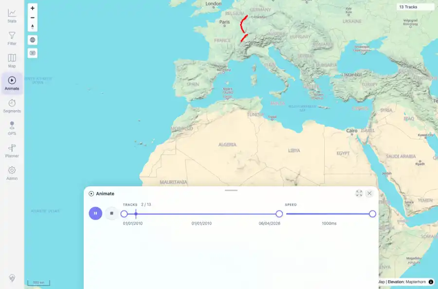

# Packet: AVR_01

## Scope

- Coverage source: `documentation/testing/frontend-regression-test-plan.md`
- Coverage ID or run packet: AVR_01
- In scope: Animation controls: open animation panel, adjust playback speed, play/pause/stop, and verify moving playhead/count state.
- Out of scope: Other coverage IDs except where noted as shared state/evidence.

## Prerequisites

- Required previous coverage IDs or run packets: MCT_06 terminal; 13-track data state including two synthetic crossing tracks.
- Required app/data state: Current run-state and packet set for this run.
- Required browser context: As specified by the coverage action.

## Allowed Mutations

- Allowed: Operate the animation panel and update AVR_01 packet/run-state evidence only.
- Not allowed: Collapse this ID into a parent row or skip required direct evidence.

## Actions And Results

| Coverage ID | Action | Expected result | Actual result | Status | Evidence |
|---|---|---|---|---|---|
| AVR_01 | Opened Animate, targeted the visible inline speed slider, changed speed with keyboard controls, started playback, paused, stopped, and captured running state. | Animation panel opens on current tracks; speed control responds; play shows animated/running state; pause and stop restore usable controls. | PASS: Animate opened with 13 / 13 tracks. Speed changed from 20ms to 1000ms, playback entered Pause animation with playhead visible and 2 / 13 tracks, pause restored Play animation, stop disabled Stop and removed playhead, and Home changed speed to 1ms. | PASS | [assets/AVR_01-animation-running.webp](../assets/AVR_01-animation-running.webp); [assets/AVR_01-animation-controls.txt](../assets/AVR_01-animation-controls.txt) |

## Issues

| ID | Severity | Summary | Reproduction | Expected | Actual | Evidence | Release impact |
|---|---|---|---|---|---|---|---|

## Evidence Files

| File | Purpose |
|---|---|
| [assets/AVR_01-animation-running.webp](../assets/AVR_01-animation-running.webp) | Screenshot evidence |
| [assets/AVR_01-animation-controls.txt](../assets/AVR_01-animation-controls.txt) | Text/log evidence |

## Screenshot Evidence

## Timings

| Step | Timing |
|---|---:|
| Open and control animation | ~5 seconds |

## Handoff Notes

- Completed: This coverage ID is terminal.
- Remaining unfinished coverage: Continue with the next queue row.
- Blocked or not applicable: none.
- State left for the next packet: unchanged.
