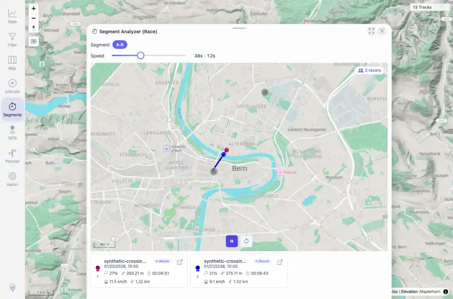

# Packet: AVR_02

## Scope

- Coverage source: `documentation/testing/frontend-regression-test-plan.md`
- Coverage ID or run packet: AVR_02
- In scope: Virtual race from measured segment: launch race, confirm racers/ranking/progress, pause and reset.
- Out of scope: Other coverage IDs except where noted as shared state/evidence.

## Prerequisites

- Required previous coverage IDs or run packets: AVR_01 terminal; MCT synthetic A-B segment available.
- Required app/data state: Current run-state and packet set for this run.
- Required browser context: As specified by the coverage action.

## Allowed Mutations

- Allowed: Operate Segments and Virtual Race UI and update AVR_02 packet/run-state evidence only.
- Not allowed: Collapse this ID into a parent row or skip required direct evidence.

## Actions And Results

| Coverage ID | Action | Expected result | Actual result | Status | Evidence |
|---|---|---|---|---|---|
| AVR_02 | Searched Bern, selected synthetic A-B crossing points, analyzed the segment, opened Virtual Race, selected A-B, started, paused, and reset the race. | Virtual race loads racers from selected segment, shows ranks/cards/minimap, updates progress while running, and pause/reset controls work. | PASS: A-B race loaded 2 racers for synthetic-crossing-a.gpx and synthetic-crossing-b.gpx with ranks 1/2 and minimap canvas. Running cards advanced from 0% to 26%/20% with distance meters; pause left controls available; reset returned both cards to 0%. | PASS | [assets/AVR_02-virtual-race-running.webp](../assets/AVR_02-virtual-race-running.webp); [assets/AVR_02-virtual-race-running.txt](../assets/AVR_02-virtual-race-running.txt) |

## Issues

| ID | Severity | Summary | Reproduction | Expected | Actual | Evidence | Release impact |
|---|---|---|---|---|---|---|---|

## Evidence Files

| File | Purpose |
|---|---|
| [assets/AVR_02-virtual-race-running.webp](../assets/AVR_02-virtual-race-running.webp) | Screenshot evidence |
| [assets/AVR_02-virtual-race-running.txt](../assets/AVR_02-virtual-race-running.txt) | Text/log evidence |

## Screenshot Evidence

## Timings

| Step | Timing |
|---|---:|
| Segment race workflow | ~12 seconds |

## Handoff Notes

- Completed: This coverage ID is terminal.
- Remaining unfinished coverage: Continue with the next queue row.
- Blocked or not applicable: none.
- State left for the next packet: unchanged.
