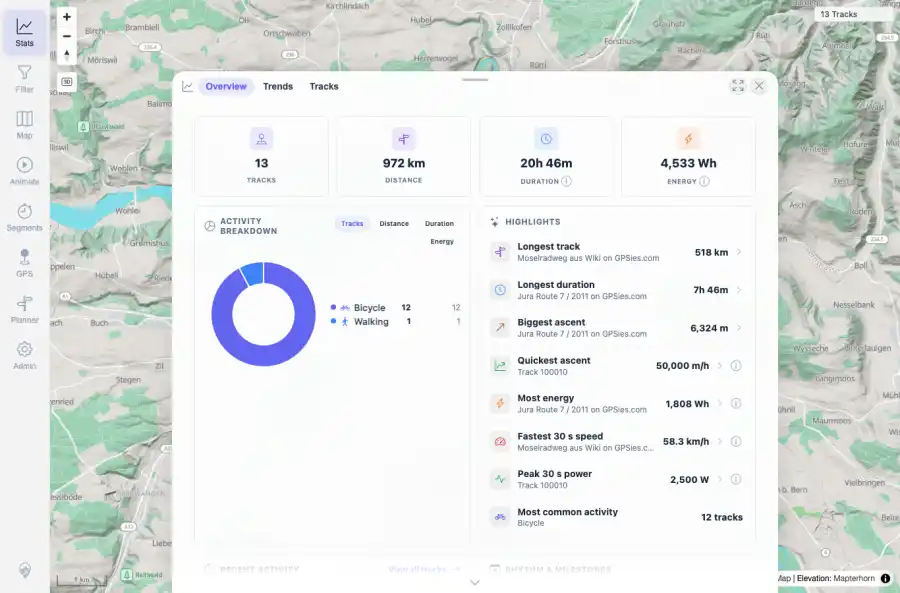

# Packet: AVR_03

## Scope

- Coverage source: `documentation/testing/frontend-regression-test-plan.md`
- Coverage ID or run packet: AVR_03
- In scope: Animation/race cleanup: after stopping/resetting, verify the normal map and other tools remain usable.
- Out of scope: Other coverage IDs except where noted as shared state/evidence.

## Prerequisites

- Required previous coverage IDs or run packets: AVR_02 terminal.
- Required app/data state: Current run-state and packet set for this run.
- Required browser context: As specified by the coverage action.

## Allowed Mutations

- Allowed: Close animation/race overlays, click the map, open Stats, and update AVR_03 packet/run-state evidence only.
- Not allowed: Collapse this ID into a parent row or skip required direct evidence.

## Actions And Results

| Coverage ID | Action | Expected result | Actual result | Status | Evidence |
|---|---|---|---|---|---|
| AVR_03 | Closed race and animation UI after stop/reset, clicked the map, then opened Stats. | Temporary animation/race state is cleaned up; normal map selection and navigation tools continue to work. | PASS: After reset/close, a normal map click opened the expected two-track chooser for the synthetic crossing tracks, and Stats opened with Overview/Trends/Tracks and 13-track totals. | PASS | [assets/AVR_03-post-stop-usable.webp](../assets/AVR_03-post-stop-usable.webp); [assets/AVR_03-post-stop-usable.txt](../assets/AVR_03-post-stop-usable.txt) |

## Issues

| ID | Severity | Summary | Reproduction | Expected | Actual | Evidence | Release impact |
|---|---|---|---|---|---|---|---|

## Evidence Files

| File | Purpose |
|---|---|
| [assets/AVR_03-post-stop-usable.webp](../assets/AVR_03-post-stop-usable.webp) | Screenshot evidence |
| [assets/AVR_03-post-stop-usable.txt](../assets/AVR_03-post-stop-usable.txt) | Text/log evidence |

## Screenshot Evidence

## Timings

| Step | Timing |
|---|---:|
| Post-race cleanup check | ~4 seconds |

## Handoff Notes

- Completed: This coverage ID is terminal.
- Remaining unfinished coverage: Continue with the next queue row.
- Blocked or not applicable: none.
- State left for the next packet: unchanged.
