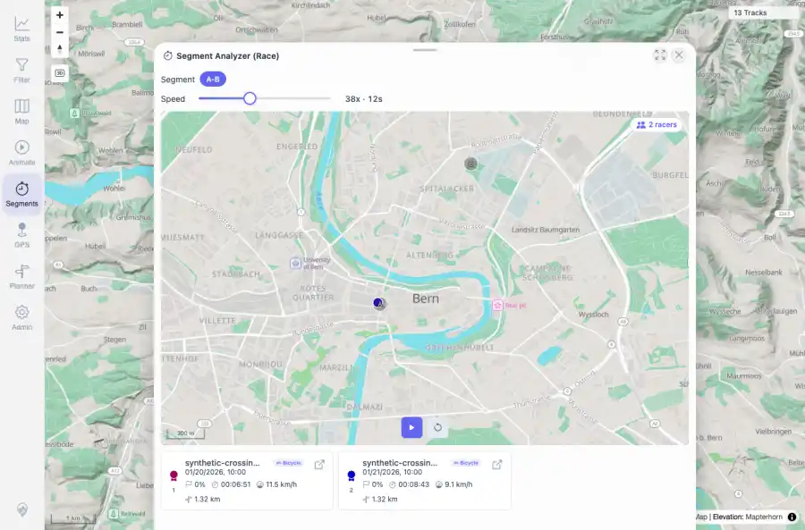

# Packet: AVR_04

## Scope

- Coverage source: `documentation/testing/frontend-regression-test-plan.md`
- Coverage ID or run packet: AVR_04
- In scope: Virtual race geometry: verify the race minimap/markers use local segment geometry and no bad global/zero coordinates.
- Out of scope: Other coverage IDs except where noted as shared state/evidence.

## Prerequisites

- Required previous coverage IDs or run packets: AVR_02 terminal; race sub-track API responses captured.
- Required app/data state: Current run-state and packet set for this run.
- Required browser context: As specified by the coverage action.

## Allowed Mutations

- Allowed: Inspect race minimap/subtrack responses and update AVR_04 packet/run-state evidence only.
- Not allowed: Collapse this ID into a parent row or skip required direct evidence.

## Actions And Results

| Coverage ID | Action | Expected result | Actual result | Status | Evidence |
|---|---|---|---|---|---|
| AVR_04 | Captured virtual-race geometry evidence for selected A-B segment and inspected sub-track response bounds. | Race minimap renders selected local segment geometry with visible racer cards/markers and no zero, invalid, or off-continent coordinates. | PASS: Race minimap rendered with 2 racer cards. Two sub-track responses had 2 points each, combined bounds 7.4470..7.4572 longitude and 46.9480..46.9582 latitude near Bern, with invalid=0, zeroish=0, offContinent=0. | PASS | [assets/AVR_04-race-geometry.webp](../assets/AVR_04-race-geometry.webp); [assets/AVR_04-race-geometry.txt](../assets/AVR_04-race-geometry.txt) |

## Issues

| ID | Severity | Summary | Reproduction | Expected | Actual | Evidence | Release impact |
|---|---|---|---|---|---|---|---|

## Evidence Files

| File | Purpose |
|---|---|
| [assets/AVR_04-race-geometry.webp](../assets/AVR_04-race-geometry.webp) | Screenshot evidence |
| [assets/AVR_04-race-geometry.txt](../assets/AVR_04-race-geometry.txt) | Text/log evidence |

## Screenshot Evidence

## Timings

| Step | Timing |
|---|---:|
| Geometry sanity inspection | ~2 seconds |

## Handoff Notes

- Completed: This coverage ID is terminal.
- Remaining unfinished coverage: Continue with the next queue row.
- Blocked or not applicable: none.
- State left for the next packet: unchanged.
