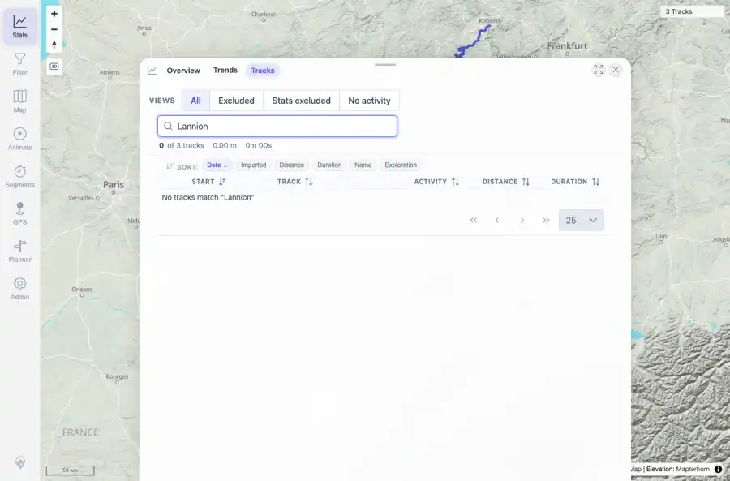
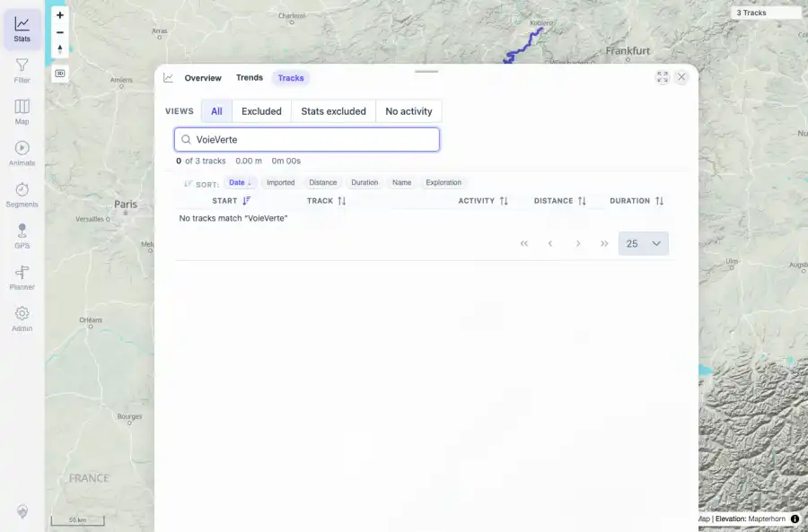
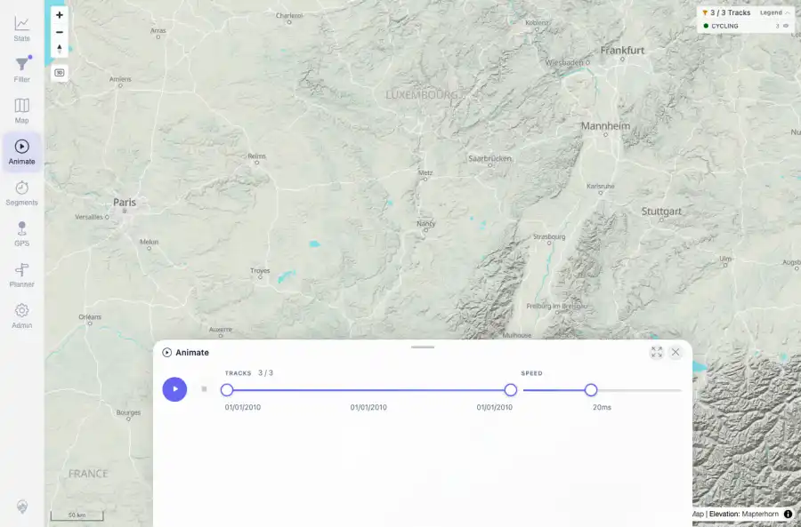
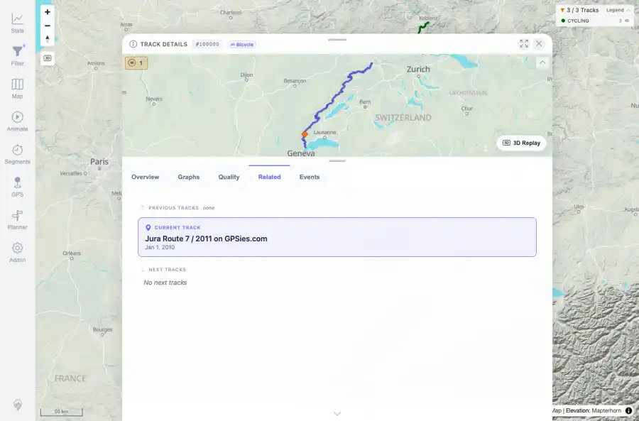

# Packet: DEL_03

## Scope

- Coverage source: `documentation/testing/frontend-regression-test-plan.md`
- Coverage ID or run packet: DEL_03
- In scope: Verify deleted tracks disappear from map, track browser, filter results, selection lists, heatmap, related-track lists, and statistics totals.
- Out of scope: Other coverage IDs except where noted as shared state/evidence.

## Prerequisites

- Required previous coverage IDs or run packets: DEL_01 and DEL_02 terminal; two source files removed and deletion processed.
- Required app/data state: Current run-state and packet set for this run.
- Required browser context: As specified by the coverage action.

## Allowed Mutations

- Allowed: Read-only UI/API verification; temporary heatmap layer toggle restored off; packet/run-state updates.
- Not allowed: Collapse this ID into a parent row or skip required direct evidence.

## Actions And Results

| Coverage ID | Action | Expected result | Actual result | Status | Evidence |
|---|---|---|---|---|---|
| DEL_03 | Checked map count, statistics totals, track browser searches for both deleted names, activity filter results, Animate track-selection count, heatmap layer after deletion, Related tab on a remaining track, and API track/simplified totals. | The two deleted tracks are absent from all checked user-facing surfaces; totals reflect the three remaining tracks; heatmap/filter/map/browser/related/selection surfaces no longer expose stale deleted tracks. | All checked surfaces showed three remaining tracks. API files were JuraRoute72011.gpx, MoselradwegAusWiki.gpx, and Vitry-le-Francois_Langres.gpx; deleted files were absent. Browser searches for Lannion and VoieVerte returned no tracks. Stats showed 3 tracks/938 km/19h 04m; filter showed 3/3 cycling tracks; selection showed 3/3; Related contained no deleted names; heatmap toggled on with 3-track state and was restored off. | PASS | [assets/DEL_03-deletion-surface-summary.txt](../assets/DEL_03-deletion-surface-summary.txt); [assets/DEL_03-map-after-deletion.webp](../assets/DEL_03-map-after-deletion.webp); [assets/DEL_03-map-after-deletion.txt](../assets/DEL_03-map-after-deletion.txt); [assets/DEL_03-stats-after-deletion.webp](../assets/DEL_03-stats-after-deletion.webp); [assets/DEL_03-stats-after-deletion.txt](../assets/DEL_03-stats-after-deletion.txt); [assets/DEL_03-search-deleted-lannion.webp](../assets/DEL_03-search-deleted-lannion.webp); [assets/DEL_03-search-deleted-lannion.txt](../assets/DEL_03-search-deleted-lannion.txt); [assets/DEL_03-search-deleted-voieverte.webp](../assets/DEL_03-search-deleted-voieverte.webp); [assets/DEL_03-search-deleted-voieverte.txt](../assets/DEL_03-search-deleted-voieverte.txt); [assets/DEL_03-filter-after-deletion.webp](../assets/DEL_03-filter-after-deletion.webp); [assets/DEL_03-filter-after-deletion.txt](../assets/DEL_03-filter-after-deletion.txt); [assets/DEL_03-selection-list-after-deletion.webp](../assets/DEL_03-selection-list-after-deletion.webp); [assets/DEL_03-selection-list-after-deletion.txt](../assets/DEL_03-selection-list-after-deletion.txt); [assets/DEL_03-heatmap-after-deletion.webp](../assets/DEL_03-heatmap-after-deletion.webp); [assets/DEL_03-heatmap-after-deletion.txt](../assets/DEL_03-heatmap-after-deletion.txt); [assets/DEL_03-related-after-deletion.webp](../assets/DEL_03-related-after-deletion.webp); [assets/DEL_03-related-after-deletion.txt](../assets/DEL_03-related-after-deletion.txt) |

## Issues

| ID | Severity | Summary | Reproduction | Expected | Actual | Evidence | Release impact |
|---|---|---|---|---|---|---|---|

## Evidence Files

| File | Purpose |
|---|---|
| [assets/DEL_03-deletion-surface-summary.txt](../assets/DEL_03-deletion-surface-summary.txt) | Text/log evidence |
| [assets/DEL_03-map-after-deletion.webp](../assets/DEL_03-map-after-deletion.webp) | Screenshot evidence |
| [assets/DEL_03-map-after-deletion.txt](../assets/DEL_03-map-after-deletion.txt) | Text/log evidence |
| [assets/DEL_03-stats-after-deletion.webp](../assets/DEL_03-stats-after-deletion.webp) | Screenshot evidence |
| [assets/DEL_03-stats-after-deletion.txt](../assets/DEL_03-stats-after-deletion.txt) | Text/log evidence |
| [assets/DEL_03-search-deleted-lannion.webp](../assets/DEL_03-search-deleted-lannion.webp) | Screenshot evidence |
| [assets/DEL_03-search-deleted-lannion.txt](../assets/DEL_03-search-deleted-lannion.txt) | Text/log evidence |
| [assets/DEL_03-search-deleted-voieverte.webp](../assets/DEL_03-search-deleted-voieverte.webp) | Screenshot evidence |
| [assets/DEL_03-search-deleted-voieverte.txt](../assets/DEL_03-search-deleted-voieverte.txt) | Text/log evidence |
| [assets/DEL_03-filter-after-deletion.webp](../assets/DEL_03-filter-after-deletion.webp) | Screenshot evidence |
| [assets/DEL_03-filter-after-deletion.txt](../assets/DEL_03-filter-after-deletion.txt) | Text/log evidence |
| [assets/DEL_03-selection-list-after-deletion.webp](../assets/DEL_03-selection-list-after-deletion.webp) | Screenshot evidence |
| [assets/DEL_03-selection-list-after-deletion.txt](../assets/DEL_03-selection-list-after-deletion.txt) | Text/log evidence |
| [assets/DEL_03-heatmap-after-deletion.webp](../assets/DEL_03-heatmap-after-deletion.webp) | Screenshot evidence |
| [assets/DEL_03-heatmap-after-deletion.txt](../assets/DEL_03-heatmap-after-deletion.txt) | Text/log evidence |
| [assets/DEL_03-related-after-deletion.webp](../assets/DEL_03-related-after-deletion.webp) | Screenshot evidence |
| [assets/DEL_03-related-after-deletion.txt](../assets/DEL_03-related-after-deletion.txt) | Text/log evidence |

## Screenshot Evidence

## Timings

| Step | Timing |
|---|---:|
| Browser/API deletion-surface verification | 73 seconds |

## Handoff Notes

- Completed: This coverage ID is terminal.
- Remaining unfinished coverage: Continue with the next queue row.
- Blocked or not applicable: none.
- State left for the next packet: unchanged.
