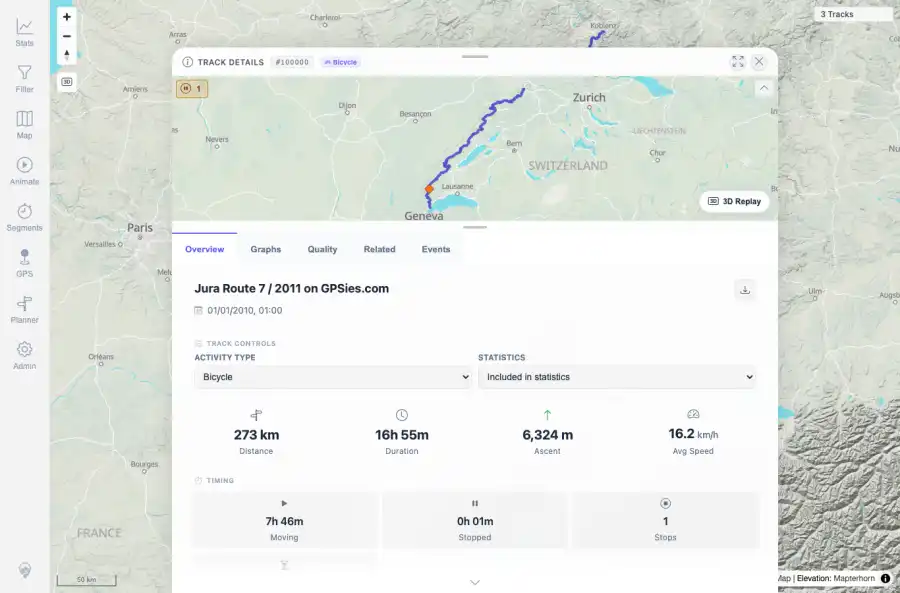
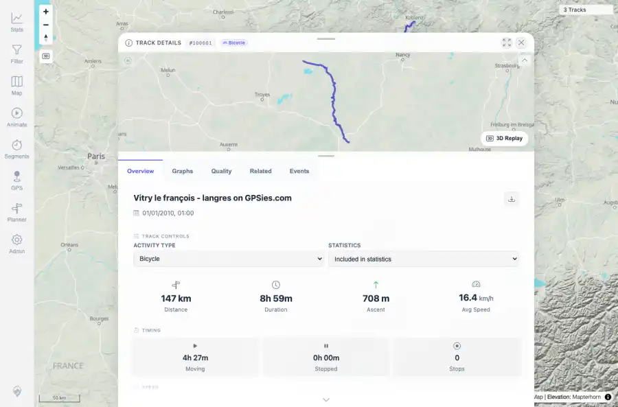
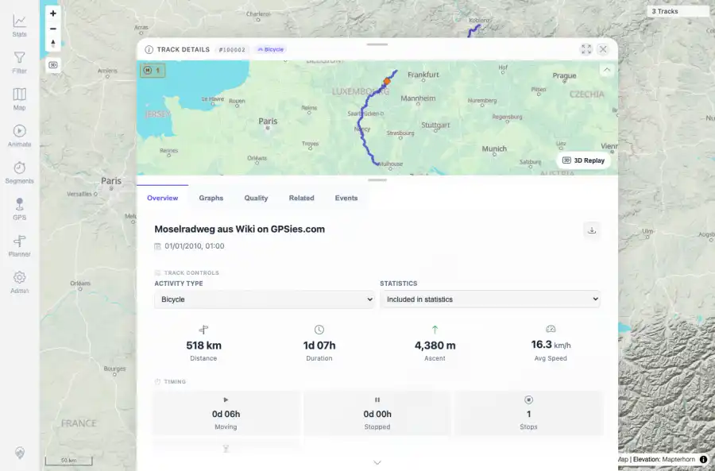

# Packet: DEL_04

## Scope

- Coverage source: `documentation/testing/frontend-regression-test-plan.md`
- Coverage ID or run packet: DEL_04
- In scope: Verify the remaining imported GPX tracks still display and open correctly after deletion sync.
- Out of scope: Other coverage IDs except where noted as shared state/evidence.

## Prerequisites

- Required previous coverage IDs or run packets: DEL_01 through DEL_03 terminal; deleted tracks removed and three tracks remain.
- Required app/data state: Current run-state and packet set for this run.
- Required browser context: As specified by the coverage action.

## Allowed Mutations

- Allowed: Read-only direct user-facing detail-route checks and packet/run-state updates.
- Not allowed: Collapse this ID into a parent row or skip required direct evidence.

## Actions And Results

| Coverage ID | Action | Expected result | Actual result | Status | Evidence |
|---|---|---|---|---|---|
| DEL_04 | Opened the detail route for each remaining GPX-backed track: JuraRoute72011.gpx, Vitry-le-Francois_Langres.gpx, and MoselradwegAusWiki.gpx. | Each remaining track still opens to Track Details with the correct title/id, core tabs, map/details content, and no not-found/error state. | All three remaining detail pages opened correctly with TRACK DETAILS, Overview/Graphs/Quality/Related/Events tabs, expected names/ids, and three-track map state. API still listed exactly the three remaining GPX files. | PASS | [assets/DEL_04-remaining-track-open-summary.txt](../assets/DEL_04-remaining-track-open-summary.txt); [assets/DEL_04-open-jura.webp](../assets/DEL_04-open-jura.webp); [assets/DEL_04-open-jura.txt](../assets/DEL_04-open-jura.txt); [assets/DEL_04-open-vitry.webp](../assets/DEL_04-open-vitry.webp); [assets/DEL_04-open-vitry.txt](../assets/DEL_04-open-vitry.txt); [assets/DEL_04-open-mosel.webp](../assets/DEL_04-open-mosel.webp); [assets/DEL_04-open-mosel.txt](../assets/DEL_04-open-mosel.txt) |

## Issues

| ID | Severity | Summary | Reproduction | Expected | Actual | Evidence | Release impact |
|---|---|---|---|---|---|---|---|

## Evidence Files

| File | Purpose |
|---|---|
| [assets/DEL_04-remaining-track-open-summary.txt](../assets/DEL_04-remaining-track-open-summary.txt) | Text/log evidence |
| [assets/DEL_04-open-jura.webp](../assets/DEL_04-open-jura.webp) | Screenshot evidence |
| [assets/DEL_04-open-jura.txt](../assets/DEL_04-open-jura.txt) | Text/log evidence |
| [assets/DEL_04-open-vitry.webp](../assets/DEL_04-open-vitry.webp) | Screenshot evidence |
| [assets/DEL_04-open-vitry.txt](../assets/DEL_04-open-vitry.txt) | Text/log evidence |
| [assets/DEL_04-open-mosel.webp](../assets/DEL_04-open-mosel.webp) | Screenshot evidence |
| [assets/DEL_04-open-mosel.txt](../assets/DEL_04-open-mosel.txt) | Text/log evidence |

## Screenshot Evidence

## Timings

| Step | Timing |
|---|---:|
| Browser remaining-track open checks | 16 seconds |

## Handoff Notes

- Completed: This coverage ID is terminal.
- Remaining unfinished coverage: Continue with the next queue row.
- Blocked or not applicable: none.
- State left for the next packet: unchanged.
