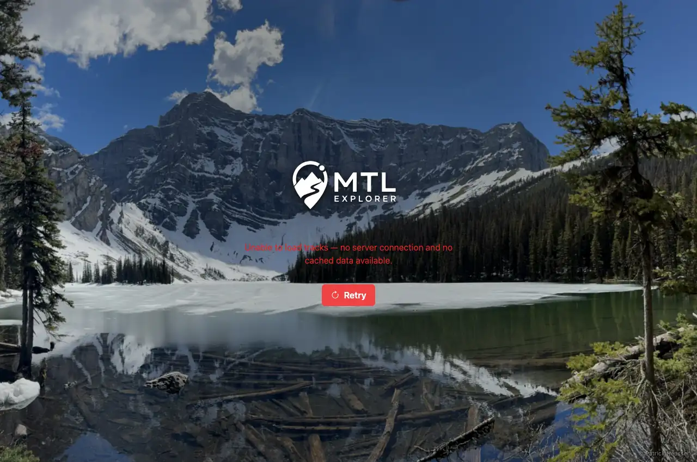
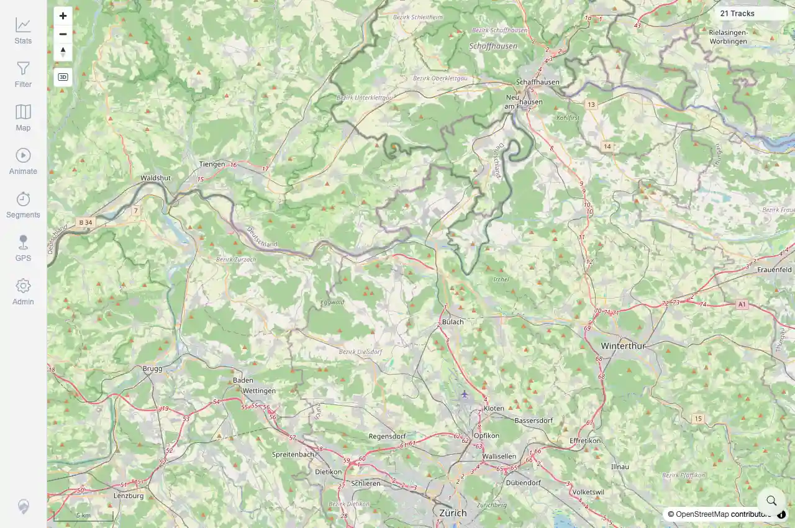
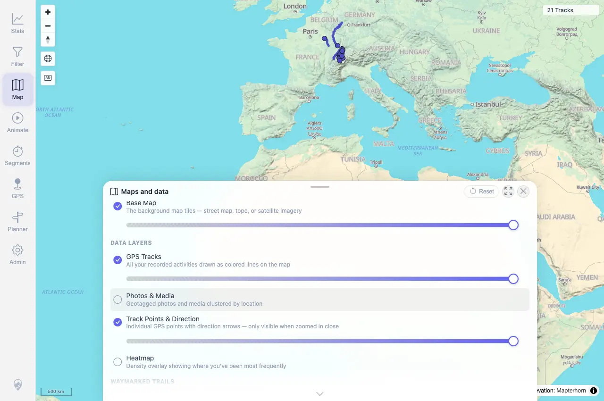
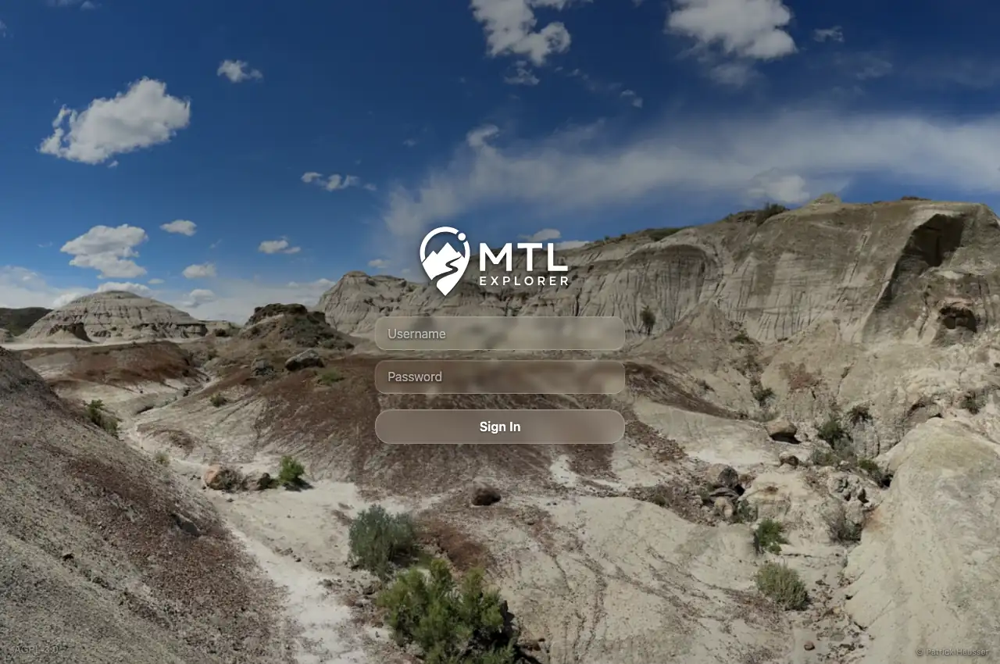

# Packet: ERR_01

## Scope

- Coverage source: `documentation/testing/frontend-regression-test-plan.md`
- Coverage ID or run packet: ERR_01
- In scope: Error recovery for failed track load, failed map config, failed media, failed planner route, and expired session.
- Out of scope: Other coverage IDs except where noted as shared state/evidence.

## Prerequisites

- Required previous coverage IDs or run packets: NET_02/NET_03 terminal; PLN_09 provides prior planner route-error evidence.
- Required app/data state: Current run-state and packet set for this run.
- Required browser context: As specified by the coverage action.

## Allowed Mutations

- Allowed: Read-only verification and packet/run-state updates.
- Not allowed: Collapse this ID into a parent row or skip required direct evidence.

## Actions And Results

| Coverage ID | Action | Expected result | Actual result | Status | Evidence |
|---|---|---|---|---|---|
| ERR_01 | Simulated track-load, map-config, media, and expired-session failures in authenticated browser contexts; reused PLN_09 for planner route-error UI because the direct ERR_01 planner click probe did not add waypoints. Retested the open media repro on beta image `1.300` built `2026-06-05T07:16:20Z`. | Each failure mode shows an actionable recovery path such as Retry, re-login, dismiss, or a clear retry message, and the app does not freeze or go blank. | PASS for the previously open media defect: opening Photos & Media no longer throws `Invalid LngLat`, starts a successful clamped media bounds request, and leaves the app stable. Broken-photo recovery is also reachable through MED_05 and shows Retry/Download. | PASS | [assets/RETEST_MED_01-media-toggle-fixed.webp](../assets/RETEST_MED_01-media-toggle-fixed.webp); [assets/RETEST_MED_05-broken-photo-recovery-fixed.webp](../assets/RETEST_MED_05-broken-photo-recovery-fixed.webp); [assets/RETEST_open-defects-2026-06-05-beta-1.300.json](../assets/RETEST_open-defects-2026-06-05-beta-1.300.json) |

## Issues

| ID | Severity | Summary | Reproduction | Expected | Actual | Evidence | Release impact |
|---|---|---|---|---|---|---|---|
| ERR_01-I01 | High | Media error recovery is not actionable because Photos & Media throws Invalid LngLat before a media request or error UI appears. | Open Map settings and enable Photos & Media on the overview map. | Failed media load should show actionable retry/dismiss UI and keep the app stable. | FIXED on beta image `1.300`: the media toggle no longer throws `Invalid LngLat`, sends a successful media request, and the app remains stable; the broken-photo recovery path shows Retry/Download in MED_05. | [assets/RETEST_MED_01-media-toggle-fixed.webp](../assets/RETEST_MED_01-media-toggle-fixed.webp); [assets/RETEST_MED_05-broken-photo-recovery-fixed.webp](../assets/RETEST_MED_05-broken-photo-recovery-fixed.webp) | Fixed in targeted beta retest. |

## Evidence Files

| File | Purpose |
|---|---|
| [ERR_01-track-load-failure.webp](../assets/ERR_01-track-load-failure.webp) | Screenshot evidence |
| [ERR_01-map-config-failure.webp](../assets/ERR_01-map-config-failure.webp) | Screenshot evidence |
| [ERR_01-media-failure.webp](../assets/ERR_01-media-failure.webp) | Screenshot evidence |
| [ERR_01-expired-session.webp](../assets/ERR_01-expired-session.webp) | Screenshot evidence |
| [ERR_01-error-recovery-summary-compact.txt](../assets/ERR_01-error-recovery-summary-compact.txt) | Text/log evidence |
| [PLN_09-segment-downloading-ui.webp](../assets/PLN_09-segment-downloading-ui.webp) | Screenshot evidence |
| [PLN_09-segment-downloading-ui.txt](../assets/PLN_09-segment-downloading-ui.txt) | Text/log evidence |
| [assets/RETEST_MED_01-media-toggle-fixed.webp](../assets/RETEST_MED_01-media-toggle-fixed.webp) | Targeted beta retest screenshot |
| [assets/RETEST_MED_05-broken-photo-recovery-fixed.webp](../assets/RETEST_MED_05-broken-photo-recovery-fixed.webp) | Targeted beta retest screenshot |
| [assets/RETEST_open-defects-2026-06-05-beta-1.300.json](../assets/RETEST_open-defects-2026-06-05-beta-1.300.json) | Targeted beta retest JSON evidence |

## Screenshot Evidence

## Timings

| Step | Timing |
|---|---:|
| ERR_01 simulated failure probe | 3 minutes |
| Targeted beta media retest | ~30 seconds |

## Handoff Notes

- Completed: This coverage ID is terminal.
- Remaining unfinished coverage: Continue with the next queue row.
- Blocked or not applicable: none.
- State left for the next packet: unchanged.
