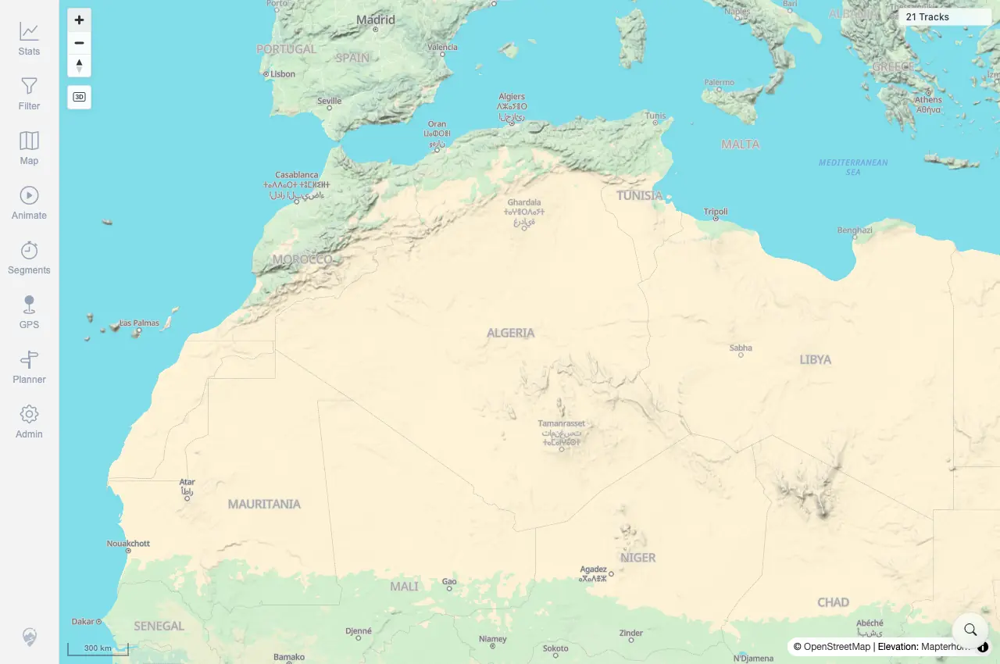

# Packet: ERR_02

## Scope

- Coverage source: `documentation/testing/frontend-regression-test-plan.md`
- Coverage ID or run packet: ERR_02
- In scope: Rapid switching between tools and cleanup of previous tool state.
- Out of scope: Other coverage IDs except where noted as shared state/evidence.

## Prerequisites

- Required previous coverage IDs or run packets: Previous queue rows terminal or explicitly not required.
- Required app/data state: Current run-state and packet set for this run.
- Required browser context: As specified by the coverage action.

## Allowed Mutations

- Allowed: Read-only verification and packet/run-state updates.
- Not allowed: Collapse this ID into a parent row or skip required direct evidence.

## Actions And Results

| Coverage ID | Action | Expected result | Actual result | Status | Evidence |
|---|---|---|---|---|---|
| ERR_02 | Clicked desktop navigation tools in rapid sequence, closed the sheet stack with Escape, then verified map zoom control, visible sheets, visible tool remnants, and cursors. | Rapid tool switching does not leave previous tool markers, listeners, sheets, or cursors behind; the map remains interactive. | All 15 nav clicks succeeded. After closing tools, visible sheet count was 0 before and after zoom, visible remnant count was 0, no stale grabbing/crosshair/not-allowed cursor was present, two canvases remained visible, and Zoom in changed the scale from 500 km to 300 km. | PASS | [ERR_02-rapid-tool-switch-cleanup.webp](../assets/ERR_02-rapid-tool-switch-cleanup.webp); [ERR_02-rapid-tool-switch-cleanup-compact.txt](../assets/ERR_02-rapid-tool-switch-cleanup-compact.txt) |

## Issues

| ID | Severity | Summary | Reproduction | Expected | Actual | Evidence | Release impact |
|---|---|---|---|---|---|---|---|

## Evidence Files

| File | Purpose |
|---|---|
| [ERR_02-rapid-tool-switch-cleanup.webp](../assets/ERR_02-rapid-tool-switch-cleanup.webp) | Screenshot evidence |
| [ERR_02-rapid-tool-switch-cleanup-compact.txt](../assets/ERR_02-rapid-tool-switch-cleanup-compact.txt) | Text/log evidence |

## Screenshot Evidence

## Timings

| Step | Timing |
|---|---:|
| Rapid tool switch probe | 1 minute |

## Handoff Notes

- Completed: This coverage ID is terminal.
- Remaining unfinished coverage: Continue with the next queue row.
- Blocked or not applicable: none.
- State left for the next packet: unchanged.
