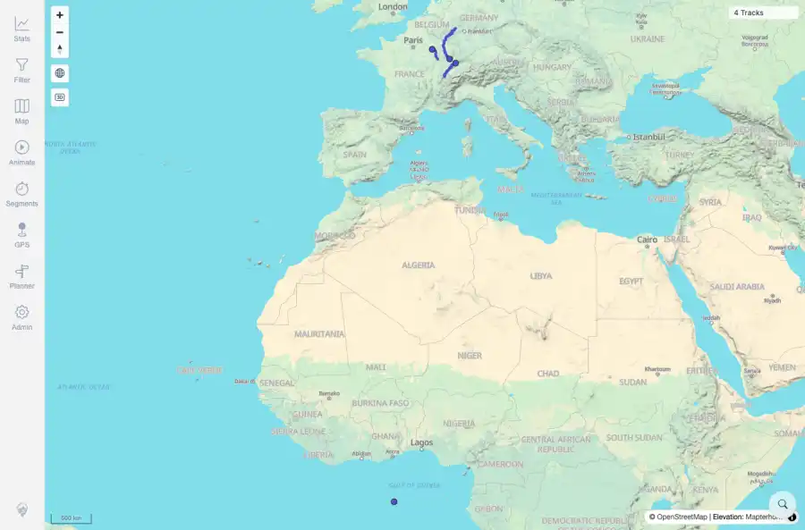
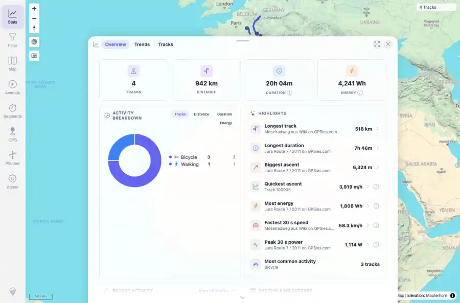
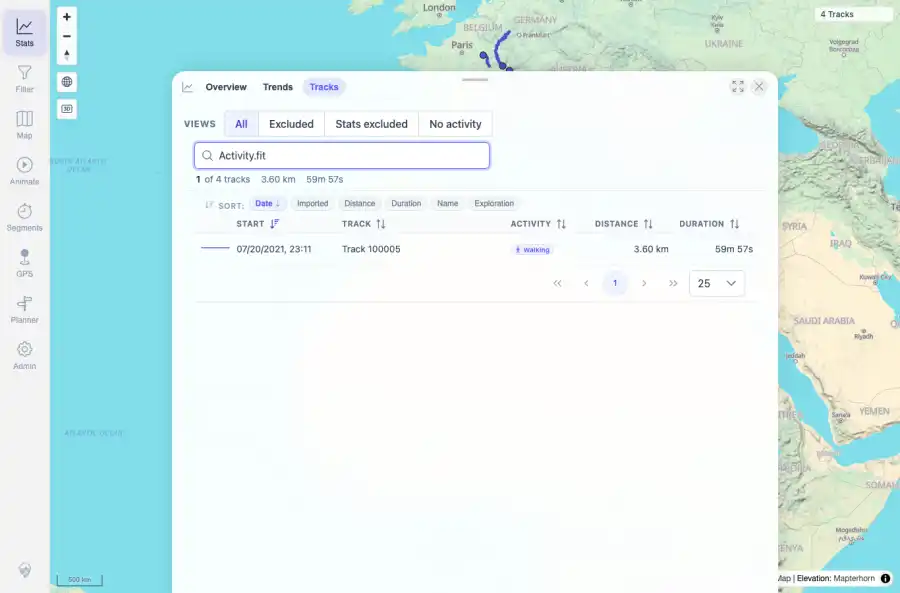

# Packet: FIT_02

## Scope

- Coverage source: `documentation/testing/frontend-regression-test-plan.md`
- Coverage ID or run packet: FIT_02
- In scope: Verify FIT import acceptance, successful indexing, map display, browser search, and statistics inclusion.
- Out of scope: Other coverage IDs except where noted as shared state/evidence.

## Prerequisites

- Required previous coverage IDs or run packets: FIT_01 terminal; Activity.fit present in watched folder.
- Required app/data state: Current run-state and packet set for this run.
- Required browser context: As specified by the coverage action.

## Allowed Mutations

- Allowed: Read-only API polling and UI verification; packet/run-state updates.
- Not allowed: Collapse this ID into a parent row or skip required direct evidence.

## Actions And Results

| Coverage ID | Action | Expected result | Actual result | Status | Evidence |
|---|---|---|---|---|---|
| FIT_02 | Polled import/indexer state, opened map and stats, searched the track browser for Activity.fit, and compared API/UI totals. | The FIT file is accepted/indexed successfully, creates a displayed track on the map, is searchable in the browser, and is included in statistics. | Activity.fit indexed as track 100005 with loadStatus=SUCCESS, 3,600 points, walking activity, 3.60 km, and 59m57s motion duration. Map and stats showed 4 tracks; stats activity breakdown included Walking 1; browser search query Activity.fit returned the Track 100005 Walking row. | PASS | [assets/FIT_02-index-wait.txt](../assets/FIT_02-index-wait.txt); [assets/FIT_02-ui-api-summary.txt](../assets/FIT_02-ui-api-summary.txt); [assets/FIT_02-map-fit-indexed.webp](../assets/FIT_02-map-fit-indexed.webp); [assets/FIT_02-map-fit-indexed.txt](../assets/FIT_02-map-fit-indexed.txt); [assets/FIT_02-stats-fit-included.webp](../assets/FIT_02-stats-fit-included.webp); [assets/FIT_02-stats-fit-included.txt](../assets/FIT_02-stats-fit-included.txt); [assets/FIT_02-track-search-fit.webp](../assets/FIT_02-track-search-fit.webp); [assets/FIT_02-track-search-fit.txt](../assets/FIT_02-track-search-fit.txt) |

## Issues

| ID | Severity | Summary | Reproduction | Expected | Actual | Evidence | Release impact |
|---|---|---|---|---|---|---|---|

## Evidence Files

| File | Purpose |
|---|---|
| [assets/FIT_02-index-wait.txt](../assets/FIT_02-index-wait.txt) | Text/log evidence |
| [assets/FIT_02-ui-api-summary.txt](../assets/FIT_02-ui-api-summary.txt) | Text/log evidence |
| [assets/FIT_02-map-fit-indexed.webp](../assets/FIT_02-map-fit-indexed.webp) | Screenshot evidence |
| [assets/FIT_02-map-fit-indexed.txt](../assets/FIT_02-map-fit-indexed.txt) | Text/log evidence |
| [assets/FIT_02-stats-fit-included.webp](../assets/FIT_02-stats-fit-included.webp) | Screenshot evidence |
| [assets/FIT_02-stats-fit-included.txt](../assets/FIT_02-stats-fit-included.txt) | Text/log evidence |
| [assets/FIT_02-track-search-fit.webp](../assets/FIT_02-track-search-fit.webp) | Screenshot evidence |
| [assets/FIT_02-track-search-fit.txt](../assets/FIT_02-track-search-fit.txt) | Text/log evidence |

## Screenshot Evidence

## Timings

| Step | Timing |
|---|---:|
| FIT indexing wait | <1 second after polling began |
| Browser/API FIT surface verification | 12 seconds |

## Handoff Notes

- Completed: This coverage ID is terminal.
- Remaining unfinished coverage: Continue with the next queue row.
- Blocked or not applicable: none.
- State left for the next packet: unchanged.
