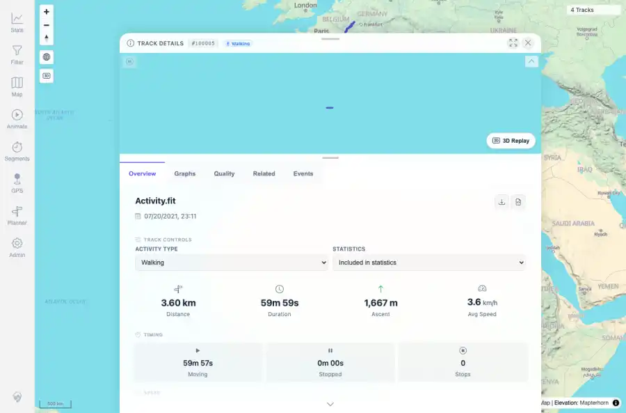
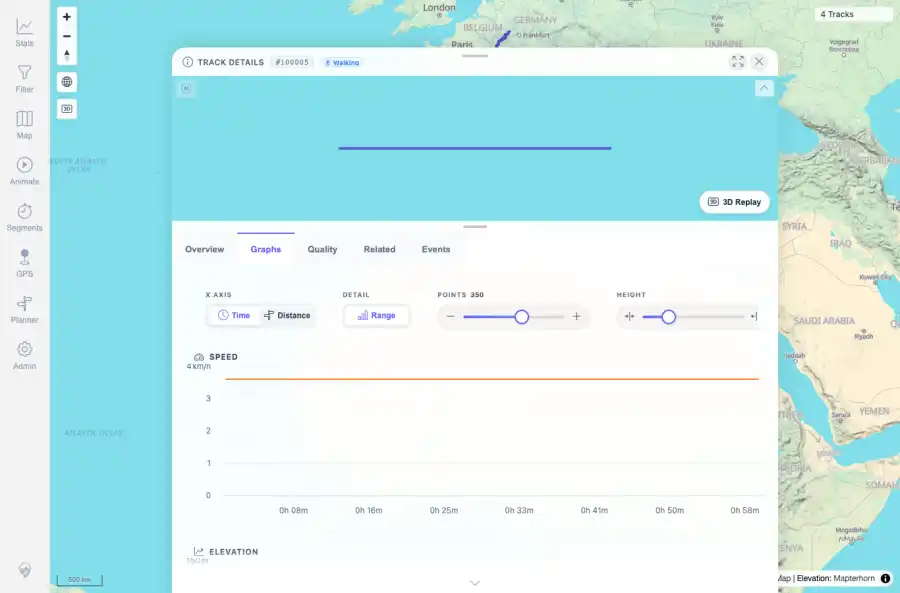
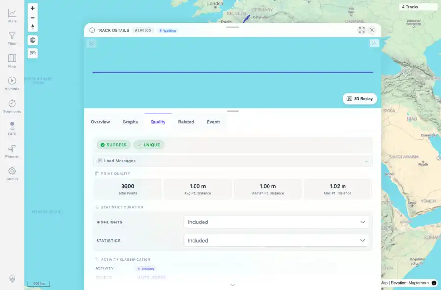
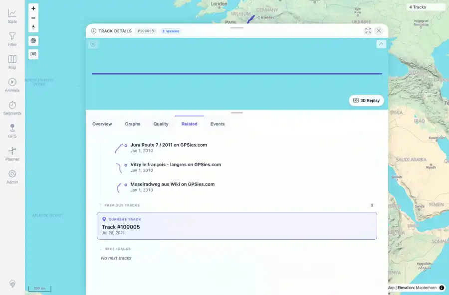
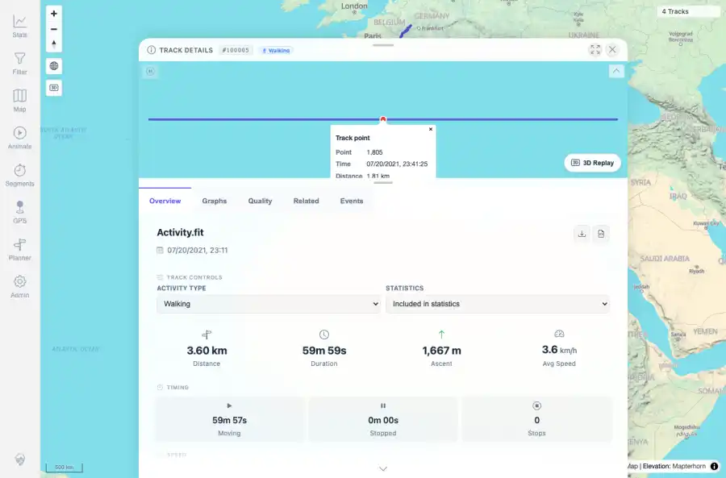

# Packet: FIT_03

## Scope

- Coverage source: `documentation/testing/frontend-regression-test-plan.md`
- Coverage ID or run packet: FIT_03
- In scope: Open the FIT-backed track details and verify overview, graphs, quality, events, related tracks, mini-map, and point popup rendering.
- Out of scope: Other coverage IDs except where noted as shared state/evidence.

## Prerequisites

- Required previous coverage IDs or run packets: FIT_02 terminal; FIT-backed track 100005 present and indexed successfully.
- Required app/data state: Current run-state and packet set for this run.
- Required browser context: As specified by the coverage action.

## Allowed Mutations

- Allowed: Read-only FIT detail navigation and packet/run-state updates.
- Not allowed: Collapse this ID into a parent row or skip required direct evidence.

## Actions And Results

| Coverage ID | Action | Expected result | Actual result | Status | Evidence |
|---|---|---|---|---|---|
| FIT_03 | Opened /mtl/track/100005, captured Overview, Graphs, Quality, Related, and Events tabs, verified the mini-map canvas, and clicked the mini-map to open a track point popup. | The FIT-backed detail page renders like a GPX-backed track: overview stats, graph charts and controls, quality metadata, related/events tabs, mini-map, and point popups work. | Track 100005 opened as Activity.fit/Walking. Overview showed 3.60 km and timing/elevation stats; Graphs showed X axis Time/Distance, Range, Points, Height, Speed, Elevation, Elevation Gain Rate, and Distance Over Time charts; Quality showed SUCCESS/UNIQUE/3600 points and Walking classification; Related and Events rendered; mini-map canvas was present and a point popup opened with point/time/distance/elevation/speed/elapsed. | PASS | [assets/FIT_03-detail-summary.txt](../assets/FIT_03-detail-summary.txt); [assets/FIT_03-overview.webp](../assets/FIT_03-overview.webp); [assets/FIT_03-overview.txt](../assets/FIT_03-overview.txt); [assets/FIT_03-graphs.webp](../assets/FIT_03-graphs.webp); [assets/FIT_03-graphs.txt](../assets/FIT_03-graphs.txt); [assets/FIT_03-quality.webp](../assets/FIT_03-quality.webp); [assets/FIT_03-quality.txt](../assets/FIT_03-quality.txt); [assets/FIT_03-related.webp](../assets/FIT_03-related.webp); [assets/FIT_03-related.txt](../assets/FIT_03-related.txt); [assets/FIT_03-events.webp](../assets/FIT_03-events.webp); [assets/FIT_03-events.txt](../assets/FIT_03-events.txt); [assets/FIT_03-point-popup.webp](../assets/FIT_03-point-popup.webp); [assets/FIT_03-point-popup.txt](../assets/FIT_03-point-popup.txt) |

## Issues

| ID | Severity | Summary | Reproduction | Expected | Actual | Evidence | Release impact |
|---|---|---|---|---|---|---|---|

## Evidence Files

| File | Purpose |
|---|---|
| [assets/FIT_03-detail-summary.txt](../assets/FIT_03-detail-summary.txt) | Text/log evidence |
| [assets/FIT_03-overview.webp](../assets/FIT_03-overview.webp) | Screenshot evidence |
| [assets/FIT_03-overview.txt](../assets/FIT_03-overview.txt) | Text/log evidence |
| [assets/FIT_03-graphs.webp](../assets/FIT_03-graphs.webp) | Screenshot evidence |
| [assets/FIT_03-graphs.txt](../assets/FIT_03-graphs.txt) | Text/log evidence |
| [assets/FIT_03-quality.webp](../assets/FIT_03-quality.webp) | Screenshot evidence |
| [assets/FIT_03-quality.txt](../assets/FIT_03-quality.txt) | Text/log evidence |
| [assets/FIT_03-related.webp](../assets/FIT_03-related.webp) | Screenshot evidence |
| [assets/FIT_03-related.txt](../assets/FIT_03-related.txt) | Text/log evidence |
| [assets/FIT_03-events.webp](../assets/FIT_03-events.webp) | Screenshot evidence |
| [assets/FIT_03-events.txt](../assets/FIT_03-events.txt) | Text/log evidence |
| [assets/FIT_03-point-popup.webp](../assets/FIT_03-point-popup.webp) | Screenshot evidence |
| [assets/FIT_03-point-popup.txt](../assets/FIT_03-point-popup.txt) | Text/log evidence |

## Screenshot Evidence

## Timings

| Step | Timing |
|---|---:|
| Browser FIT detail verification | 17 seconds |

## Handoff Notes

- Completed: This coverage ID is terminal.
- Remaining unfinished coverage: Continue with the next queue row.
- Blocked or not applicable: none.
- State left for the next packet: unchanged.
