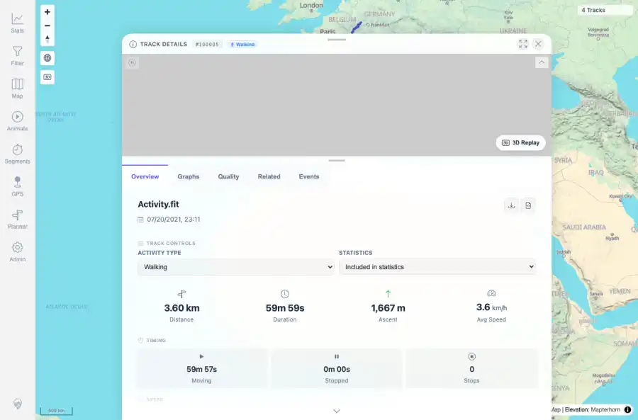

# Packet: FIT_04

## Scope

- Coverage source: `documentation/testing/frontend-regression-test-plan.md`
- Coverage ID or run packet: FIT_04
- In scope: Verify Download original source file for the FIT-backed track returns the original FIT file and checksum.
- Out of scope: Other coverage IDs except where noted as shared state/evidence.

## Prerequisites

- Required previous coverage IDs or run packets: FIT_03 terminal; FIT-backed track detail page available.
- Required app/data state: Current run-state and packet set for this run.
- Required browser context: As specified by the coverage action.

## Allowed Mutations

- Allowed: Use the visible Download original control, save the binary to /tmp for checksum comparison, and update packet/run-state; do not add binary download to run assets.
- Not allowed: Collapse this ID into a parent row or skip required direct evidence.

## Actions And Results

| Coverage ID | Action | Expected result | Actual result | Status | Evidence |
|---|---|---|---|---|---|
| FIT_04 | Opened track 100005, clicked the Download original control, saved the downloaded file to /tmp, and compared size/SHA-256/extension against the staged Activity.fit source. | The downloaded original remains a FIT file and matches the uploaded/staged checksum. | Download original suggested Activity.fit, saved 94,096 bytes, and matched the staged source SHA-256 949a238e1bb75c3684479785f76fa9a16888bb394518844248f488171d591387. FIT header bytes were present and no binary was stored in the run assets. | PASS | [assets/FIT_04-original-download.txt](../assets/FIT_04-original-download.txt); [assets/FIT_04-download-original-control.webp](../assets/FIT_04-download-original-control.webp); [assets/FIT_04-download-original-control.txt](../assets/FIT_04-download-original-control.txt) |

## Issues

| ID | Severity | Summary | Reproduction | Expected | Actual | Evidence | Release impact |
|---|---|---|---|---|---|---|---|

## Evidence Files

| File | Purpose |
|---|---|
| [assets/FIT_04-original-download.txt](../assets/FIT_04-original-download.txt) | Text/log evidence |
| [assets/FIT_04-download-original-control.webp](../assets/FIT_04-download-original-control.webp) | Screenshot evidence |
| [assets/FIT_04-download-original-control.txt](../assets/FIT_04-download-original-control.txt) | Text/log evidence |

## Screenshot Evidence

## Timings

| Step | Timing |
|---|---:|
| Browser original-download verification | 7 seconds |

## Handoff Notes

- Completed: This coverage ID is terminal.
- Remaining unfinished coverage: Continue with the next queue row.
- Blocked or not applicable: none.
- State left for the next packet: unchanged.
